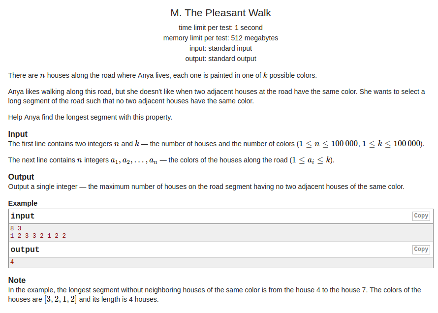

## Codeforces - 1090M. The Pleasant Walk

#### [题目链接](http://codeforces.com/problemset/problem/1090/M)

> http://codeforces.com/problemset/problem/1090/M

#### 题目大意
给你一排颜色(<font color = red>用不同的数字区分</font>)，要你求最长的每个相邻颜色都不同的子数组长度。

#### 解析
简单的动态规划题。`dp[i]`代表的是当前`0~i`之间的最长答案。

代码:(上面是一维`dp`数组代码，下面是滚动优化代码)
```cpp
#include <bits/stdc++.h>

const int MAX = 100001;

int main(int argc, char const** argv)
{ 
    std::ios::sync_with_stdio(false);
    std::cin.tie(0);
    int n, k, arr[MAX+1], dp[MAX+1] ;
    std::cin >> n >> k;
    for(int i = 0; i < n; i++)
        std::cin >> arr[i];
    int res = 1;
    dp[0] = 1; // remember this
    for(int i = 1; i < n; i++){
        dp[i] = 1;
        if(arr[i] != arr[i-1])
            dp[i] = dp[i-1] + 1;
        res = std::max(res, dp[i]);
    }
    std::cout << res << std::endl;
    return 0;
}

#if 0
// roll optimize 
int main(int argc, char const** argv)
{ 
    std::ios::sync_with_stdio(false);
    std::cin.tie(0);
    int n, k, arr[MAX+1] ;
    std::cin >> n >> k;
    for(int i = 0; i < n; i++)
        std::cin >> arr[i];
    int res = 1, roll = 1;
    for(int i = 1; i < n; i++){
        if(arr[i] != arr[i-1])
            roll += 1;
        else 
            roll = 1;
        res = std::max(res, roll);
    }
    std::cout << res << std::endl;
    return 0;
}
#endif

```
