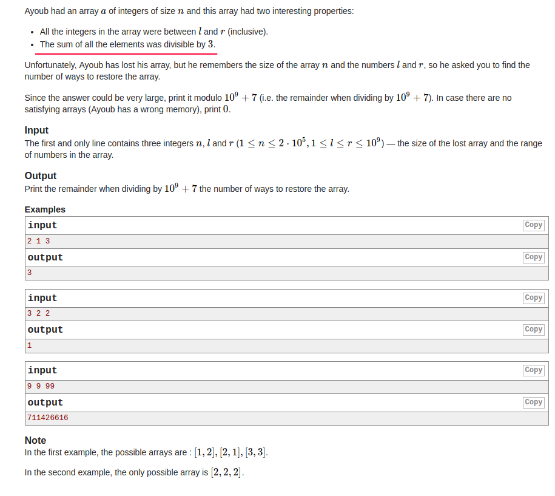

## Codeforces - 1105C. Ayoub and Lost Array(DP)
#### [题目链接](https://codeforces.com/problemset/problem/1105/C)
> https://codeforces.com/problemset/problem/1105/C
#### 题目

给你`n, l ,r`，从`l`到`r`中选`n`个数，**允许相同**。要使最终这`n`个数的和是`3`的倍数，求有多少个方案。



#### 解析

因为`1 <= L <= R < 1000000000`，所以不能从`L, R`下手(一开始就是从`L, R`下手，果断超时)。

要换一种思路: 

* 求`n`个数的和为`3`的倍数，就是余数加起来为`3`的倍数；
* 如果能在常数时间内求出 : `[l, r]`之间除以`3`的余数为`i`的个数(自己推理一下即可(所以为什么这一题标注`Math`...))。
* 即用`mods[0]`表示`[l, r] % 3 == 0`的个数，`mods[1]`表示`[l, r] % 3 == 1`的个数，`mods[2]`表示`[l, r] % 3 == 2`的个数；
* 然后递推方程就是如下的三个，**即: `dp[i][j]`表示第`i`个数时，前`i`个数的和`mod 3`为`j`的方案数。**

```java
dp[i][0] = dp[i-1][0]*mods[0] + dp[i-1][1]*mods[2] + dp[i-1][2]*mods[1];
dp[i][1] = dp[i-1][0]*mods[1] + dp[i-1][1]*mods[0] + dp[i-1][2]*mods[2];
dp[i][2] = dp[i-1][0]*mods[2] + dp[i-1][1]*mods[1] + dp[i-1][2]*mods[0];
```

`dp`方程仔细看一下就懂，举一个例子

* `dp[i][0]`表示的是前`i`个数的和`mod 3 ` 为`0`的方案；
* 则`dp[i][0]`就是`i-1`个数的时候，下面三种情况的和: 
  * `i-1`个数的和`mod 3  == 0`的个数 和 `mods[0]`(`[l, r]`之间`mod 3 == 0`的个数)相乘；
  * `i-1`个数的和`mod 3  == 1`的个数 和 `mods[2]`(`[l, r]`之间`mod 3 == 2`的个数)相乘；
  * `i-1`个数的和`mod 3  == 2`的个数 和 `mods[1]`(`[l, r]`之间`mod 3 == 1`的个数)相乘；

一开始超时的代码: 

```java
import java.io.*;
import java.util.*;

public class Main {

    final static int mod = 1000000000 + 7;
    static int n, L, R;
    static int[][] dp;

    static int dfs(int sum, int pos){ 
        if(pos == n){ 
            if(sum == 0)
                return 1;
            return 0;
        }
        if(dp[sum][pos] != -1)
            return dp[sum][pos];
        int res = 0;
        for(int i = L; i <= R; i++){ 
            int temp = sum;
            sum += i;
            sum %= 3;
            res += dfs(sum, pos + 1);
            res %= mod;
            sum = temp;
        }
        return dp[sum][pos] = res;
    }

    public static void main(String[] args) {
        Scanner in = new Scanner(new BufferedInputStream(System.in));
        PrintStream out = System.out;
        n = in.nextInt();
        L = in.nextInt();
        R = in.nextInt();
        dp = new int[3][n];
        for(int i = 0; i < 3; i++)
            Arrays.fill(dp[i], -1);
        out.println( dfs(0, 0) );
    }
}
```

AC代码:

```java
import java.io.*;
import java.util.*;

public class Main {

    final static int P = 1000000000 + 7;

    public static void main(String[] args) {
        Scanner in = new Scanner(new BufferedInputStream(System.in));
        PrintStream out = System.out;
        int n = in.nextInt(), l = in.nextInt(), r = in.nextInt();
        long[][] dp = new long[n+1][3];
        long[] mods = new long[3];
        dp[1][0] = mods[0] = r/3 - (l-1)/3;
        dp[1][1] = mods[1] = (r+2)/3 - (l+1)/3;
        dp[1][2] = mods[2] = (r+1)/3 - l/3;
        for(int i = 2; i <= n; i++){ 
            dp[i][0] = ( dp[i-1][0]*mods[0] + dp[i-1][1]*mods[2] + dp[i-1][2]*mods[1] ) % P;
            dp[i][1] = ( dp[i-1][0]*mods[1] + dp[i-1][1]*mods[0] + dp[i-1][2]*mods[2] ) % P;
            dp[i][2] = ( dp[i-1][0]*mods[2] + dp[i-1][1]*mods[1] + dp[i-1][2]*mods[0] ) % P;
        }
        out.println(dp[n][0]);
    }
}

```

