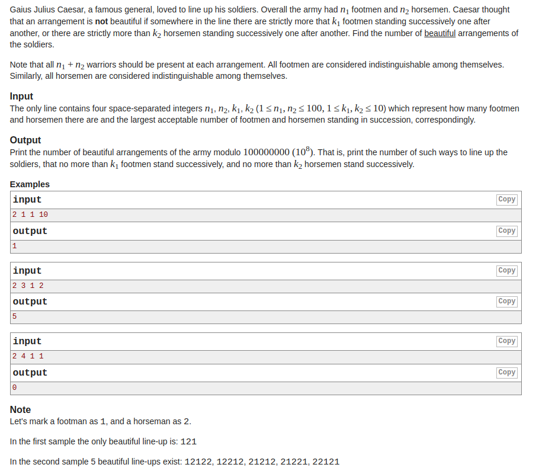
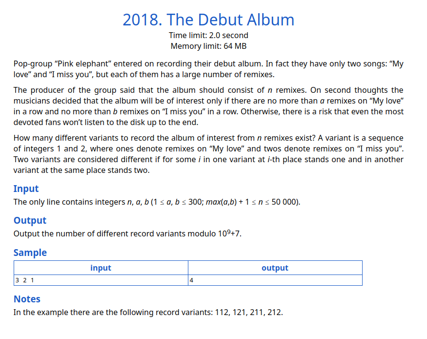

## Codeforces - 118D. Caesar's Legions | TimusOJ - 2018. The Debut Album (DP)

* [Codeforces - 118D. Caesar's Legions](#1)
* [TimusOJ - 2018. The Debut Album](#timusoj---2018-the-debut-album)
***

### <font color = red id = "1">Codeforces - 118D. Caesar's Legions
#### [题目链接](https://codeforces.com/problemset/problem/118/D)

> https://codeforces.com/problemset/problem/118/D

#### 题目

给你四个数`N1、N2、K1、K2`，分别代码你总共有`N1`个`1`，`N2`个`2`，要你将这个`N1 + N2`个数排列，需要满足下面两个要求: 

* `1`不能连续摆放`K1`个；
* `2`不能连续摆放`K2`个；

问你总共有多少种摆放方法。

#### 解析

递归的思路: 


* 递归函数有四个参数`n1、n2、k1、k2`，分别表示 : ①当前已经有的`1`的个数，②当前已经有的`2`的个数，③当前已经连续的`1`的个数，④当前已经连续的`2`的个数；

* 当前层的答案是如果`n1 < N1 && k1 < K1`则当前可以选择`1`，然后去递归；且如果`n2 < N2 && k2 < K2`则当前可以选择`2`，相加返回即可；


```java
import java.io.*;
import java.util.*;

public class Main{ 

    static int N1, N2, K1, K2;  
    final static int mod = 100000000;
    static int[][][][] dp;

    static int recur(int n1, int n2, int k1, int k2){
        if(n1 == N1 && n2 == N2)
            return 1;
        if(dp[n1][n2][k1][k2] != -1)
            return dp[n1][n2][k1][k2];
        int res = 0;
        if(n1 < N1 && k1 < K1)
            res += recur(n1+1, n2, k1+1, 0);
        if(n2 < N2 && k2 < K2)
            res += recur(n1, n2+1, 0, k2+1);
        return dp[n1][n2][k1][k2] = res % mod;
    }

    public static void main(String[] args) {
        Scanner cin = new Scanner(new BufferedInputStream(System.in));
        PrintStream out = System.out;
        N1 = cin.nextInt();
        N2 = cin.nextInt();
        K1 = cin.nextInt();
        K2 = cin.nextInt();
        dp = new int[N1+1][N2+1][K1+1][K2+1];
        for(int a = 0; a <= N1; a++){ //注意 <= ,初始化不要搞错
            for(int b = 0; b <= N2; b++){ 
                for(int c = 0; c <= K1; c++)
                    for(int d = 0; d <= K2; d++)
                        dp[a][b][c][d] = -1;
            }
        }
        out.println((recur(0, 0, 0, 0) + mod)%mod);
    }
}
```

上面的代码虽然可以通过，但是消耗内存比较大，在下面的那个题目中就不能用这个方法(会超内存)，必须换一种思路: 


* 从后往前计算，当前如果是`1`，则可以由前面的最后一个是`2`的一些数(`cur - i `)组成；
* 如果当前是`2`，则可以由前面的最后一个是`1`的一些数组成；

具体看代码吧。。。

```java
import java.io.*;
import java.util.*;

public class Main{ 

    static int N1, N2, K1, K2;
    final static int mod = 100000000;
    static int[][][] dp;
    
    static int recur(int n1, int n2, int cate){ 
        if(n1 == 0 && n2 == 0)
            return 1;
        if(dp[n1][n2][cate] != -1)
            return dp[n1][n2][cate];
        int res = 0;
        if(cate == 1){ 
            for(int i = 1; n1 - i >= 0 && i <= Math.min(N1, K1); i++)
                res = (res + recur(n1 - i, n2, 2)) % mod;
        }else { 
            for(int i = 1; n2 - i >= 0 && i <= Math.min(N2, K2); i++)
                res = (res + recur(n1, n2 - i, 1)) % mod;
        }
        return dp[n1][n2][cate] = res % mod;
    }

    public static void main(String[] args) {
        Scanner cin = new Scanner(new BufferedInputStream(System.in));
        PrintStream out = System.out;
        N1 = cin.nextInt();
        N2 = cin.nextInt();
        K1 = cin.nextInt();
        K2 = cin.nextInt();
        dp = new int[N1+1][N2+1][3];
        for(int i = 0; i <= N1; i++){ 
            for(int j = 0; j <= N2; j++){ 
                for(int k = 0; k <= 2; k++)
                    dp[i][j][k] = -1;
            }
        }
        out.println( (recur(N1, N2, 1) + recur(N1, N2, 2)) % mod);
    }
}
```

#### <font color = red id = "2">TimusOJ - 2018. The Debut Album
#### [题目链接](http://acm.timus.ru/problem.aspx?space=1&num=2018)

> http://acm.timus.ru/problem.aspx?space=1&num=2018

#### 题目

和上一个题目很像，给你三个数`N、A、B`，要你将`N`个数(只包含`1、2`)排列，其中`1`不能连续有`A`个，`2`不能连续有`B`个，问你有多少中摆放方法。


#### 解析
这个题目不能用第一个题目的第一种方法，因为这样内存消耗很大。

`MLE`代码: 
```java
import java.io.*;
import java.util.*;

public class Main{ 

    static int N, A, B;
    final static int mod = 1000000000 + 7;
    static int[][][] dp;

    static int recur(int n, int a, int b){
        if(n == N)
            return 1;
        if(dp[n][a][b] != -1)
            return dp[n][a][b];
        int res = 0;
        if(a < A)
            res += recur(n+1, a+1, 0);
        if(b < B)
            res += recur(n+1, 0, b+1);
        return dp[n][a][b] = res % mod;
    }

    public static void main(String[] args) {
        Scanner cin = new Scanner(new BufferedInputStream(System.in));
        PrintStream out = System.out;
        N = cin.nextInt();
        A = cin.nextInt();
        B = cin.nextInt();
        dp = new int[N+1][A+1][B+1];
        for(int i = 0; i <= N; i++){ 
            for(int j = 0; j <= A; j++){ 
                for(int k = 0; k <= B; k++)
                    dp[i][j][k] = -1;
            }
        }
        out.println((recur(0, 0, 0) + mod)%mod);
    }
}

```
同样也是第二种方法的思路，这里给出递归和递推的代码: 
```java
import java.io.*;
import java.util.*;

public class Main{ 

    static int N, A, B;
    final static int mod = 1000000000 + 7;
    static int[][] dp;

    static int recur(int n, int cate){
        if(n == 0)
            return 1;
        if(dp[n][cate] != -1)
            return dp[n][cate];
        int res = 0;
        if(cate == 1){
            for(int i = 1; n - i >= 0 && i <= Math.min(N, A); i++)
                res = (res + recur(n - i, 2)) % mod;
        }else { // cate == 2 
            for(int i = 1; n - i >= 0 && i <= Math.min(N, B); i++)
                res = (res + recur(n - i, 1)) % mod;
        }
        return dp[n][cate] = res % mod;
    }

    public static void main(String[] args) {
        Scanner cin = new Scanner(new BufferedInputStream(System.in));
        PrintStream out = System.out;
        N = cin.nextInt();
        A = cin.nextInt();
        B = cin.nextInt();
        dp = new int[N+1][3];
        for(int i = 0; i <= N; i++){ 
            dp[i][1] = -1;
            dp[i][2] = -1;
        }
        out.println( (recur(N, 1) + recur(N, 2) )%mod);
    }
}
```

```java
import java.io.*;
import java.util.*;

public class Main{ 

    final static int mod = 1000000000 + 7;

    public static void main(String[] args) {
        Scanner cin = new Scanner(new BufferedInputStream(System.in));
        PrintStream out = System.out;
        int N = cin.nextInt();
        int A = cin.nextInt();
        int B = cin.nextInt();
        int[][] dp = new int[N+1][3];
        dp[0][1] = 1; dp[0][2] = 1;
        for(int cur = 1; cur <= N; cur++){ 
            for(int i = 1; cur-i >= 0 && i <= Math.min(N, A); i++)
                dp[cur][1] = (dp[cur][1] + dp[cur-i][2]) % mod;
            for(int i = 1; cur-i >= 0 && i <= Math.min(N, B); i++)
                dp[cur][2] = (dp[cur][2] + dp[cur-i][1]) % mod;
        }
        out.println( (dp[N][1] + dp[N][2]) % mod);
    }
}
```

