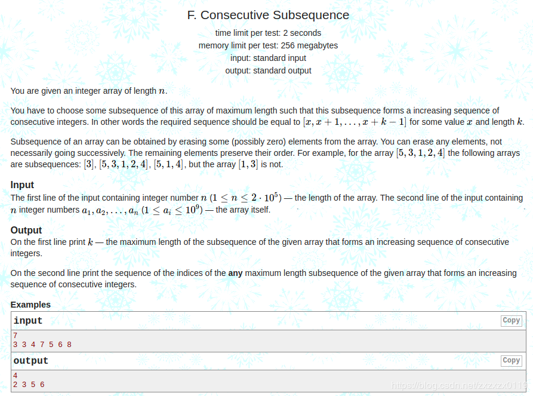
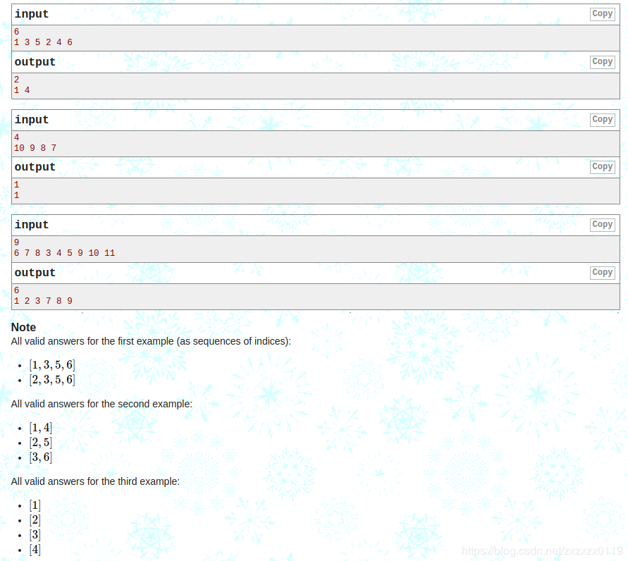
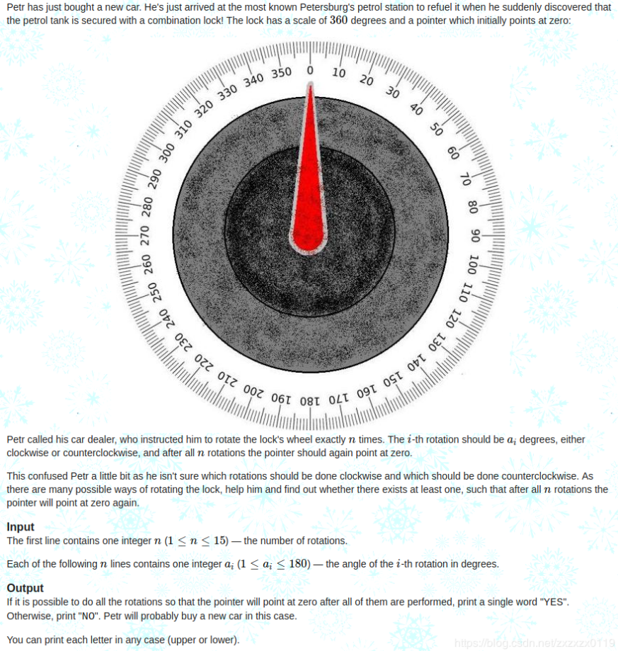
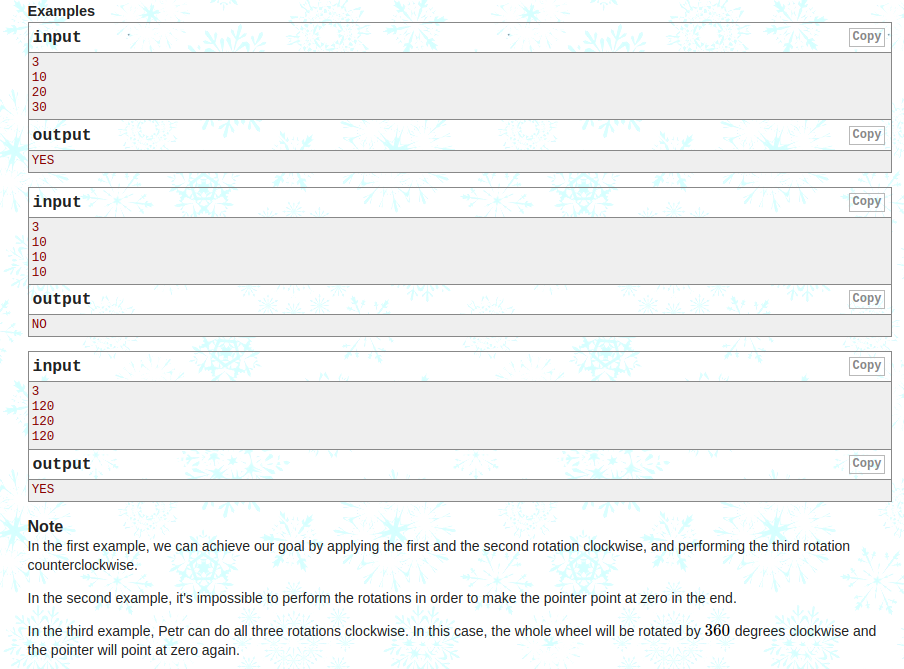

## Codeforces - 977F. Consecutive Subsequence( Map + DP) & 1097B. Petr and a Combination Lock(枚举)

* Codeforces - 977F. Consecutive Subsequence( Map + DP)
* Codeforces - 1097B. Petr and a Combination Lock(枚举)
***

### Codeforces - 977F. Consecutive Subsequence( Map + DP)
#### [题目链接](https://codeforces.com/problemset/problem/977/F)

> https://codeforces.com/problemset/problem/977/F

#### 题目
**求最长的连续递增子序列(注意是连续递增(也就是值前后相差为`1`))， 输出长度以及子序列的下标。**



#### 解析
这题一开始以为是[最长递增子序列](https://blog.csdn.net/zxzxzx0119/article/details/81224734)的变形，但是代码`O(N^2)`内会超时。
```java
import java.io.BufferedInputStream;
import java.io.PrintStream;
import java.util.Scanner;

public class Main {

    static int[] getDp(int[] arr){
        int[] dp = new int[arr.length];
        for(int i = 0; i < arr.length; i++){
            dp[i] = 1;
            for(int j = 0; j < i; j++){
                if(arr[j] + 1 == arr[i]){
                    dp[i] = Math.max(dp[i],dp[j]+1);
                }
            }
        }
        return dp;
    }

    static int[] getLis(int[] arr,int[] dp){
        int len = 0;
        int index = 0;
        for(int i = 0; i < dp.length; i++){
            if(dp[i] > len){
                len = dp[i];
                index = i;
            }
        }
        int[] lis = new int[len];
        lis[--len] = index;
        for(int i = index - 1; i >= 0; i--){
            if(dp[i] == dp[index] - 1 && arr[i] + 1 == arr[index]){
                lis[--len] = i;
                index = i;
            }
        }
        return lis;
    }

    public static void main(String[] args){
        Scanner cin = new Scanner(new BufferedInputStream(System.in));
        PrintStream out = System.out;
        int n = cin.nextInt();
        int[] arr = new int[n];
        for(int i = 0; i < n; i++)
            arr[i] = cin.nextInt();
        int[] dp = getDp(arr);
        int[] lisIndex = getLis(arr, dp);
        out.println(lisIndex.length);
        for(int i = 0; i < lisIndex.length-1; i++)
            out.print(lisIndex[i] + 1 + " ");
        out.println(lisIndex[lisIndex.length-1]+1);
    }
}
```

这里需要灵活的应用`Map`（因为`a[i]`比较大，所以不用数组），在`O(N)`时间内解决:

* 其实也是`dp`， `map[a[i]]`表示的以`a[i]`结尾的最长连续递增序列的最长长度。
* `map[arr[i]]`的更新是在 `map[arr[i] - 1]`的基础上`+1`的；

然后遍历`map`找到最大值即可。最后通过最大长度`maxLen`和最大值`maxValue`构造出索引。

```java
import java.io.BufferedInputStream;
import java.io.PrintStream;
import java.util.HashMap;
import java.util.Map;
import java.util.Scanner;

public class Main {

    public static void main(String[] args){
        Scanner cin = new Scanner(new BufferedInputStream(System.in));
        PrintStream out = System.out;
        int n = cin.nextInt();
        int[] arr = new int[n];
        // map中key: arr[i], value : arr[i]结尾的最长长度
        HashMap<Integer, Integer>hMap = new HashMap<>();
        for(int i = 0; i < n; i++) {
            arr[i] = cin.nextInt();
            if(hMap.get(arr[i]-1) == null)
                hMap.put(arr[i], 1);
            else
                hMap.put(arr[i], hMap.get(arr[i]-1)+1);// 在arr[i] - 1的基础上更新
        }

        int maxLen = 0; //记录最长长度
        int maxValue = 0; //最长递增序列的最大值
        for(Map.Entry<Integer, Integer>entry : hMap.entrySet()){
            if(entry.getValue() > maxLen){
                maxLen = entry.getValue();
                maxValue = entry.getKey();
            }
        }
        int minValue = maxValue - maxLen + 1;// 最长递增序列的最小值
        out.println(maxLen);
        for(int i = 0; i < arr.length; i++){
            if(minValue == arr[i]){
                out.print((i+1) + " ");
                minValue = arr[i] + 1;
            }
        }
        out.println();
    }
}

```

***
### <font color = red id = "2">Codeforces - 1097B. Petr and a Combination Lock(枚举)
#### [题目链接](https://codeforces.com/problemset/problem/1097/B)
#### 题目
给你一个`n`和`n`个角度，要你顺时针或者逆时针旋转这些角度，问你能不能回到源点( `0`角度)。



#### 解析

利用二进制枚举，枚举`2 ^ n`所有情况，每种情况计算累加和算出来，如果是`0`或者`360`的倍数，就可以回到起点，否则就不能。

关于二进制枚举子集可以看[**这里**](https://blog.csdn.net/zxzxzx0119/article/details/79838261#4)。

下面这两行在代码中是等价的。
```java
sum += arr[i] * ( (cur&(1 << i)) != 0 ? 1 : -1);
sum += arr[i] * ( (1&(cur >> i)) != 0 ? 1 : -1); 
```

```java
import java.io.BufferedInputStream;
import java.io.PrintStream;
import java.util.Scanner;

public class Main {

    public static void main(String[] args) {

        Scanner cin = new Scanner(new BufferedInputStream(System.in));
        PrintStream out = System.out;
        int n = cin.nextInt();
        int[] arr = new int[n];
        for (int i = 0; i < n; i++)
            arr[i] = cin.nextInt();
        boolean ok = false;
        for (int cur = 0; cur < (1 << n); cur++) {
            int sum = 0;
            for (int i = 0; i < n; i++)
//                sum += arr[i] * ( (cur&(1 << i)) != 0 ? 1 : -1);
                sum += arr[i] * ((1 & (cur >> i)) != 0 ? 1 : -1); // 和上面一行等价
            if (sum % 360 == 0) {
                ok = true;
                break;
            }
        }
        out.println(ok ? "YES" : "NO");
    }
}
```
也可以递归枚举所有的可能: 
```java
import java.io.BufferedInputStream;
import java.io.PrintStream;
import java.util.Scanner;

public class Main {

    static boolean recur(int[] arr, int i, int sum){
        if(i == arr.length)
            return sum % 360 == 0 ? true : false;
        return recur(arr, i+1, sum+arr[i]) || recur(arr, i+1, sum-arr[i]);
    }

    public static void main(String[] args) {
        Scanner cin = new Scanner(new BufferedInputStream(System.in));
        PrintStream out = System.out;
        int n = cin.nextInt();
        int[] arr = new int[n];
        for (int i = 0; i < n; i++)
            arr[i] = cin.nextInt();
        boolean ok = recur(arr, 0,0);
        out.println(ok ? "YES" : "NO");
    }
}
```

