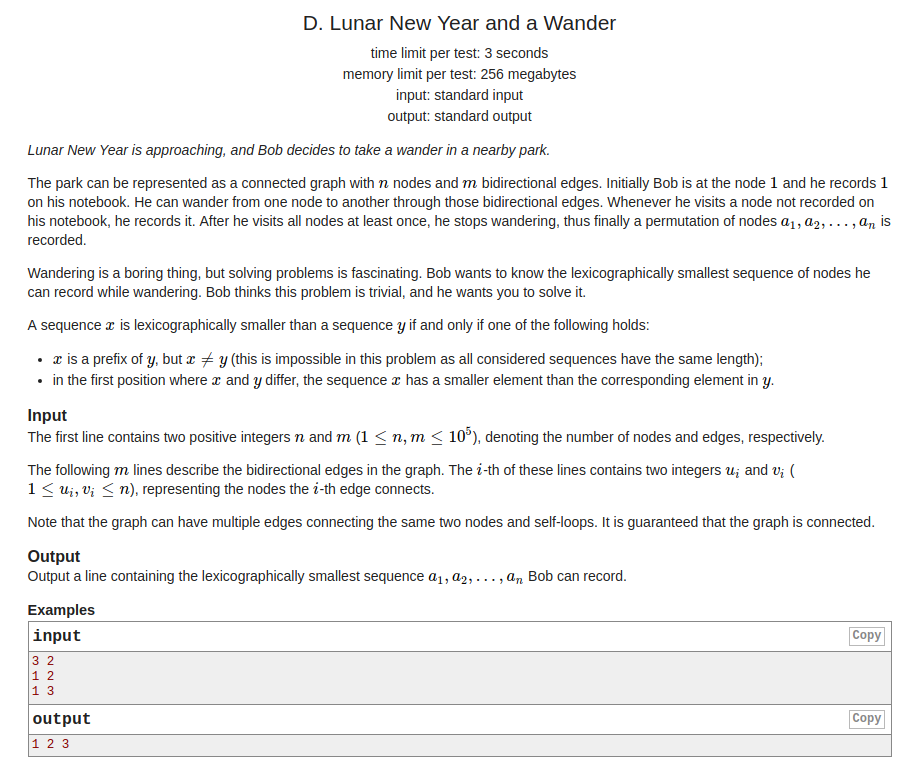
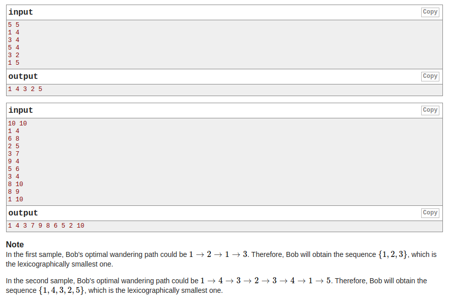

## Codeforces - 1106D. Lunar New Year and a Wander(图简单题)
***
#### [题目链接](https://codeforces.com/problemset/problem/1106/D)

> https://codeforces.com/problemset/problem/1106/D

#### 题目

给你一张图，`n、m`分别代表`n`个顶点和`m`条边，然后给你无向图的`m`条边，要你从`1`开始，找到一个遍历图的最小的字典序序列。注意图可能有重复边和自环。



#### 解析
这题主要是处理<font color = red>字典序以及重复边</font>两个问题:

* 字典序可以用优先队列或者`TreeSet`来搞定；
* 重复边利用`Set`去重即可，如果用`ArrayList`的`contains`方法会`TLE`；

遍历过程就很简单了: 

* 首先将`1`，加入优先队列，用一个`cnt`遍历统计当前访问的不重复的节点，当`cnt > n`的循环退出；
* 然后遍历当前节点的所有相邻节点，如果没有访问过，就加入优先队列，优先队列取出来的一定是当前字典序最小的；


下面是一开始的`TLE`代码:

```java
import java.io.*;
import java.util.*;

public class Main {

    public static void main(String[] args){
        Scanner cin = new Scanner(new BufferedInputStream(System.in));
        PrintStream out = System.out;
        int n = cin.nextInt();
        int m = cin.nextInt();
        ArrayList<Integer>G[] = new ArrayList[n+1];
        for(int i = 0; i <= n; i++)
            G[i] = new ArrayList<>();
        boolean[] vis = new boolean[n+1];
        for(int i = 0; i < m; i++){
            int from = cin.nextInt();
            int to = cin.nextInt();
            if(!G[from].contains(to)) { // 防止重复的边，但是contains判断会超时
                G[from].add(to);
                G[to].add(from);
            }
        }
        PriorityQueue<Integer>pq = new PriorityQueue<>();
        pq.add(1);
        ArrayList<Integer>res = new ArrayList<>();
        int cnt = 1;
        while(cnt <= n){
            int poll = pq.poll();
            if(vis[poll])
                continue;
            vis[poll] = true;
            res.add(poll);

            for(int i = 0; i < G[poll].size(); i++){
                int to = G[poll].get(i);
                if(!vis[to]){
                    pq.add(to);
                }
            }
            cnt++;
        }
        for(Integer node : res)
            out.print(node + " ");
        out.println();
    }
}
```
利用`HashSet`+`PriorityQueue`通过的代码: 
```java
import java.io.*;
import java.util.*;

public class Main {

    public static void main(String[] args){
        Scanner cin = new Scanner(new BufferedInputStream(System.in));
        PrintStream out = System.out;
        int n = cin.nextInt();
        int m = cin.nextInt();
        HashMap<Integer, HashSet<Integer>>G = new HashMap<>();
        for(int i = 0; i <= n; i++)
            G.put(i, new HashSet<>());
        boolean[] vis = new boolean[n+1];
        for(int i = 0; i < m; i++){
            int from = cin.nextInt();
            int to = cin.nextInt();
            G.get(from).add(to);
            G.get(to).add(from);
        }
        PriorityQueue<Integer>pq = new PriorityQueue<>();
        pq.add(1);
        ArrayList<Integer>res = new ArrayList<>();
        int cnt = 1;
        while(cnt <= n){
            int poll = pq.poll();
            if(vis[poll])
                continue;
            vis[poll] = true;
            res.add(poll);
            for(int to : G.get(poll)){
                if(!vis[to]){
                    pq.add(to);
                }
            }
            cnt++;
        }
        for(Integer node : res)
            out.print(node + " ");
        out.println();
    }
}

```
其中`PriorityQueue`和`HashSet`也可以只需要用`TreeSet`代替即可，因为`TreeSet`也保持了元素的有序性。
```java
import java.io.*;
import java.util.*;

public class Main {

    static int n, m;
    static ArrayList[] G;
    static boolean[] vis;

    public static void main(String[] args) {
        Scanner cin = new Scanner(new BufferedInputStream(System.in));
        PrintStream out = System.out;
        n = cin.nextInt();
        m = cin.nextInt();
        G = new ArrayList[n + 1];
        vis = new boolean[n + 1];
        for (int i = 0; i <= n; i++)
            G[i] = new ArrayList<>();
        for (int i = 0; i < m; i++) {
            int a = cin.nextInt();
            int b = cin.nextInt();
            G[a].add(b);
            G[b].add(a);
        }
        TreeSet<Integer> ts = new TreeSet<>(); // 去重且有序
        ts.add(1);
        while (!ts.isEmpty()) {
            int cur = ts.pollFirst(); //取出最小的
            vis[cur] = true;
            out.print(cur + " ");
            for (int to : (ArrayList<Integer>) G[cur]) {
                if (!vis[to])
                    ts.add(to);
            }
        }
    }
}
```

