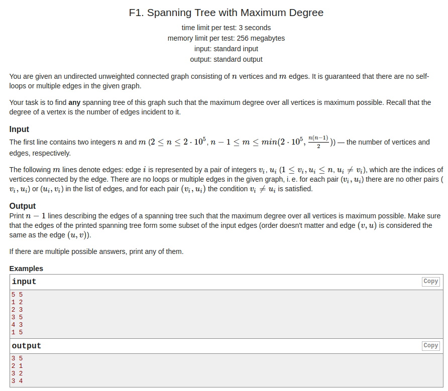
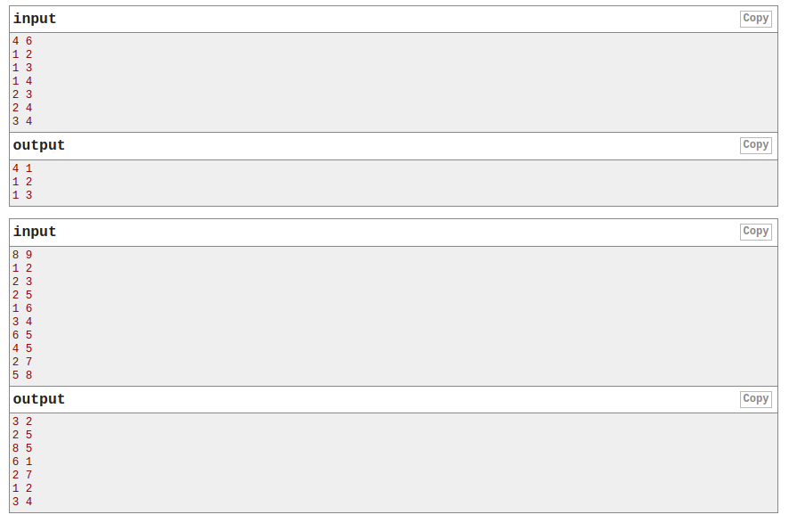
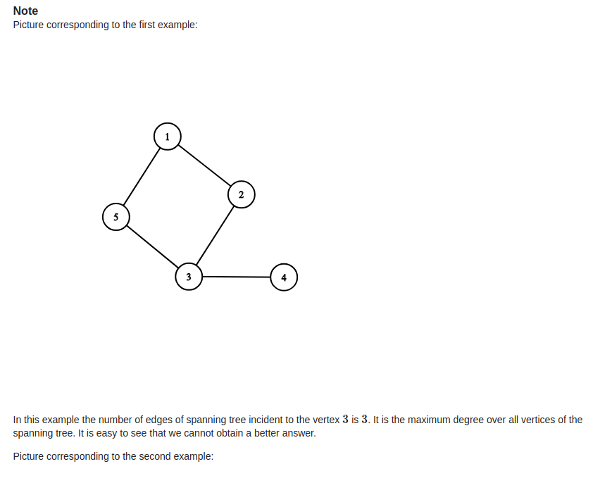
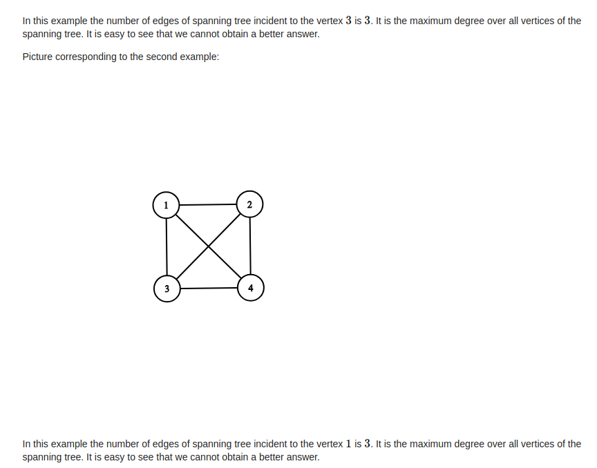
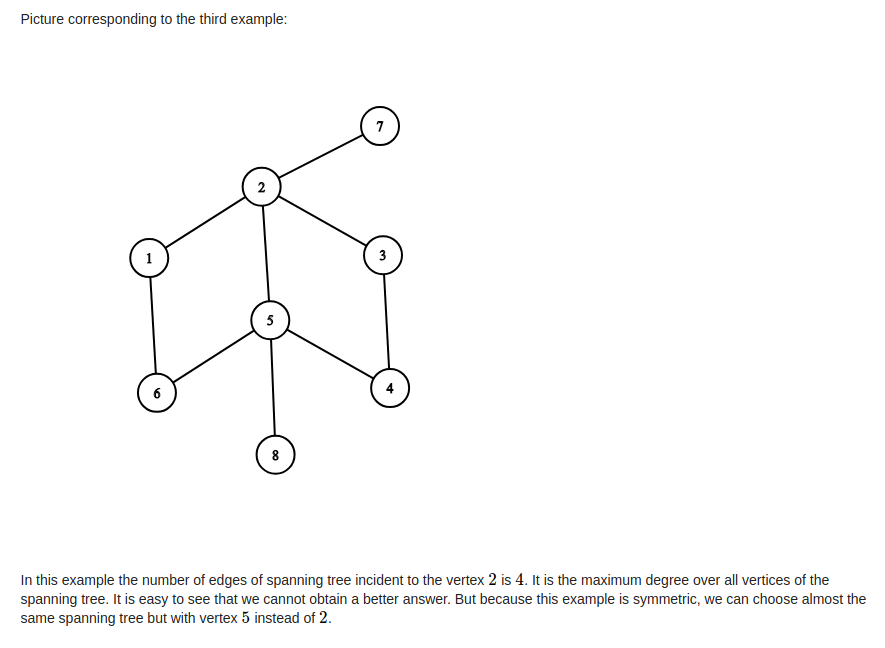
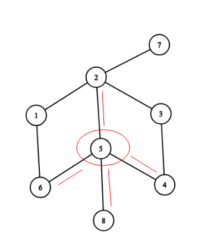

## Codeforces - 1133F1. Spanning Tree with Maximum Degree.md(DFS，记录父亲)

#### [题目链接](https://codeforces.com/problemset/problem/1133/F1)

> https://codeforces.com/problemset/problem/1133/F1

#### 题目

给你一个图，要你求必须包含**度最大的点的所有相连边**的生成树。











#### 解析

思路：

* 先找出度最大的度的顶点`maxv`。然后先将这个点的邻接边加入结果。
* 然后从和`maxv`邻接的点开始`dfs`，这个过程既要记录`vis`是否访问，又要记录一个父亲节点，这样才比较好维护；



代码:

```java
import java.io.*;
import java.util.*;

public class Main {

    static PrintStream out = System.out;

    static boolean[] vis;
    static ArrayList<Integer> G[];

    static void solve(InputStream stream) {
        Scanner in = new Scanner(new BufferedInputStream(stream));
        int n = in.nextInt();
        int m = in.nextInt();
        G = new ArrayList[n + 1];
        int[] deg = new int[n + 1];
        for (int i = 1; i <= n; i++) G[i] = new ArrayList<>();
        for (int i = 0; i < m; i++) {
            int from = in.nextInt();
            int to = in.nextInt();
            deg[to]++;
            deg[from]++;
            G[from].add(to);
            G[to].add(from);
        }
        int maxDeg = 0;
        int maxv = 0;
        for (int i = 1; i <= n; i++) { // 找度最大的
            if (deg[i] > maxDeg) {
                maxDeg = deg[i];
                maxv = i;
            }
        }
        vis = new boolean[n + 1];
        vis[maxv] = true;
        for(int to : G[maxv]){ // 先将度最大的相连的边连接起来
            vis[to] = true;
            out.println(maxv + " " + to);
        }
        for(int to : G[maxv]) dfs(to, maxv);
    }

    static void dfs(int cur, int par) { // 记录当前节点和父亲节点
//        if(vis[cur]) return ; // 不要写这里，不然第一次就不能进去
        vis[cur] = true;
        for (int to : G[cur]) {
            if(to == par || vis[to]) continue;
            out.println(cur + " " + to);
            dfs(to, cur);
        }
    }

    public static void main(String[] args) {
        solve(System.in);
    }
}
```

