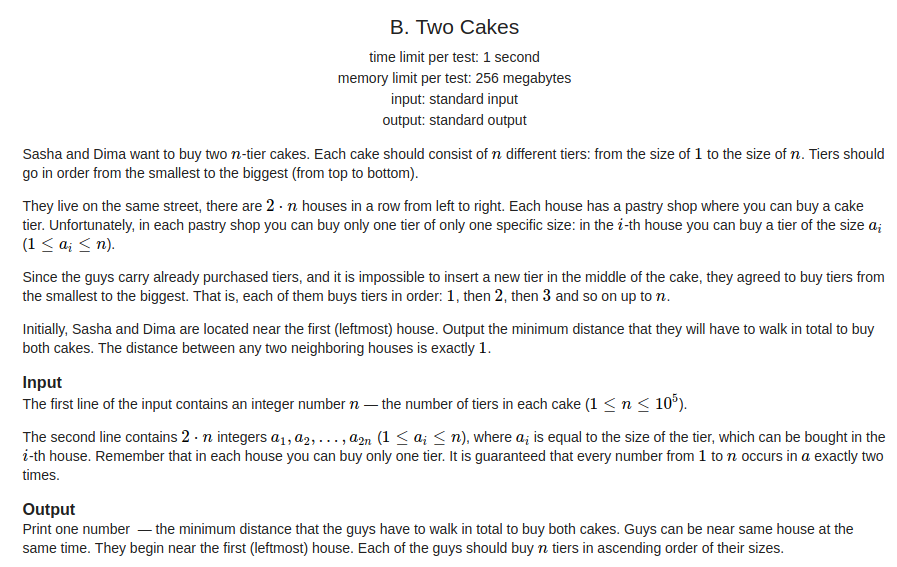
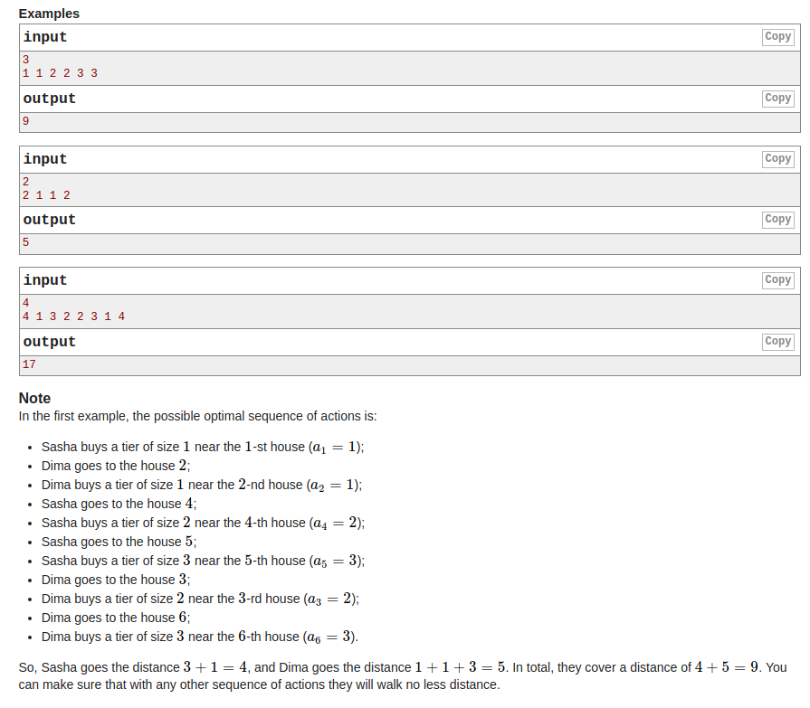

## Codeforces - 1130B. Two Cakes

#### [题目链接](https://codeforces.com/problemset/problem/1130/B)

> https://codeforces.com/problemset/problem/1130/B

#### 题目

给你`n`和`2n`个数。(`1~n`之间的数各两个)

两个人都同时从最左边的`1`位置开始出发，每次依次去找`1, 2, 3, ..., n`。问你两个人需要走的最小的路程。





### 解析

贪心的策略就是:

当前的`abs(id1 - p1[i + 1]) + abs(id2 - p2[i + 1]) `和`abs(id1 - p2[i + 1]) + abs(id2 - p1[i + 1])`哪个更小，就去哪个。

```java
import java.io.*;
import java.util.*;

public class Main {

    public static void main(String[] args) {
        Scanner in = new Scanner(new BufferedInputStream(System.in));
        PrintStream out = System.out;
        int n = in.nextInt();
        int[] arr = new int[n * 2 + 1];
        int[] p1 = new int[n * 2 + 1];
        int[] p2 = new int[n * 2 + 1];
        for (int i = 1; i <= 2 * n; i++) {
            arr[i] = in.nextInt();
            if (p1[arr[i]] == 0)
                p1[arr[i]] = i;
            else
                p2[arr[i]] = i;
        }

//        System.out.println(Arrays.toString(p1));
//        System.out.println(Arrays.toString(p2));

        int id1 = 1, id2 = 1;
        long r1 = 0, r2 = 0;
        for (int i = 0; i < n; i++) { // 每一个数
            if (abs(id1 - p1[i + 1]) + abs(id2 - p2[i + 1]) <
                    abs(id1 - p2[i + 1]) + abs(id2 - p1[i + 1])) { //贪心策略
                r1 += abs(p1[i + 1] - id1);
                id1 = p1[i + 1];
                r2 += abs(p2[i + 1] - id2);
                id2 = p2[i + 1];
            } else {
                r1 += abs(p2[i + 1] - id1);
                id1 = p2[i + 1];
                r2 += abs(p1[i + 1] - id2);
                id2 = p1[i + 1];
            }
        }
        out.println(r1 + r2);
    }

    static int abs(int n) {
        return Math.abs(n);
    }
}

```

