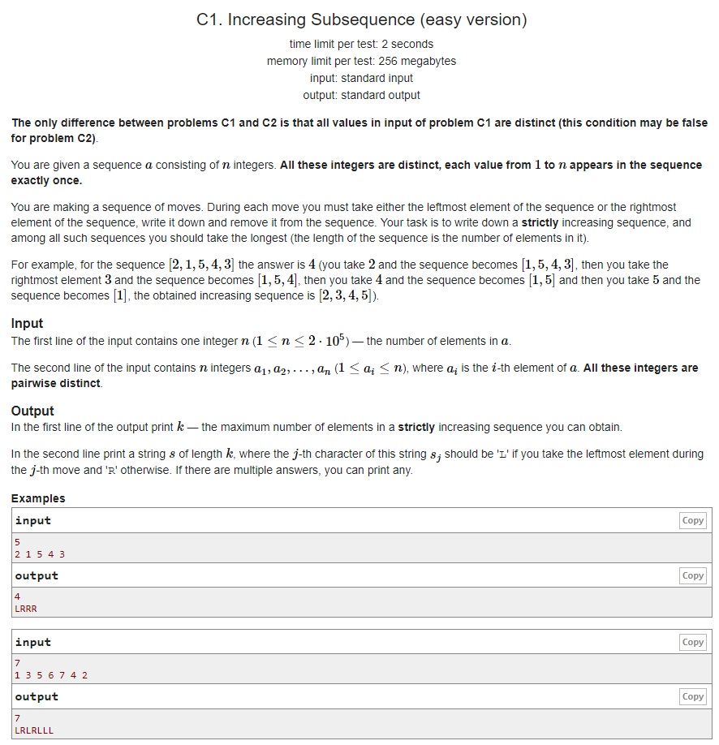

# Codeforces - 1157C1. Increasing Subsequence

#### [题目链接](https://codeforces.com/problemset/problem/1157/C1)

> https://codeforces.com/problemset/problem/1157/C1

#### 题目



### 解析

每次取两边对应的两个中满足条件的小的那个即可(贪心)。

```java
import java.util.*;
import java.io.*;

public class Main{

    static void solve(Scanner in, PrintWriter out){
        int n = in.nextInt();
        int[] a = new int[n];
        for(int i = 0; i < n; i++) a[i] = in.nextInt();
        
        int L = 0, R = n-1;
        int pre = -1;
        int res = 0;
        StringBuilder sb = new StringBuilder();
        while(L <= R && Math.max(a[L], a[R]) > pre ){
            if(a[L] > pre && a[R] > pre){
                if(a[L] < a[R]){
                    res++;
                    sb.append("L");
                    pre = a[L];
                    L++;
                    if(L == n) break;
                }else {
                    res++;
                    sb.append("R");
                    pre = a[R];
                    R--;
                    if(R == -1)break;
                }
            }else {
                if(a[L] > pre){
                    res++;
                    sb.append("L");
                    pre = a[L];
                    L++;
                    if(L == n) break;
                }else {
                    res++;
                    sb.append("R");
                    pre = a[R];
                    R--;
                    if(R == -1)break;
                }
            }
        }
        out.println(res);
        out.println(sb.toString());
    }

    public static void main(String[] args) {
        Scanner in = new Scanner(new BufferedInputStream(System.in));
        PrintWriter out = new PrintWriter(System.out);
        solve(in, out);
        out.close();
    }
}

```

