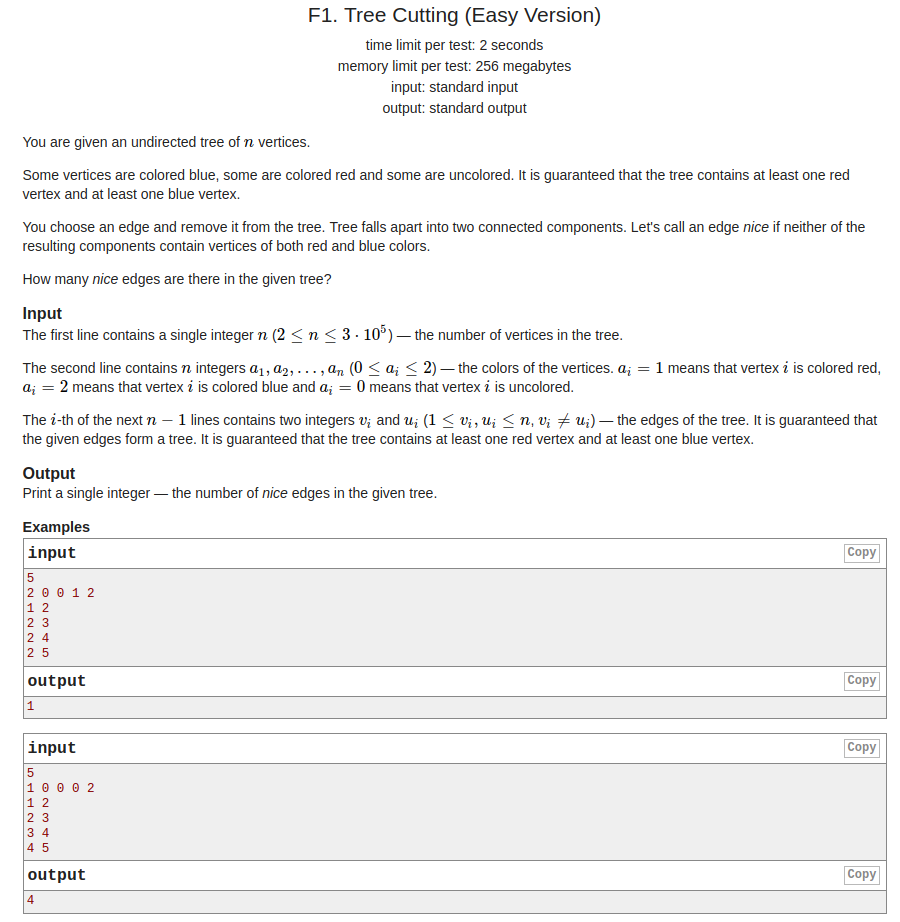
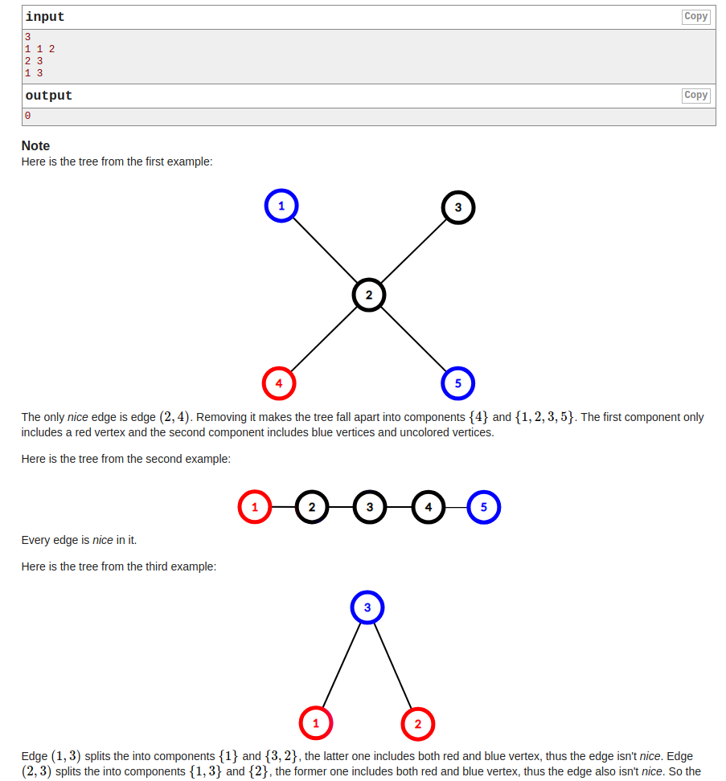

## Codeforces - 1118F1. Tree Cutting(Easy Version)

#### [题目链接](https://codeforces.com/contest/1118/problem/F1)

> https://codeforces.com/contest/1118/problem/F1

#### 题目

给一棵树，有些节点是红色(`1`)或蓝色(`2`)，或无色(`0`)，**切掉一条边后分成两棵树且红蓝在不同的树**。统计有多少条边可以切；





#### 解析

一个节点的一个子树**如果包含红的全部且不包含蓝的，或包含蓝的全部而不包含红的**，那么这条边可以切。

dfs是计算子树(不包括父亲，所以使用一个`pre`表示当前节点的父亲，然后在下面的循环中判断`if(to != pre)`)红蓝个数是否满足条件；

```java
import java.io.*;
import java.util.*;

public class Main{

    static PrintStream out = System.out;

    static int n, red, blue, res;
    static int[] a;
    static ArrayList<Integer>G[];

    static int[] dfs(int cur, int pre){
        int[] p = new int[2];
        int r = 0, b = 0; //  cur red num and cur blue num
        if(a[cur] == 1) r++;
        else if(a[cur] == 2) b++;
        for(int i = 0; i < G[cur].size(); i++){
            int to = G[cur].get(i);
            if(pre == to) continue; // 不能往回走 (爸爸已经走过了) //只是记录自己的子树
            int[] np = dfs(to, cur);
            if(np[0] == red && np[1] == 0) res++;
            if(np[0] == 0 && np[1] == blue) res++;
            r += np[0];
            b += np[1];
        }
        // 左边的
        p[0] = r;
        p[1] = b;
        return p;
    }

    static void solve(Scanner in){
        red = 0; blue = 0; res = 0;
        n = in.nextInt();
        a = new int[n+1];
        G = new ArrayList[n+1];
        for(int i = 1; i <= n; i++) {
            G[i] = new ArrayList<>();
            a[i] = in.nextInt();
            if(a[i] == 1) red++;
            else if(a[i] == 2) blue++;
        }

        for(int i = 0; i < n - 1; i++){
            int from = in.nextInt();
            int to = in.nextInt();
            G[from].add(to);
            G[to].add(from);
        }
        dfs(1, -1);
        out.println(res);
    }

    public static void main(String[] args){
        Scanner in = new Scanner(new BufferedInputStream(System.in));
        solve(in);
    }
}
```

