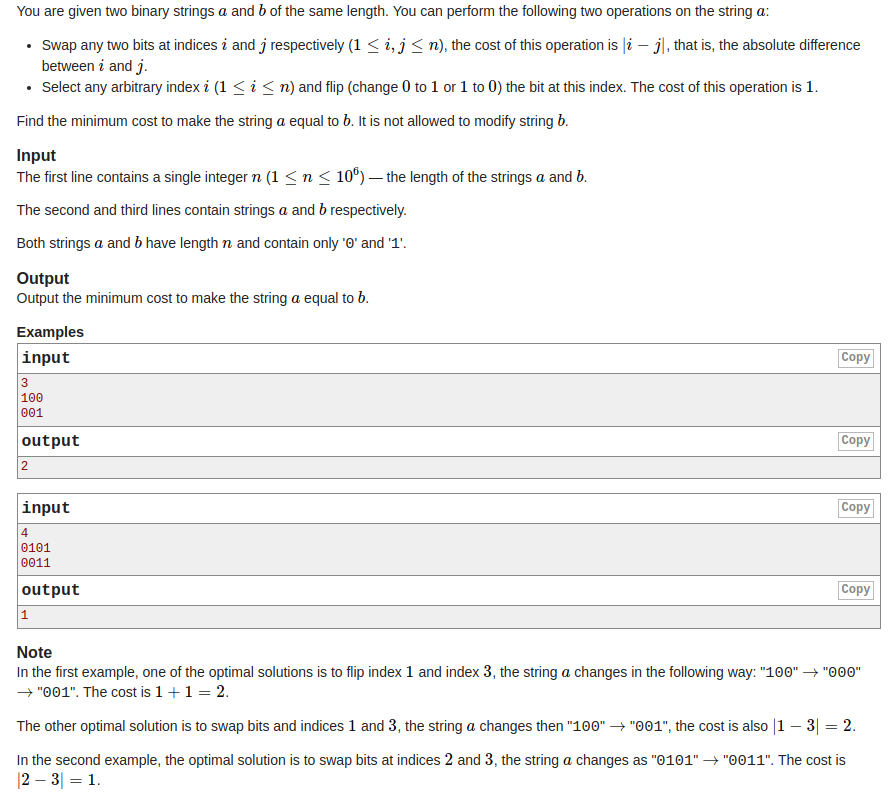
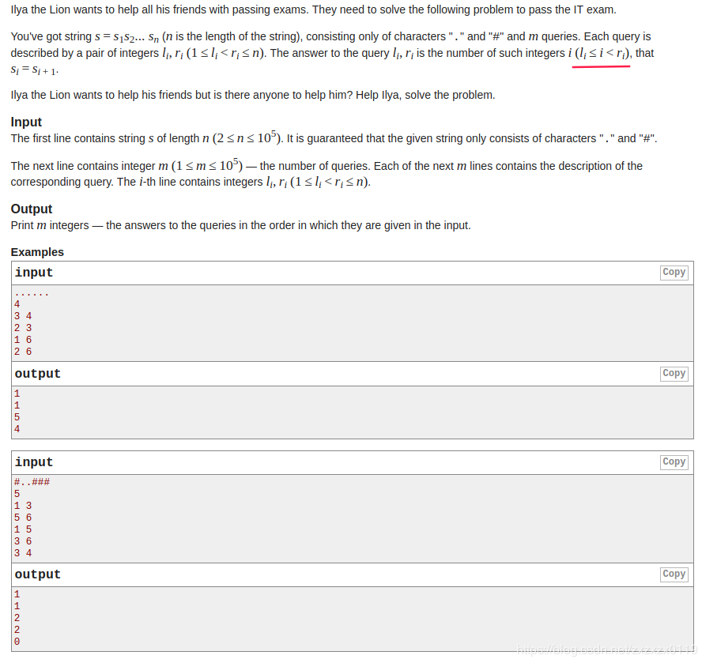
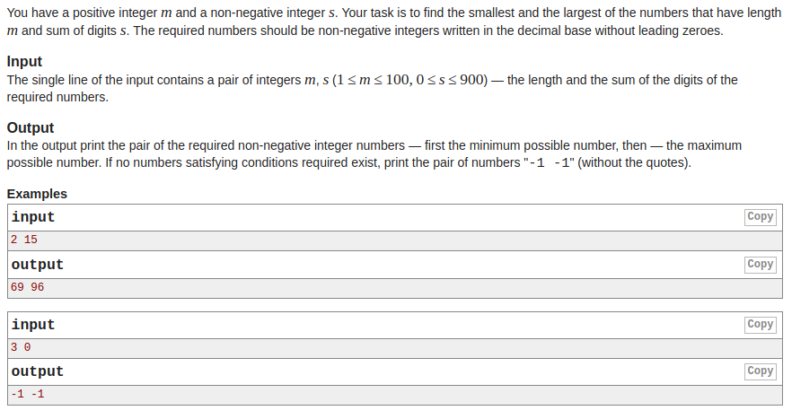
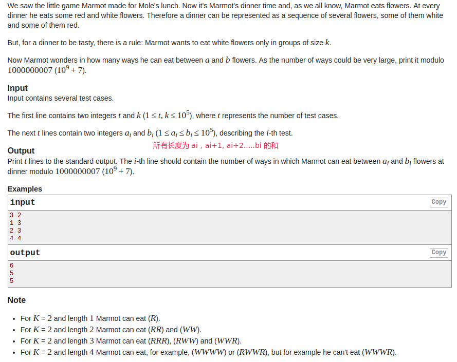

## Codeforces - 1037C & 313B & 489C & 474D

* [Codeforces - 1037C - Equalize](#codeforces---1037c---equalize)
* [Codeforces - 313B - Ilya and Queries](#codeforces---313b---Ilya-and-queries)
* [Codeforces - 489C - Given Length and Sum of Digits...](#codeforces---489c---given-length-and-sum-of-digits)
* [Codeforces - 474D - Flowers](#codeforces---474d---flowers)

***
### <font color = red id = "1"> Codeforces - 1037C - Equalize
#### [题目链接](https://codeforces.com/problemset/problem/1037/C)

> https://codeforces.com/problemset/problem/1037/C

#### 题目大意
就是给你两个字符串`a`、`b`， 都是二进制串`01`组成，要你用下面的两种方式把字符串`a`变成字符串`b`（`b`不能修改）: 

* 交换`a`的两个索引`i`、`j`的值，花费 `abs(i -  j)`；
* 将`a`的`i`位置翻转(`0`变`1`，`1`变`0`)， 花费`1`；

要你求最少的花费。

#### 解析
一开始看标签是`dp`，想了一会好像就是一个贪心，因为如果`i`，`j`距离超过`2`(不是相邻)，那就没什么用了。所以只需要求出所有不同的个数，减去相邻可以交换的个数就可以了。
```java
import java.io.BufferedInputStream;
import java.util.Scanner;

public class Main {

    public static void main(String[] args){
        Scanner cin = new Scanner(new BufferedInputStream(System.in));
        int n = cin.nextInt();
        String a = cin.next();
        String b = cin.next();
        int diff = 0;
        for(int i = 0; i < a.length(); i++)
            if(a.charAt(i) != b.charAt(i))
                diff++;
        int adjacent = 0;
        for(int i = 0; i < a.length()-1; i++){
            if(a.charAt(i) == b.charAt(i))
                continue;
            if(a.charAt(i+1) != b.charAt(i+1) && a.charAt(i) != a.charAt(i+1)){
                    adjacent++;
                    i++;
            }
        }
        System.out.println(diff-adjacent);
        
    }
}
```

***
### <font color = red id = "2">Codeforces - 313B - Ilya and Queries
#### [题目链接](https://codeforces.com/problemset/problem/313/B)

> https://codeforces.com/problemset/problem/313/B

#### 题目大意

就是给你一串字符串`str`，`n`个查询，每次查询给你两个数`l`、`r`代表一个区间，问你在`[l，r)`范围内有多少个连续的字符相同。

#### 解析
一开始又看错题目，还以为是求任意一个位置`i`，满足<font color = blue>S<sub>i</sub> = S<sub>i+1</sub></font>。。。。

用类似`dp`的思想，`dp[i]`记录的是`0~i`(`[0,i]`)之间连续出现的字符数个数。记录了这个数组之后，后面的`m`次查询就每次查询区间`[l, r]`就直接输出`dp[r-1] - dp[l-1]`就可以了。
```java
import java.io.*;
import java.util.StringTokenizer;

public class Main {

    private static class FastReader{
        public BufferedReader br;
        public StringTokenizer st;

        public FastReader(InputStream is){
            br = new BufferedReader(new InputStreamReader(is));
            st = null;
        }

        String next(){
            while(st == null || !st.hasMoreElements()){
                try {
                    st = new StringTokenizer(br.readLine());
                } catch (IOException e) {
                    e.printStackTrace();
                }
            }
            return st.nextToken();
        }
        public int nextInt(){
            return Integer.parseInt(next());
        }
        public long nextLong(){
            return Long.parseLong(next());
        }
        public double nextDouble(){
            return Double.parseDouble(next());
        }
        public String nextLine(){
            String str = "";
            try {
                str = br.readLine();
            } catch (IOException e) {
                e.printStackTrace();
            }
            return str;
        }
    }

    public static void main(String[] args){
        FastReader fr = new FastReader(new BufferedInputStream(System.in));
        String s = fr.next();
        int n = fr.nextInt();
        int[] dp = new int[s.length()];
        dp[0] = 1;
        for(int i = 1; i < s.length(); i++)
            dp[i] = s.charAt(i) == s.charAt(i-1) ? dp[i-1] + 1 : dp[i-1];
        for(int i = 0; i < n; i++){
            int l = fr.nextInt();
            int r = fr.nextInt();
            System.out.println(dp[r-1] - dp[l-1]);
        }
    }
}

```
这里使用了`FastReader`类，这是我第一次在`Codeforces`使用`Scanner`会超时(偶尔)的题目，下面的代码会超时(`Scanner`的读入会比`BufferReader`慢很多。

```java
import java.io.BufferedInputStream;
import java.util.Scanner;

public class Main {

    public static void main(String[] args){
        Scanner cin = new Scanner(new BufferedInputStream(System.in));

        String s = cin.next();
        int n = cin.nextInt();
        int[] dp = new int[s.length()];
        dp[0] = 1;
        for(int i = 1; i < s.length(); i++)
           dp[i] = s.charAt(i) == s.charAt(i-1) ? dp[i-1] + 1 : dp[i-1];

        for(int i = 0; i < n; i++){
            int l = cin.nextInt();
            int r = cin.nextInt();
            System.out.println(dp[r-1] - dp[l-1]);
        }
    }
}
```

***
### <font color = red id = "3">Codeforces - 489C - Given Length and Sum of Digits...

#### [题目链接](https://codeforces.com/problemset/problem/489/C) 

> https://codeforces.com/problemset/problem/489/C

#### 题目大意
给你两个数`m`、`s`，要你用`m`个`0~9`之间的数<font color = blue>”组成“</fonT>他们之和为`s`，这里的组成就是这些数的和为`s`，要你求这样的数的最小值和最大值。

#### 解析
细节有一点多的贪心题，错了好几次。。。注意细节就好: 

* 贪心的思想: 最小的大概是`100009999`类似这种，最大的是类似`9999910000`这种。最大值容易考虑，最小值的要注意很多情况；
* 注意输出`-1 -1`的情况即: `(s == 0 && m > 1) || s > m * 9`；
* 注意特殊情况例如`m = 3，s = 9`，不能输出`099`，而是`108`，不能有前导`0`，所以也要特殊考虑；

```java
import java.io.BufferedInputStream;
import java.util.Scanner;

public class Main {

    public static void main(String[] args){
        Scanner cin = new Scanner(new BufferedInputStream(System.in));
        int m = cin.nextInt();
        int s = cin.nextInt();
        int nineNum = s/9; // the num of 9 should be output
        int remainder = s%9;
        int left = m - nineNum;
        if((s == 0 && m > 1) || s > m * 9)
            System.out.println("-1 -1");
        else { 
            StringBuilder minn = new StringBuilder();
            StringBuilder maxx = new StringBuilder();
            if(remainder == 0 && m > 1 && left != 0) { // all number is 9 and left != 0 --> but can't have leading 0
                if(left > 0) {
                    if (left == 1) {
                        minn.append(remainder);
                    } else {
                        minn.append(1);
                        for (int i = 0; i < left - 1; i++) //not left-2
                            minn.append(0);
                        minn.append(8); // 分担出一个
                    }
                }
                for (int i = 0; i < nineNum-1; i++) { // not nineNum
                    minn.append(9);
                }
            }else {
                if(left > 0) {
                    if (left == 1) {
                        minn.append(remainder);
                    } else {
                        minn.append(1);
                        for (int i = 0; i < left - 2; i++)
                            minn.append(0);
                        minn.append(remainder - 1);
                    }
                }
                for (int i = 0; i < nineNum; i++) {
                    minn.append(9); 
                }
            }
            System.out.print(minn + " " );

            // deal with max value --> easy
            for (int i = 0; i < nineNum; i++)
                maxx.append(9);
            if(left > 0) {
                maxx.append(remainder);
                for (int i = 0; i < left - 1; i++)
                    maxx.append(0);
            }
            System.out.println(maxx);
        }
    }
}

```

***

### <font color = red id = "4">Codeforces - 474D - Flowers

#### [题目链接](https://codeforces.com/problemset/problem/474/D)

> https://codeforces.com/problemset/problem/474/D

#### 题目大意
`Marmot`吃花，两种颜色红`R`和白W，每次吃白花`W`都只能一次连续吃`k`朵，问在花的个数从`a`到`b`(`[a, b]`)范围里，总共有多少种吃法。


#### 解析 
这题没有想出来，其实不难，一开始想到了前`[0，k)`肯定是`1`，即`dp[0 ~ k-1] = 1`，且`dp[k] = 2`，但最后却没有想到`dp[i]`求法；

`dp[i]`有两种来头: 

* `dp[i-1]`上添加一朵红花；
* `dp[i-k]`上条件`k`朵白花；

所以`dp[i] = dp[i-1] + dp[i-k]`。

然后就是处理求和了，有一个要注意的地方，最后输出答案的时候，要注意输出是`(mod + sums[r] - sums[l-1])%mod`，因为如果上面取模其中，`sum[l-1] < mod`且比较大，但`sum[r] > mod`，取模之后`sum[r] < sum[l]`，所以要先加上`mod`。
```java
import java.io.BufferedInputStream;
import java.util.Scanner;

public class Main {

    public static final long mod = 1000000007;
    public static final int MAX = 100005;

    public static void main(String[] args){
        Scanner cin = new Scanner(new BufferedInputStream(System.in));
        int t = cin.nextInt();
        int k = cin.nextInt();
        long[] dp = new long[MAX];
        long[] sums = new long[MAX];
        sums[0] = 0;
        for(int i = 1; i < k; i++){
            dp[i] = 1;
            sums[i] = (dp[i]%mod + sums[i-1]%mod)%mod;
        }
        dp[k] = 2;
        sums[k] = (dp[k]%mod + sums[k-1]%mod)%mod;
        for(int i = k+1; i < MAX; i++) {
            dp[i] = (dp[i-1]%mod + dp[i-k]%mod)%mod;
            sums[i] = (sums[i-1]%mod + dp[i]%mod)%mod;
        }
        for(int i = 0; i < t; i++){
            int l = cin.nextInt();
            int r = cin.nextInt();
//            System.out.println(sums[r] - sums[l-1]);  //err
//            System.out.println( (sums[r] - sums[l-1])%mod); //err
            System.out.println( (mod + sums[r] - sums[l-1])%mod);
        }
    }
}

```

