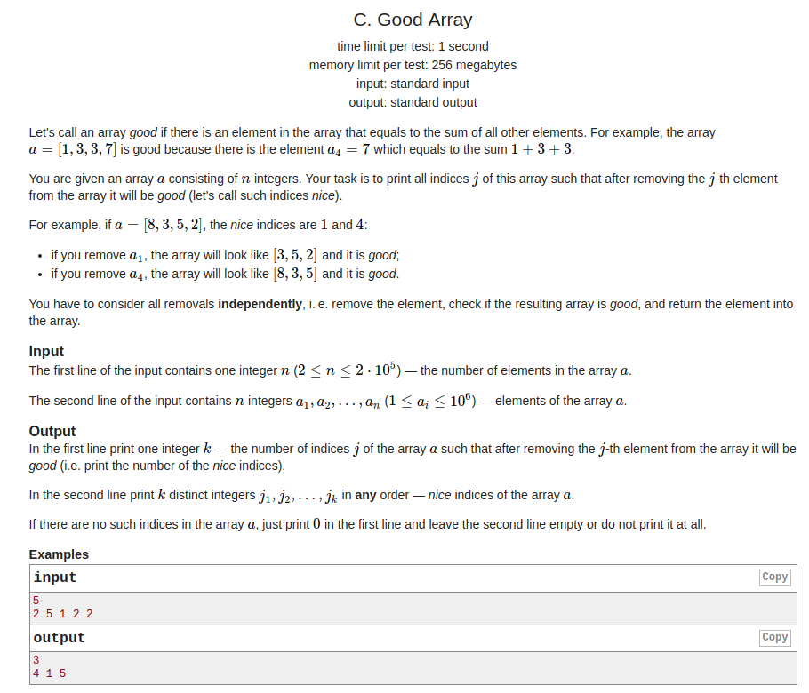
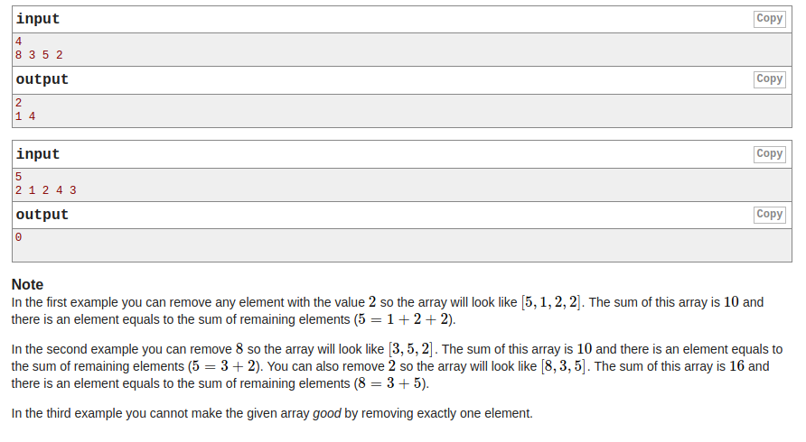

## Codeforces - 1077C. Good Array

#### [题目链接](http://codeforces.com/problemset/problem/1077/C)

> http://codeforces.com/problemset/problem/1077/C

#### 题目大意
就是给你一个数组(`n`个数)，要你从这`n`个数中除掉一个，然后其余的`n-1`个数，刚好可以组成一个`Good Array`，`Good Array`是指其中一个数刚好是其他所有数的和。要你求出所有可以去除的数的下标。





### 解析
对数组求一个和，并对数组排序(这样可以找到那个最大的数): 

* 使用一个结构体记录数组的值和对应的下标(等会排序下标就没了)，然后用之前求的和`sum`，减去当前遍历的数，看这个结果 是否等于 `2*排序之后最大的数`；
* 要记得单独考虑排序之后最后那个数(也就是最大的那个数)；
```cpp
#include <bits/stdc++.h>

const int MAX = 200001;
typedef long long ll;

class Pair{ 
public:
    int id;
    int val;
    bool operator < (const Pair&thr)const{ 
        return this->val < thr.val;
    }
};

//bool cmp(const Pair& pa, const Pair& pb){ 
//    return pa.val < pb.val;
//}

int main(int argc, char const ** argv)
{ 
    std::ios::sync_with_stdio(false);
    std::cin.tie(0);
    int n, res[MAX];
    Pair pr[MAX];
    std::cin >> n;
    ll sum = 0;
    for(int i = 0; i < n; i++){
        std::cin >> pr[i].val;
        pr[i].id = i;
        sum += pr[i].val;
    }
    //std::sort(pr, pr+n, cmp);
    std::sort(pr, pr+n);
    int count = 0;
    for(int i = 0; i < n-1; i++){ 
        ll tmp = sum;
        tmp -= pr[i].val;
        if(tmp == 2*pr[n-1].val) 
            res[count++] = pr[i].id+1;
    }
    if(sum - pr[n-1].val == 2*pr[n-2].val)
        res[count++] = pr[n-1].id+1;
    std::cout << count << std::endl;
    if(count > 0){ 
        for(int i = 0; i < count-1; i++)
            std::cout<< res[i] << " ";
        std::cout<< res[count-1] << std::endl;
    }
    return 0;
}
```
***