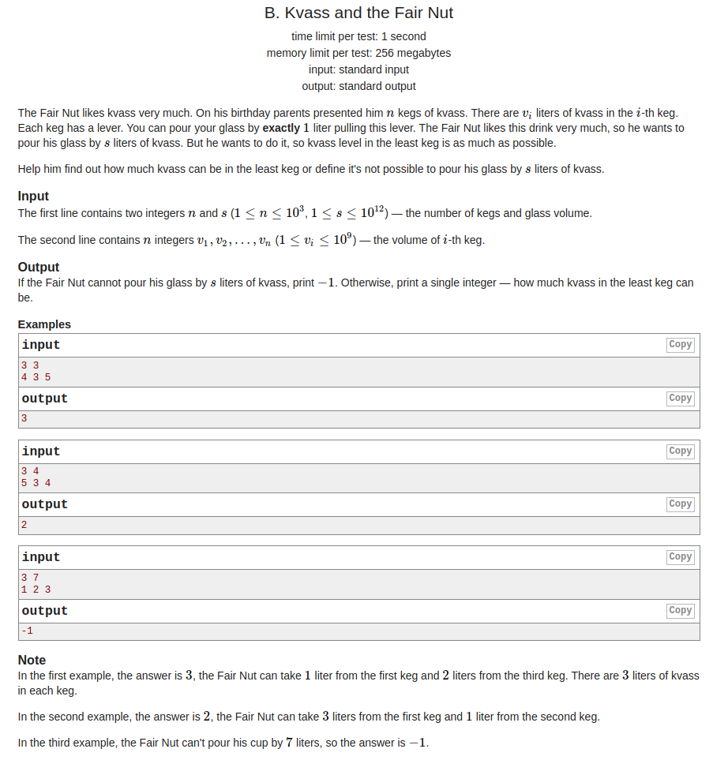

## Codeforces - 1084B. Kvass and the Fair Nut

#### [题目链接](http://codeforces.com/problemset/problem/1084/B)

> http://codeforces.com/problemset/problem/1084/B

#### 题目大意
就是给你`n`桶酒，还有一个杯子容量为`s`，以及`n`桶酒里面的酒的容量，要你用这`n`桶酒要装满这个容量为`s`的杯子，要你使得最后剩余的`n`个桶子中最小容量的桶子剩余的酒最多，求这个数。



#### 解析
贪心，先减去所有不是最小的桶子的那些`"和"`，看是否已经够了，如果不够，就每次将最小值减一，然后判断即可。
```cpp
#include <bits/stdc++.h>

const int MAX = 1001;
typedef long long ll;

int main(int argc, char const** argv)
{ 
    std::ios::sync_with_stdio(false);
    std::cin.tie(0);
    ll n, s, arr[MAX];
    std::cin >> n >> s;
    ll sum = 0; 
    ll minn = 1000000000;
    for(int i = 0; i < n; i++){ 
        std::cin >> arr[i];
        sum += arr[i];
        if(arr[i] < minn)
            minn = arr[i];
    }
    if(sum < s) 
        std::cout << -1 << std::endl;
    else{
        sum -= minn*n; 
        if(sum >= s)
            std::cout << minn << std::endl;
        else { 
            for(ll surplus = s - sum; surplus > 0; minn--)
                surplus -=  n;
            std::cout << minn << std::endl;
        }
    }
    return 0;
}
```