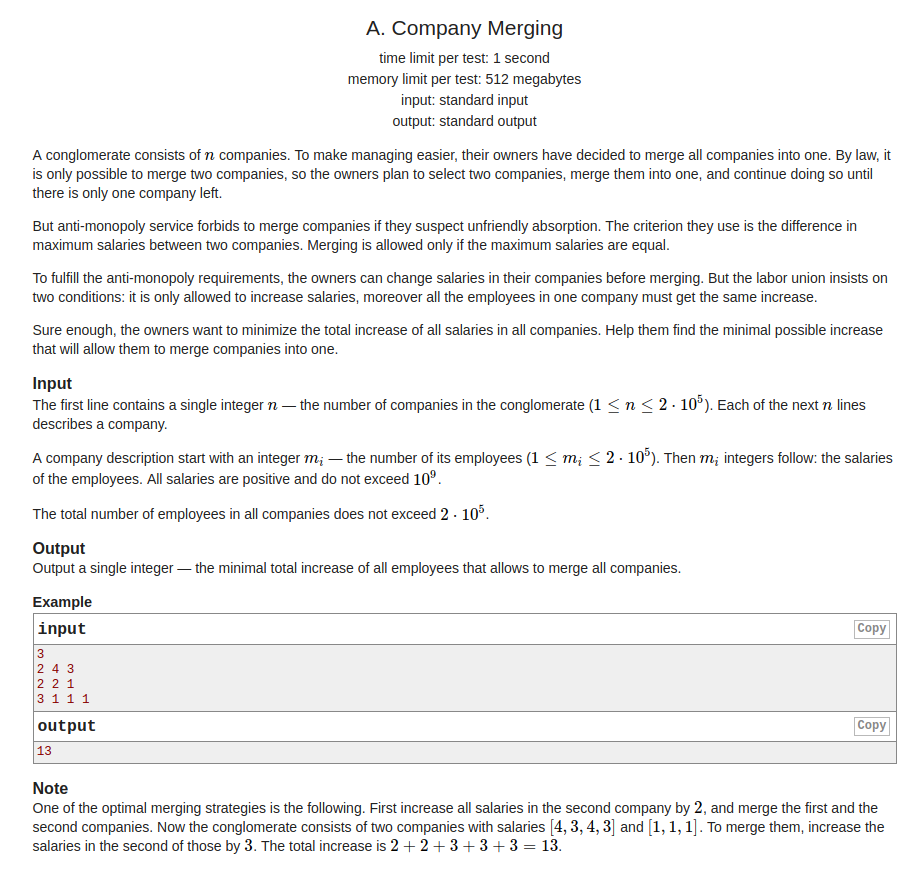

## Codeforces - 1090A. Company Merging

#### [题目链接](http://codeforces.com/problemset/problem/1090/A)

> http://codeforces.com/problemset/problem/1090/A

#### 题目大意
就是给你`n`个公司，每一个公司`m`个人，然后要将这`n`个公司两个两个的合并，每两个公司合并有一个要求: <font color = red>这两个公司的员工中工资最高的人的工资要相等。</font>

现在每次合并都可以给某个公司的人加工资，使得某两个公司可以合并，两个两个的合，问最少的需要加的工资?

#### 解析
题目不难，就是将每个公司的员工最高工资抽取出来，按照这个工资排序，然后相邻求下所需要加的钱即可。

这是当时写的代码，稍微有点多余(<font color =  blue>好像没有必要排序</font>)的是对按照<font  color = red>每个公司最高员工的工资</font>来进行对`vectort`数组的一遍排序，然后求结果。
```cpp
#include <bits/stdc++.h>

const int MAX = 2*100000 + 1;
typedef long long ll;

class Pair{
public:
    ll sz;
    ll mx;
    Pair(ll sz, ll mx){ 
        this->sz = sz;
        this->mx = mx;
    }
};

bool cmp(const Pair& pa, const Pair& pb){ 
    return pa.mx < pb.mx;
}

int main(int argc, char const** argv)
{ 
    std::ios::sync_with_stdio(false);
    std::cin.tie(0);
    ll n, m, mx, maxx;
    std::vector<Pair>vt;
    std::cin >> n; 
    for(int i = 0; i < n; i++){ 
        std::cin >> m;
        maxx = 0;
        for(int j = 0; j < m; j++){ 
            std::cin >> mx;
            maxx = std::max(maxx, mx);
        }
        vt.push_back(Pair(m, maxx));
    }
    std::sort(vt.begin(), vt.end(), cmp); //sorted by max salary
    ll res = 0;
    for(int i = 1; i < vt.size(); i++){ 
        res += (vt[i].mx - vt[i-1].mx)*vt[i-1].sz;
        vt[i].sz += vt[i-1].sz; // remember to update the number of employee
    }
    std::cout << res << std::endl;
    return 0;
}

```