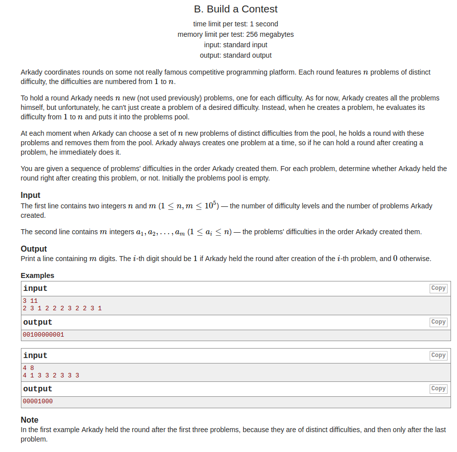

## Codeforces - 1100B. Build a Contest 

#### [题目链接](https://codeforces.com/problemset/problem/1100/B)

> https://codeforces.com/problemset/problem/1100/B

#### 题目

给你`n，m`，以及`m`个数，每个数代表一个等级，每给一个将其添加到题目池中，当题目池中`（1-n）`等级的题目都存在时，即可产生一次竞赛。**产生完竞赛之后需要将之前用过的等级移除池中(不能用之前用过的)**。

每给一个数，如果可以出竞赛，输出`1`，否则输出`0`。

 




#### 解析

思路:

* 用一个变量`sum`记录**每次新出现的等级**，当`sum == n`时，即可以产生一次竞赛；
* 用一个`counts`数组统计每个等级出现的**总次数**，每次遍历都要维护`counts`数组；
* 记得产生完一次竞赛之后，将`counts`数组全部等级`-1`；


代码

```java
import java.io.*;
import java.util.*;

public class Main {

    final static int MAX = 500001;

    public static void main(String[] args){
        Scanner in = new Scanner(new BufferedInputStream(System.in));
        PrintStream out = System.out;
        int n = in.nextInt();
        int m = in.nextInt();
        int[] arr = new int[m];
        for(int i = 0; i < m; i++)
            arr[i] = in.nextInt();
        int[] counts = new int[MAX];
        int sum = 0;
        for(int i = 0; i < m; i++){ 
            if(counts[arr[i]] == 0){ 
                sum++;
                counts[arr[i]]++; // counts[arr[i]] = 1;
                if(sum == n){ 
                    out.print("1"); 
                    for(int j = 1; j <= n; j++){  
                        if(--counts[j] == 0)                    
                            sum--;
                    }
                }else { // remember this 
                    out.print("0");
                }
            }else { 
                out.print("0");
                counts[arr[i]]++;
            }
        }
        out.println();
    }
}

```

