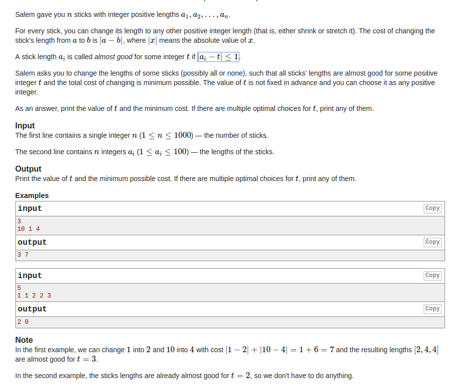

## Codeforces - 1105A. Salem and Sticks(简单模拟)
#### [题目链接](https://codeforces.com/contest/1105/problem/A)
#### 题目

给你一个数组`arr`，要你找到一个`t`，然后将数组所有的元素都变成和`t`只相差`1`的元素，问你哪个这样的`t`可以使得变换的代价最小，`a`变化到`b`需要的代价是`|a - b|`；



#### 解析

思路: 

* 遍历数组得到数组中的最大值`mx`和最小值`mn`，然后枚举所有的`t`从`mn ~ mx`；
* 然后对于每一个`t`计算需要的代价即可，注意`arr[i] == t`的情况，代价就是`0`，不是`|a - b| - 1`(-1)；

```java
import java.io.*;
import java.util.*;

public class Main {

    public static void main(String[] args){
        Scanner in = new Scanner(new BufferedInputStream(System.in));
        PrintStream out = System.out;
        int n = in.nextInt();
        int[] arr = new int[n];
        int mx = 0, mn = 101;
        for(int i = 0; i < n; i++){
            arr[i] = in.nextInt();
            mx = Math.max(mx, arr[i]);
            mn = Math.min(mn, arr[i]);
        }
        int rT = 0, sm = Integer.MAX_VALUE;
        for(int t = mn; t <= mx; t++){ 
            int sum = 0;
            for(int i = 0; i < n; i++){ 
                int tmp = Math.abs(arr[i] - t);
                if(tmp > 0){ 
                    sum += (tmp-1);
                }else { 
                    sum += tmp;// tmp = 0
                }
            }
            if(sum < sm){
                sm = sum;
                rT = t;
            }
        }
        out.println(rT + " " + sm);
    }
}
```

