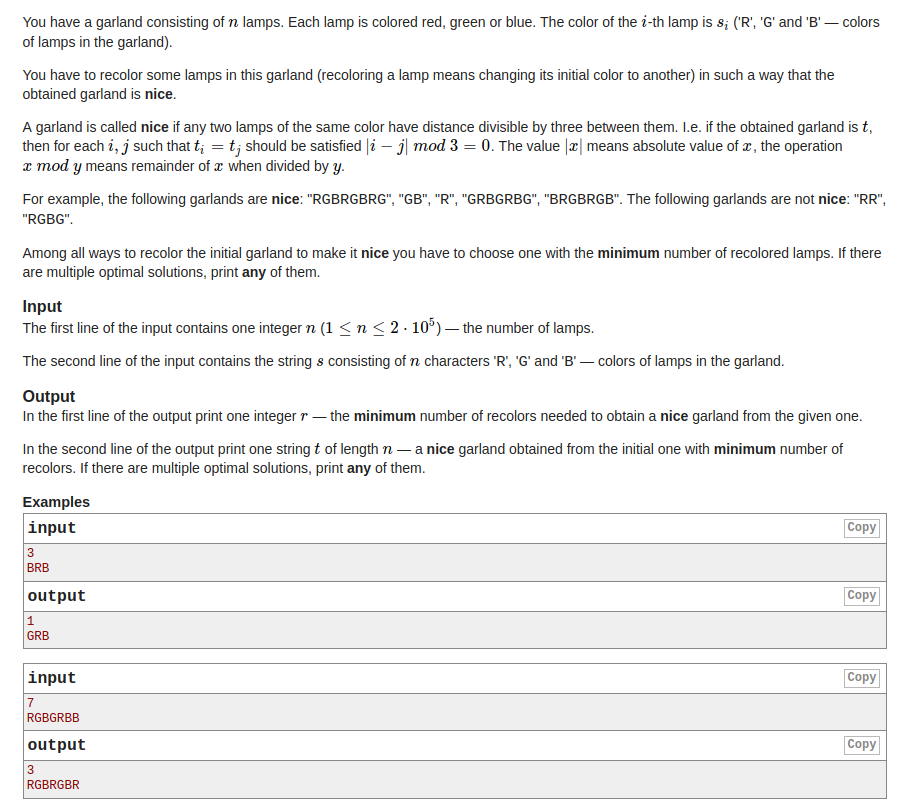
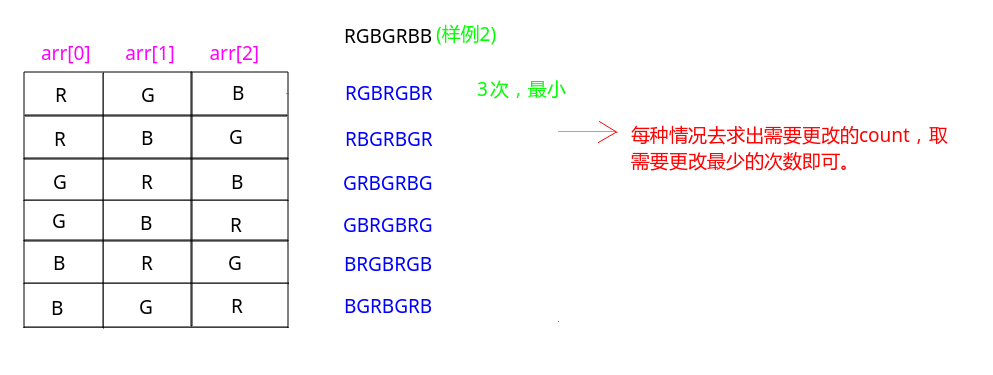

## Codeforces - 1108C. Nice Garland &  1108D. Diverse Garland(排列  | 枚举 )
* [Codeforces - 1108C. Nice Garland](#codeforces---1108c-nice-garland)
* [Codeforces - 1108D. Diverse Garland](#codeforces---1108d-diverse-garland)

***
### <font color = red id = "1">Codeforces - 1108C. Nice Garland

#### [题目链接](https://codeforces.com/problemset/problem/1108/C)

> https://codeforces.com/problemset/problem/1108/C

#### 题目

给你`n`个有`n`个字符的字符串，`Nice Garland`定义为<font color = red>任意两个位置`i、j`的字符，如果`|i - j| % 3 == 0 && str[i].color = str[j].color`，这个串就是`Nice Garland`</font>，给你一个字符串，要你改变最少的字符，重新组装字符串，使得字符串是`Nice Garland`。

#### 解析

使用枚举`{'R', 'G', 'B'}`三个字符的排列，然后每次遍历数组，去组合字符串，看每次需要改变多少字符，取最小需要改变的一个即可。

```java
import java.io.*;
import java.util.*;

public class Main {

    public static void main(String[] args){
        Scanner cin = new Scanner(new BufferedInputStream(System.in));
        PrintStream out = System.out;
        int n = cin.nextInt();
        String str = cin.next();
        char[] chs = str.toCharArray();
        char[] initArr = {'R', 'G', 'B'};
        char[] tmpArr = new char[3];
        char[] resPer = new char[3];
        int res = Integer.MAX_VALUE;
        for(int i = 0; i < 3; i++){
            for(int j = 0; j < 3; j++){
                for(int k = 0; k < 3; k++){
                    if(i == j || j == k || i == k)
                        continue;
                    tmpArr[0] = initArr[i];
                    tmpArr[1] = initArr[j];
                    tmpArr[2] = initArr[k];
                    chs = str.toCharArray(); //注意每次都要用原来的str
                    int count = 0;
                    for(int p = 0; p < n; p++){
                        if(chs[p] != tmpArr[p%3]){
                            count++;
                            chs[p] = tmpArr[p%3];
                        }
                    }
                    if(count < res){
                        res = count;
                        for(int p = 0; p < 3; p++)
                            resPer[p] = tmpArr[p];
                    }
                }
            }
        }
        out.println(res);
        for(int i = 0; i < n; i++)
            out.print(resPer[i%3]);
        out.println();
    }
}
```

***
### <font color = red id = "2">Codeforces - 1108D. Diverse Garland
#### [题目链接](https://codeforces.com/problemset/problem/1108/D)
#### 题目

这题和上题差不多，也是给你`n`个有`n`个字符的字符串，这里的`Diverse Garland`定义为<font color = red>任意两个相邻的字符不能相等</font>，要你改变最少的字符，使得字符串是`Diverse Garland`。

#### 解析
使用<font color = red>贪心+枚举</font>即可:

* 从`1 ~ n-1`位置枚举，如果`str[i] == str[i-1]`，说明至少需要改变其中一个；
* 此时我们去看`str[i + 1]`的情况，此时贪心的思想就是让`str[i-1] 、str[i]、str[i+1]`这三个字符，只需要改变`str[i]`就能让`str[i-1]、str[i]、str[i+1]`三个字符组成的字符串是`Diverse Garland`；
* 具体的六种情况我在代码中都注释了，注意细节即可；


```java
import java.io.*;
import java.util.*;

public class Main {

    public static void main(String[] args) {
        Scanner cin = new Scanner(new BufferedInputStream(System.in));
        PrintStream out = System.out;
        int n = cin.nextInt();
        String str = cin.next();
        char[] chs = str.toCharArray();
        int count = 0;
        for (int i = 1; i <= n - 1; i++) {
            if (chs[i] != chs[i - 1])
                continue;
            count++;
            if (chs[i] == 'R') {  // RRB -> RGB
                if (i + 1 < n && chs[i + 1] == 'B') {
                    chs[i] = 'G';
                } else { // RR(R|G) -> RB(R|G)
                    chs[i] = 'B';
                }
            } else if (chs[i] == 'B') {
                if (i + 1 < n && chs[i + 1] == 'R') { //BBR --> BGR
                    chs[i] = 'G';
                } else {  // BB(B|G) --> BR(B|G)
                    chs[i] = 'R';
                }
            } else { // chs[i] == 'G'
                if (i + 1 < n && chs[i + 1] == 'R') { //GGR --> GBR
                    chs[i] = 'B';
                } else {             // GG(G|B) --> GR(G|B)
                    chs[i] = 'R';
                }
            }

        }
        out.println(count);
        out.println(new String(chs));
    }
}
```

