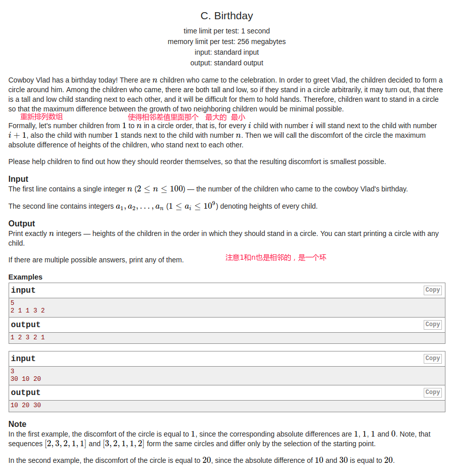

## Codeforces - 1131C. Birthday(贪心)

#### [题目链接](https://codeforces.com/problemset/problem/1131/C)

> https://codeforces.com/problemset/problem/1131/C

#### 题目

给你`n`和`n`个数，要你重新排列`n`个数，使得这些数的相邻差值中最大的那个值最小。



### 解析

排序后，从第一个开始隔一个取一个，取到最后。

然后从倒数第二个往前取，这样才是最小的。

```java
import java.io.*;
import java.util.*;

public class Main {

    static PrintStream out = System.out;

    static void solve(Scanner in) {
        int n = in.nextInt();
        int[] arr = new int[n];
        for(int i = 0; i < n; i++) arr[i] = in.nextInt();
        Arrays.sort(arr);
        for(int i = 0; i < n; i += 2) out.print(arr[i] + " ");
        for(int i = (n % 2 == 0 ? n-1 : n-2); i >= 0; i -= 2) out.print(arr[i] + " ");
        out.println();
    }

    public static void main(String[] args) {
        Scanner in = new Scanner(new BufferedInputStream(System.in));
        solve(in);
    }
}
```

