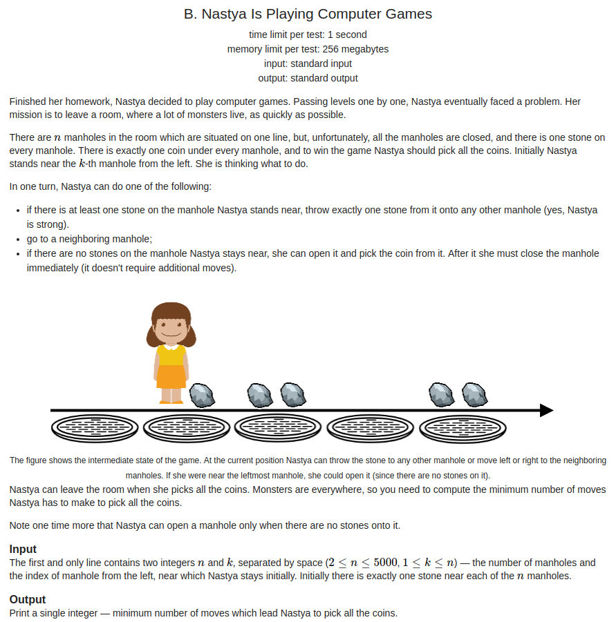
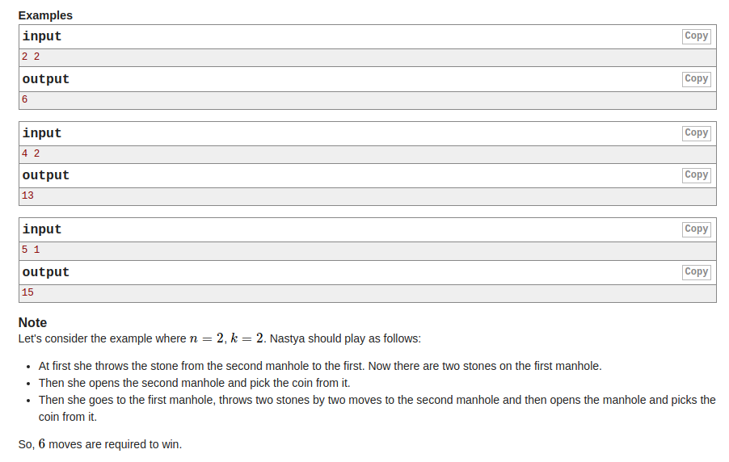

## Codeforces - 1136B. Nastya Is Playing Computer Games

#### [题目链接](https://codeforces.com/problemset/problem/1136/B)

> https://codeforces.com/problemset/problem/1136/B

#### 题目

有n个井盖，每个井盖上有一个小石头。给出n和k，k表示刚开始在第k个井盖上方。

有三种操作，左右移动，扔石头到任意一个井盖，下到井盖里拿金币。

只有井盖上没有石头才能下井盖。求捡完全部金币的最小步数。





#### 解析

模拟题。

* (1)、首先每个点至少要丢掉石头和捡起硬币，需要`2 * n`；
* (2)、可以发现，我们只需要丟额外的一个石头，所以`+1`；
* (3)、然后就是计算步数，不在两边的时候，需要额外多走`min(k-1, n-k)`步；

代码:

```java
import java.io.*;
import java.util.*;

public class Main {

    static PrintStream out = System.out;

    static void solve(InputStream stream) {
        Scanner in = new Scanner(new BufferedInputStream(stream));
        int n = in.nextInt();
        int k = in.nextInt();
        int res = 0;
        res += 2 * n;//每个点: 扔掉石头和捡起钱的花费
        res += 1; // 只需要额外多扔掉一个石头
        if(k == n || k == 1) res += n - 1; // 如果是左右端点，步行的步数
        else res += (n-1) + Math.min(k-1, n-k); //其他点，需要额外的步数
        out.println(res);

    }
    public static void main(String[] args) {
        solve(System.in);
    }
}
```

