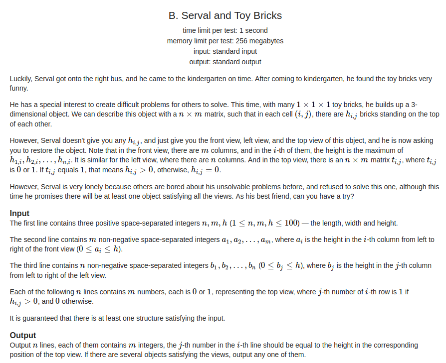
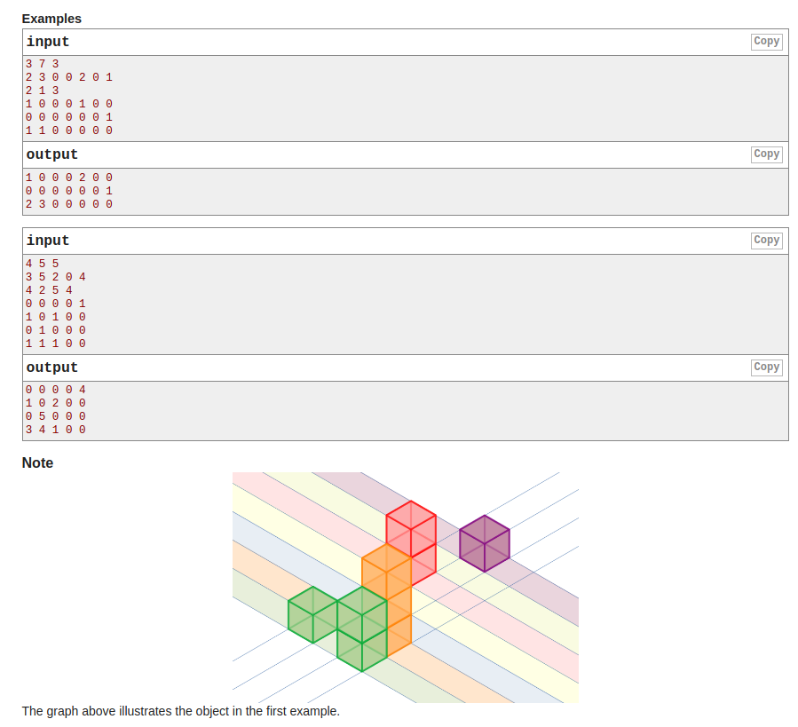
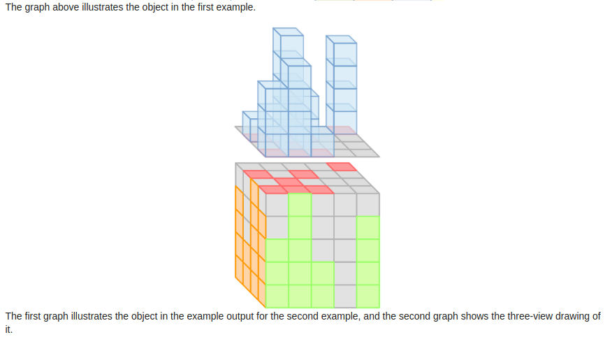

## Codeforces - 1153B. Serval and Toy Bricks

#### [题目链接](https://codeforces.com/problemset/problem/1153/B)

> https://codeforces.com/problemset/problem/1153/B

#### 题目

给出一个立体图形，高度最高为h，第一行给出n、m、h，第二行给出正视图每一列的高度(共m列)，第三行给出左视图每一列的高度(共n列)，然后有n*m个数，若其值为0，则意味着该处高度为0；若其值为1，则意味着该处高度不为0。求满足题意的立体图形的每一处的高度。(有多个解输出任意一个即可)







## 解析

**设序列A存储正视图m列的高度，序列B存储左视图n列的高度**。

二维数组C存储`n*m`的01矩阵，若`C[i][j]=0`，则该处答案为0，(因为高度为0)否则输出`min(A[i]，B[j]` )

代码:

```java
import java.io.*;
import java.util.*;

public class Main {

    static void solve(InputStream stream, PrintWriter out) {
        FR in = new FR(stream);
        int n = in.nextInt();
        int m = in.nextInt();
        int h = in.nextInt();
        int[] z = new int[m];
        int[] left = new int[n];
        for(int i = 0; i < m; i++) z[i] = in.nextInt();
        for(int i = 0; i < n; i++) left[i] = in.nextInt();
        for(int i = 0; i < n; i++){ 
            for(int j = 0; j < m; j++){ 
                int x = in.nextInt();
                if(x == 0){ 
                    out.print(0 + " ");
                }else { 
                    out.print(Math.min(left[i], z[j]) + " "); //去一个最小的即可
                }
            }
            out.println();
        }

    }

    /*--------------------------------------------------------------------------------------*/

    public static void main(String[] args) {
        OutputStream os = System.out;
        InputStream is = System.in;
        PrintWriter out = new PrintWriter(os);
        solve(is, out);
        out.close();
    }

    static class FR {

        BufferedReader br;
        StringTokenizer tk;

        FR(InputStream stream) {
            br = new BufferedReader(new InputStreamReader(stream), 32768);
            tk = null;
        }

        String next() {
            while (tk == null || !tk.hasMoreElements()) {
                try {
                    tk = new StringTokenizer(br.readLine());
                } catch (IOException e) {
                    e.printStackTrace();
                }
            }
            return tk.nextToken();
        }

        int nextInt() {
            return Integer.parseInt(next());
        }
    }

}

```

