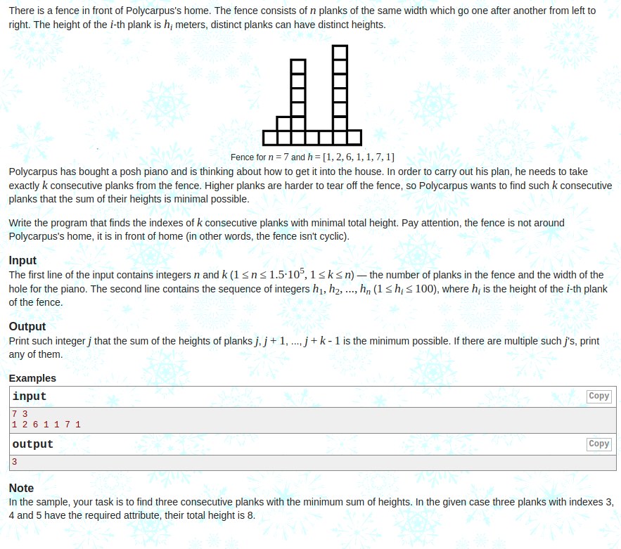
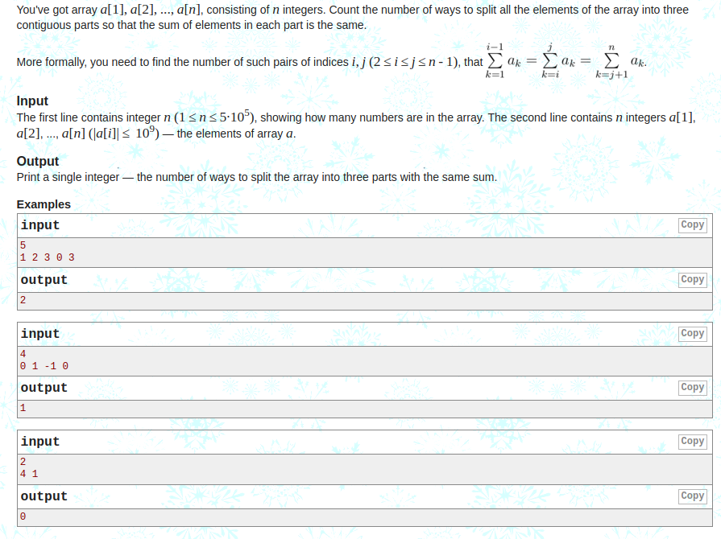
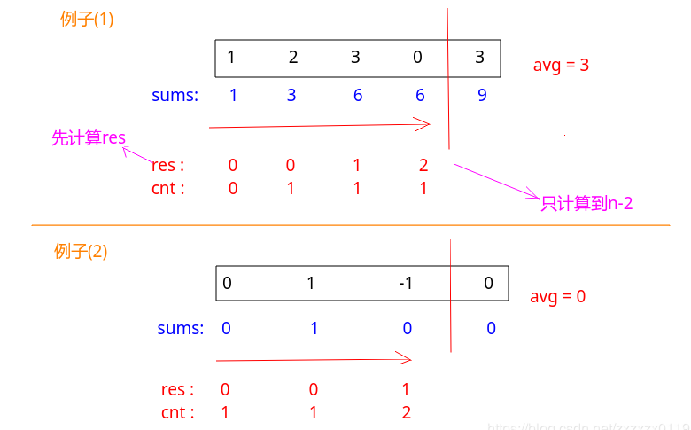

## Codeforces - 363B. Fence & 466C. Number of Ways

* [Codeforces - 363B - Fence](#1)
* [Codeforces - 466C - Number of Ways](#codeforces---466c---number-of-ways)

***
### <font color  = red id = "1">Codeforces - 363B - Fence
#### [题目链接](https://codeforces.com/problemset/problem/363/B)

> https://codeforces.com/problemset/problem/363/B

#### 题目大意
就是给你一个`n、k`，然后给你`n`个数，要你在`n`个数中求最小的`k`个数的和，这`k`个数必须是连续的。


#### 解析
思路: 

* 先求前`k`个数的和，然后类似和滑动窗口一样；
* 用两个指针，第一个`i`指向窗口的左边，另一个`j`指向窗口的右边，然后每次左边去掉一个数，右边加上一个数，然后计算新的和，看是否更小，如果更小，更新即可；

```java
import java.io.BufferedInputStream;
import java.util.Scanner;

public class Main {

    public static void main(String[] args){
        Scanner cin = new Scanner(new BufferedInputStream(System.in));
        int n = cin.nextInt();
        int k = cin.nextInt();
        int[] arr = new int[n];
        for(int i = 0; i < n; i++)
            arr[i] = cin.nextInt();

        int sum = 0;
        for(int i = 0; i < k; i++) // 先计算前k个数
            sum += arr[i];

        int minn = sum;
        int mini = 0;
        for(int i = 0, j = k; j < n ; i++, j++ ){ //然后每次前面减去一个数，后面加上一个数，看是否有更小的k个数
            sum = sum-arr[i]+arr[j];
            if(sum < minn){
                minn = sum;
                mini = i+1;
            }
        }
        System.out.println(mini + 1);
    }
}
```
***
### <font color  = red id = "2">Codeforces - 466C - Number of Ways
#### [题目链接](https://codeforces.com/problemset/problem/466/C)

> https://codeforces.com/problemset/problem/466/C

#### 题目大意
就是给你一个数组，要将这个数组分成和相等的三个部分，问你有多少种分法。




#### 解析

这题没做出来，完整的题解在[**这里**](https://codeforces.com/blog/entry/13758)。解法很奇妙:

* 首先计算出每个位置的前缀和`sums[i]`，整个数组的和存在`sums[n-1]`中；
* 因为要分成三部分，所以`sums[n-1] % 3`一定要等于`0`，不然就没有解，输出`0`即可；
* 然后就遍历整个数组，记`sums[n-1]/3 = avg`，看`sums[i] == avg`和`sums[i] == 2 * avg`的位置，然后使用两个变量`res`和`cnt`统计，其中的玄机也是很巧妙。统计的顺序可以从`n-2  ~  0`，也可以从`0  ~  n-2`(<font color = red>`n-1`是第三个部分，不要算进去</font>)。看两个例子就能体会到了。。




注释部分是从`n-2  ~  0`，非注释部分是从`0  ~   n-2`: 
```java
import java.io.BufferedInputStream;
import java.util.Scanner;

public class Main {

    public static void main(String[] args){
        Scanner cin = new Scanner(new BufferedInputStream(System.in));
        int n = cin.nextInt();
        int[] arr = new int[n];
        for(int i = 0; i < n; i++)
            arr[i] = cin.nextInt();
        long[] sums = new long[n];
        sums[0] = arr[0];
        for(int i = 1; i < n; i++)
            sums[i] = sums[i-1] + arr[i];
        // each part is S/3
        if(sums[n-1]%3 != 0){
            System.out.println(0);
            return;
        }
        long avg = sums[n-1]/3;
        long cnt = 0, res = 0;
//        for(int i = n-2; i >= 0; i--){ // 必须从n-2开始,从n-1会出错,因为n-1是第3个S/3了
//            if(sums[i] == avg)  // 这个必须在下面cnt+=1之前
//                res += cnt;
//            if(sums[i] == avg*2)
//                cnt += 1;
//        }
        for(int i = 0; i < n-1; i++){ // 必须只能到n-2,到n-1会出错,因为n-1是第3个S/3了
            if(sums[i] == avg*2) // 这个必须在下面cnt+=1之前
                res += cnt;
            if(sums[i] == avg)
                cnt += 1;
        }
        System.out.println(res);
    }
}
```

