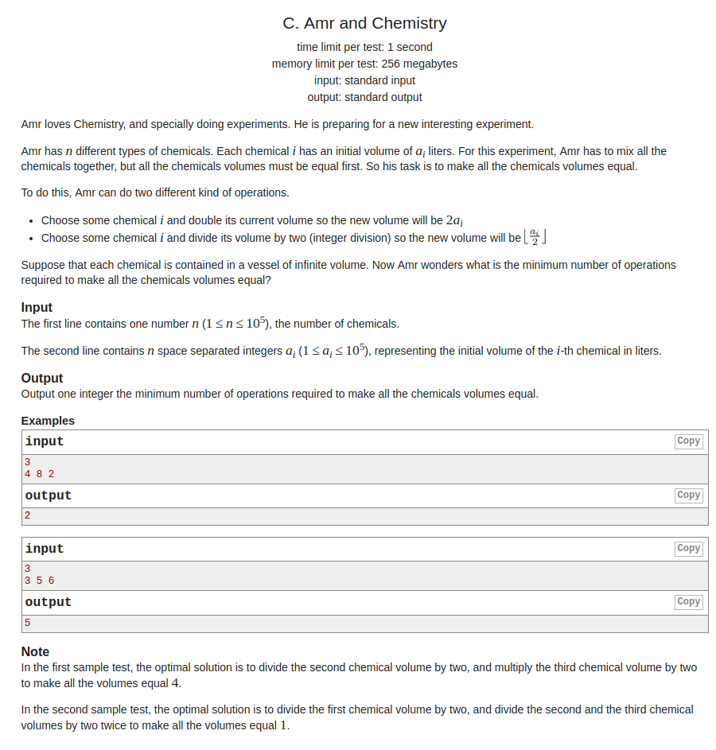

# Codeforces - 558C. Amr and Chemistry

#### [题目链接](https://codeforces.com/problemset/problem/558/C)

> https://codeforces.com/problemset/problem/558/C

#### 题目

就是给你`n`，和`n`个数`a[i]`，每次可以将`a[i]/2`或者`a[i]*2`，问你最少的次数将所有数变成一样的。



## 解析

暴力。

参考: 

https://www.cnblogs.com/zhengguiping--9876/p/5162393.html

https://blog.csdn.net/u014028317/article/details/46897963

`cnt`数组统计到这个点的`a[i]`的数目，`num`数组统计到这个点的需要的步数。

```java
import java.io.*;
import java.util.*;

public class Main {
    
    static void solve(InputStream stream, PrintWriter out) {
        FR in = new FR(stream);
        int n = in.nextInt();
        int[] a = new int[n];
        int max = 0;
        for (int i = 0; i < n; i++) {
            a[i] = in.nextInt();
            max = Math.max(max, a[i]);
        }
        int[] cnt = new int[max + 1];
        int[] num = new int[max + 1];
        for (int i = 0; i < n; i++) {
            int t = a[i];
            int step = 0;
            cnt[a[i]]++;
            while(t * 2 <= max){
                t *= 2;
                step++;
                cnt[t]++;
                num[t] += step;
            }

            t = a[i];
            step = 0;
            while(t > 0){
                if(t != 1 && t%2 == 1){
                    int step2 = step + 1;
                    int t2 = t / 2;
                    while(t2*2 <= max){
                        t2 *= 2;
                        step2++;
                        cnt[t2]++;
                        num[t2] += step2;
                    }
                }
                t /= 2;
                step++;
                cnt[t]++;
                num[t] += step;
            }
        }
        int min = Integer.MAX_VALUE;
        for(int i = 0 ; i <= max; i++)if(cnt[i] == n) min = Math.min(min, num[i]);
        out.println(min);
    }
    
    /**-----------------------------------not code------------------------------------------**/

    public static void main(String[] args) {
        OutputStream os = System.out;
        InputStream is = System.in;
        PrintWriter out = new PrintWriter(os);
        solve(is, out);
        out.close();
    }

    static class FR {
        BufferedReader br;
        StringTokenizer tk;

        FR(InputStream stream) {
            br = new BufferedReader(new InputStreamReader(stream), 32768);
            tk = null;
        }

        String next() {
            while (tk == null || !tk.hasMoreElements()) {
                try {
                    tk = new StringTokenizer(br.readLine());
                } catch (IOException e) {
                    e.printStackTrace();
                }
            }
            return tk.nextToken();
        }
        int nextInt() {
            return Integer.parseInt(next());
        }
    }
}
```

