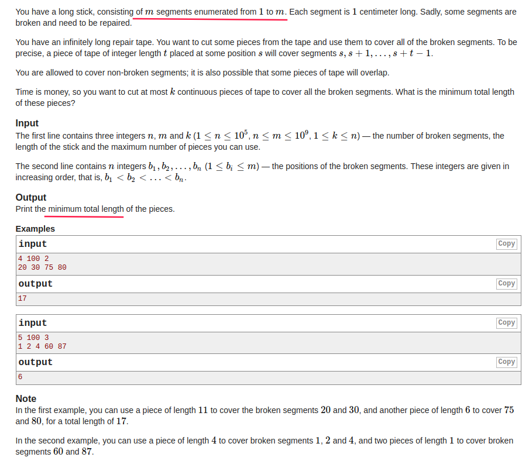

## Codeforces - 1110B. Tape(贪心+排序)
#### [题目链接](https://codeforces.com/problemset/problem/1110/B)
#### 题目

给你一根木棍，包含`m`段，每段`1cm`（总长度`m cm`），现在有`n`个段(洞)需要修复，你有`k`个`pieces`，问你修复这`n`个段需要的最小长度的`pieces`。



#### 解析

很好的贪心题: 

* 假设先用最长的一段`piece`来修复整个`stick`，耗费`m`长度；
* **然后将最大的`k-1`个那些间隔(用`d`数组统计间距)挖去，这样就划分成了`k`个部分；**
* 注意在挖去的时候减去的距离是`d[i] - 1`而不是`d[i]`，自己带入一个实例就清楚了；

代码:


```java
import java.io.*;
import java.util.*;

public class Main {

    public static void main(String[] args){
        Scanner in = new Scanner(new BufferedInputStream(System.in));
        PrintStream out = System.out;
        int n = in.nextInt();
        int m = in.nextInt();
        int k = in.nextInt();
        int[] arr = new int[n];
        int[] d = new int[n];
        for(int i = 0; i < n; i++){
            arr[i] = in.nextInt(); // arr is sorted 
            if(i != 0) d[i] = arr[i] - arr[i-1];
        }
        Arrays.sort(d);
        long res = arr[n-1] - arr[0] + 1; // max answer
        // 挖 k - 1个最大的间隔
        for(int i = n - 1; i > (n - k); i--) // d数组总长度1~n-1,  将这些划分成k个，所以减去最大的k-1段
            res -= (d[i]-1);
        out.println(res);
    }
}
```

