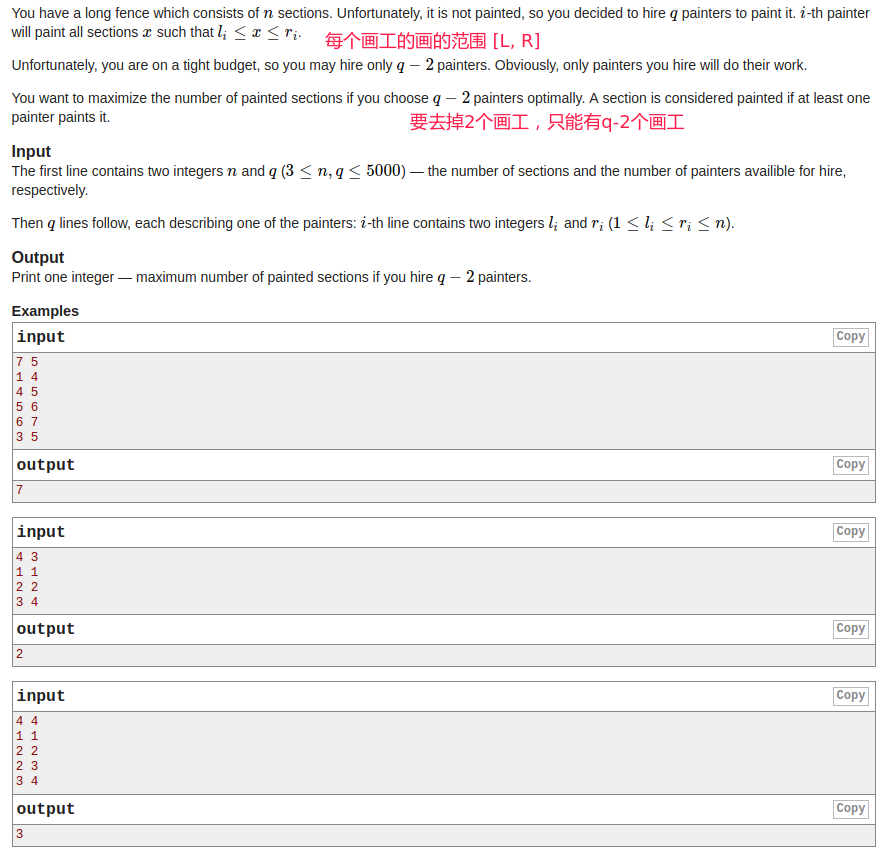

## Codeforces - 1132C. Painting the Fence

#### [题目链接](https://codeforces.com/problemset/problem/1132/C)

> https://codeforces.com/problemset/problem/1132/C

#### 题目

给你`n、Q`，`n`表示`1~n`个点，给你`Q`个画工，每个画工的范围是`L[i] ~ R[i]`的区间，要你从中去掉两个画工，使得能画的点尽可能的多，输出这个数量。



#### 解析

* 枚举，Q次循环，首先去掉当前线段(去掉一条)，最后还要恢复该线段；
* 去掉该线段后我们想要再去掉一条线段取得最大值，先用`tmp`记录去掉一条线段后的可覆盖的点的个数。
* 我们需要用到**覆盖次数为1**的前缀和了，因为覆盖次数再多一点的话，去不去掉没影响，但是覆盖次数为1的等下枚举去掉第2条的时候就有影响了；
* 看L到R区间内有几个覆盖次数为1的，如果为0，则tmp不需要变，否则tmp需要减去该值，运用前缀和可以O(1)查找。
* 之后更新最优值即可。

代码:


```java
import java.io.*;
import java.util.*;

public class Main {

    static PrintStream out = System.out;

    static void solve(InputStream stream) {
        Scanner in = new Scanner(new BufferedInputStream(stream));
        int n = in.nextInt();
        int Q = in.nextInt();
        int[] L = new int[Q + 1];
        int[] R = new int[Q + 1];
        int[] c = new int[n + 1]; // 每个位置出现的次数
        int[] sums = new int[n + 1]; // 只出现一次的前缀和
        for (int q = 1; q <= Q; q++) {
            L[q] = in.nextInt();
            R[q] = in.nextInt();
            for(int i = L[q]; i <= R[q]; i++) c[i]++;// 记录每个点覆盖的次数
        }
        int res = 0;
        for(int q = 1; q <= Q; q++){//先枚举去掉 L[q]~R[q]
            for(int i = L[q]; i <= R[q]; i++) c[i]--;
            int tmp = 0;
            for(int i = 1; i <= n; i++){// 求出出现大于1次的: tmp, 顺便求出次数为1的前缀和sums
                if(c[i] > 0) tmp++;
                if(c[i] == 1) sums[i] = sums[i-1] + 1; // 为1的前缀和，因为下面枚举下面的时候，为1的可以消失
                else sums[i] = sums[i-1];
            }
            for(int p = q + 1; p <= Q; p++)  //如果 q == Q, 这时虽然只去掉了一个，但是这个循环根本不会进行
                res = Math.max(res, tmp - (sums[R[p]] - sums[L[p]-1]));
            for(int i = L[q]; i <= R[q]; i++) c[i]++; // 还原
        }
        out.println(res);
    }

    public static void main(String[] args) {
        solve(System.in);
    }
}
```

