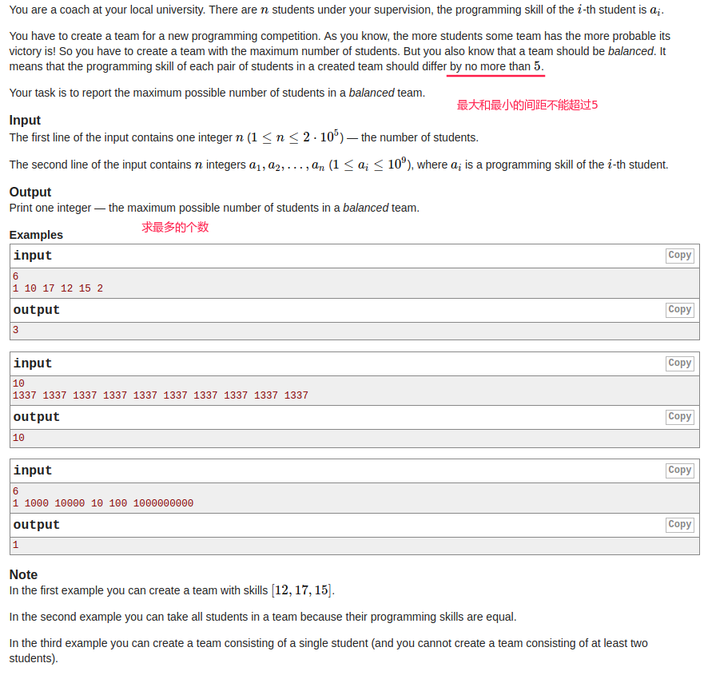

## Codeforces - 1133C. Balanced Team(滑动窗口)(有坑不要用int用Integer)

#### [题目链接](https://codeforces.com/contest/1133/problem/C)

https://codeforces.com/contest/1133/problem/C

#### 题目

给你`n`个数，要你从中取最多的个数，但是取出的数的最大值和最小值的差不能超过`5`。



#### 解析

题目不难，先排序，然后用两个指针滑动即可。

但是这题有一个很大的坑，就是数组要用`Integer`，而不是`int`，因为Java内部对于`int`是使用快速排序，而对于`Integer`是使用堆排序，所以堆排序最坏情况要比快速排序更好。

具体看[**这里**](https://codeforces.com/blog/entry/46756)。

代码：

```java
import java.io.*;
import java.util.*;

public class Main {

    static PrintStream out = System.out;

    // write code
    static void solve(InputStream stream) {
        Scanner in = new Scanner(new BufferedInputStream(stream));
        int n = in.nextInt();
        // 用int 就会超时,因为Arrays.sort(int)用的是快排,而Arrays.sort(Integer)用的是归并排序
        Integer[] a = new Integer[n];
        for(int i = 0; i < n; i++) a[i] = in.nextInt();
        Arrays.sort(a);
        int res = 1;
        int l = 0;
        for(int r = 0; r < n; r++) {
            while(a[r] - a[l] > 5)
                l++;
            res = Math.max(res, r - l + 1);
        }
        out.println(res);
    }

    public static void main(String[] args) {
        solve(System.in);
    }
}
```

C++也有坑，不能用`cin`:，用不用`qsort`倒无所谓。

```c++
#include <bits/stdc++.h>
using namespace std;

const int maxn = 2e5 + 10;

int cmp(const void * a, const void * b){ 
  return ( *(int*)a - *(int*)b );
}

int main()
{ 
#ifndef ONLINE_JUDGE
    freopen("in.txt","r",stdin);
#endif
//code start 

    int n;
    int a[maxn];
    cin >> n;
    for(int i = 0; i < n; i++) scanf("%d", &a[i]);
    //for(int i = 0; i < n; i++) cin >> a[i]; //用cin就会超时
    sort(a, a + n);
    //qsort(a, n, sizeof(a[0]), cmp);
    int res = 1;
    for(int l = 0, r = 0; r < n; r++){ 
        while(a[r] - a[l] > 5) l++;
        res = max(res, r - l + 1);
    }
    cout << res << '\n';

// code end
#ifndef ONLINE_JUDGE
    cerr << "Time elapsed: " << 1.0 * clock() / CLOCKS_PER_SEC << " s.\n";
#endif
    return 0;
}

```

