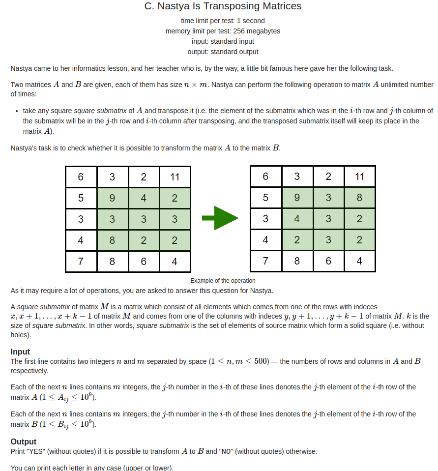
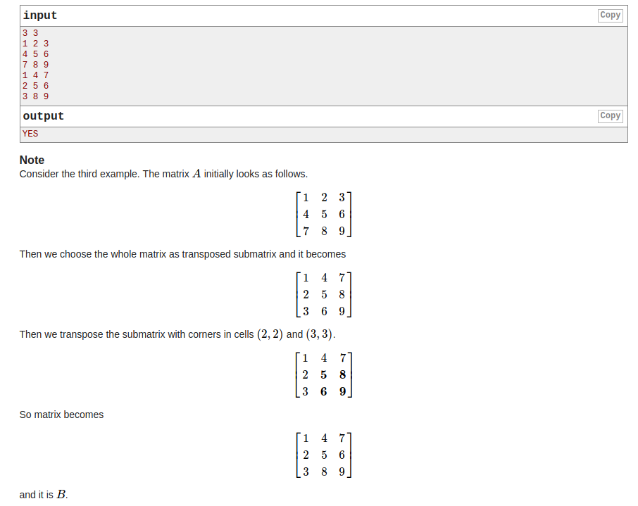
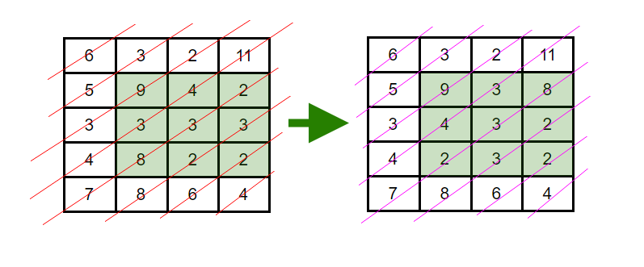

## Codeforces - 1136C. Nastya Is Transposing Matrices(判断a矩阵是否可以通过转置得到b矩阵)

#### [题目链接](https://codeforces.com/problemset/problem/1136/C)

> https://codeforces.com/problemset/problem/1136/C

#### 题目

给你`n`和`m`，以及两个`n`行`m`列的矩阵`a、b`，问你能不能通过**不断的转置`a`矩阵里面的子矩阵**，得到`b`。





#### 解析

将两个矩阵对应的划线区域排序，然后比较是否都相同即可。

意思就是只要`b`对应的划线区域(斜线)是`a`对应的斜线区域的元素即可，不需要顺序。

这个过程可以用排序解决，也可以用哈希表解决。



代码:

注意下面的`!Object.equals`用法:

https://www.cnblogs.com/woaixingxing/p/7482215.html

```java
import java.io.*;
import java.util.*;

public class Main {

    static PrintStream out = System.out;

    static void solve(InputStream stream) {
        Scanner in = new Scanner(new BufferedInputStream(stream));
        int n = in.nextInt();
        int m = in.nextInt();
        int[][] a = new int[n][m];
        int[][] b = new int[n][m];
        for (int i = 0; i < n; i++) {
            for (int j = 0; j < m; j++) {
                a[i][j] = in.nextInt();
            }
        }
        for (int i = 0; i < n; i++) {
            for (int j = 0; j < m; j++) {
                b[i][j] = in.nextInt();
            }
        }
        boolean ok = true;
        for (int i = 0, j = 0; i < n && j < m; ) {
            List<Integer> arr1 = new ArrayList<>();
            List<Integer> arr2 = new ArrayList<>();
            for (int pr = i, pc = j; pr >= 0 && pc < m; pr--, pc++) {
                arr1.add(a[pr][pc]);
                arr2.add(b[pr][pc]);
            }
            Collections.sort(arr1);
            Collections.sort(arr2);
            for (int p = 0; p < arr1.size(); p++)
//                if (arr1.get(p) != arr2.get(p)) {   // Wrong , 直接这样有可能是null，则会返回false
                if (!Objects.equals(arr1.get(p), arr2.get(p))) {  //Right
                    ok = false;
                    break;
                }
            if (!ok) break;
            if (i == n - 1)
                j++;
            else
                i++;
        }
        out.println(ok ? "YES" : "NO");
    }

    public static void main(String[] args) {
        solve(System.in);
    }
}
```

更好的做法: 原理差不多。

```java
import java.io.*;
import java.util.*;

public class Main {

    static PrintStream out = System.out;

    static void solve(InputStream stream) {
        Scanner in = new Scanner(new BufferedInputStream(stream));
        int n = in.nextInt();
        int m = in.nextInt();
        int[][] a = new int[n][m];
        int[][] b = new int[n][m];
        for (int i = 0; i < n; i++) {
            for (int j = 0; j < m; j++) {
                a[i][j] = in.nextInt();
            }
        }
        for (int i = 0; i < n; i++) {
            for (int j = 0; j < m; j++) {
                b[i][j] = in.nextInt();
            }
        }
        boolean ok = true;
        for (int i = 0, j = 0; i < n && j < m; ) {
            HashMap<Integer, Integer> map = new HashMap<>();
            for (int pr = i, pc = j; pr >= 0 && pc < m; pr--, pc++) {
                map.put(a[pr][pc], map.getOrDefault(a[pr][pc], 0) + 1);
                map.put(b[pr][pc], map.getOrDefault(b[pr][pc], 0) - 1);
            }
            for(int v : map.values()) if(v != 0){
                ok = false;
                break;
            }
            if(!ok) break;
            if (i == n - 1)
                j++;
            else
                i++;
        }
        out.println(ok ? "YES" : "NO");
    }

    public static void main(String[] args) {
        solve(System.in);
    }
}
```

