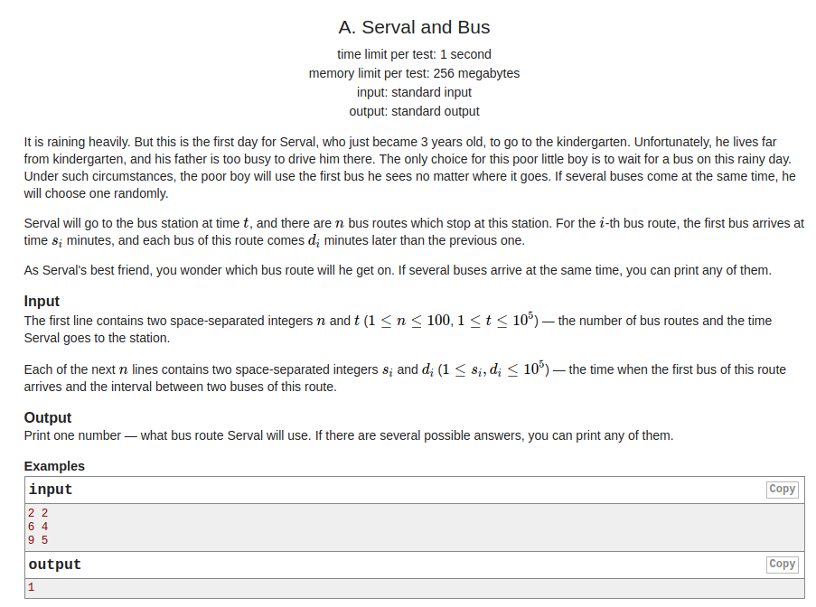
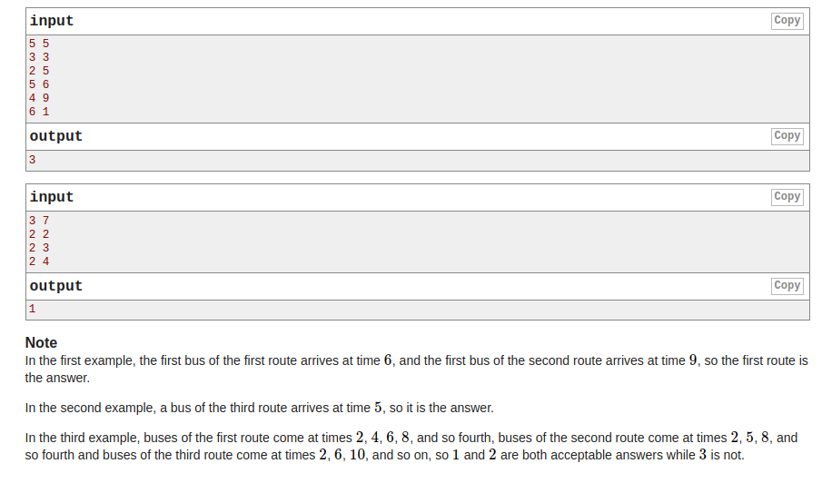

# Codeforces - 1153A. Serval and Bus

#### [题目链接](https://codeforces.com/problemset/problem/1153/A)

> https://codeforces.com/problemset/problem/1153/A

#### 题目

一个人要等车，他在`t`时刻到达车站，下面有`n`辆列车，每个列车有一个`s[i]、d[i]`表示的是`i`列车在`s[i]`的时候到达，然后每隔`d[i]`就再来一次。这个人会坐最早的列车，问你会坐那一辆。





## 解析

如果一开始就有`s[i]`和`t`相等，直接输出这个序号即可。

然后直接和求出`t`相近的时间即可。

通过`t - s[i] / d[i]`求出每一个隔的次数。

代码:

```java
import java.io.*;
import java.util.*;

public class Main {

    static void solve(InputStream stream, PrintWriter out) {
//        Scanner in = new Scanner(new BufferedInputStream(System.in));
        FR in = new FR(stream);
        int n = in.nextInt();
        int t = in.nextInt();
        int[] s = new int[n];
        int[] d = new int[n];
        int resI = 0;
        for (int i = 0; i < n; i++) {
            s[i] = in.nextInt();
            d[i] = in.nextInt();
            if (s[i] == t) resI = i + 1;
        }
        if (resI != 0) {
            out.println(resI);
            return;
        }
        for (int i = 0; i < n; i++) {
            if (t < s[i]) continue; // 直接跳过
            // div 或者 div+1
            int remain = (t - s[i]) % d[i];
            int div = (t - s[i]) / d[i];
            s[i] = remain == 0 ? s[i] + (div * d[i]) : s[i] + (div + 1) * d[i];
        }
        int min = Integer.MAX_VALUE;
        for (int i = 0; i < n; i++) {
            if (s[i] - t < min) {
                min = s[i] - t;
                resI = i + 1;
            }
        }
        out.println(resI);
    }

    /*--------------------------------------------------------------------------------------*/
    public static void main(String[] args) {
        OutputStream os = System.out;
        InputStream is = System.in;
        PrintWriter out = new PrintWriter(os);
        solve(is, out);
        out.close();
    }

    static class FR {
        BufferedReader br;
        StringTokenizer tk;

        FR(InputStream stream) {
            br = new BufferedReader(new InputStreamReader(stream), 32768);
            tk = null;
        }

        String next() {
            while (tk == null || !tk.hasMoreElements()) {
                try {
                    tk = new StringTokenizer(br.readLine());
                } catch (IOException e) {
                    e.printStackTrace();
                }
            }
            return tk.nextToken();
        }

        int nextInt() {
            return Integer.parseInt(next());
        }
    }
}
```

