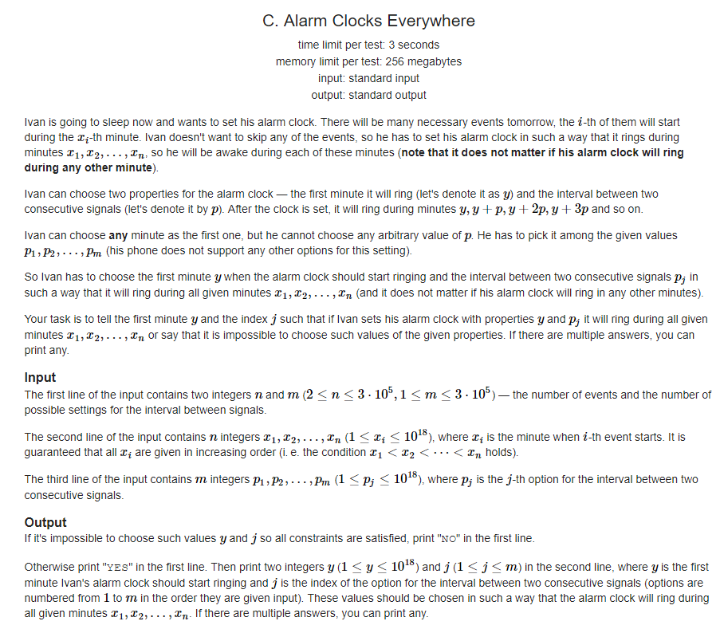
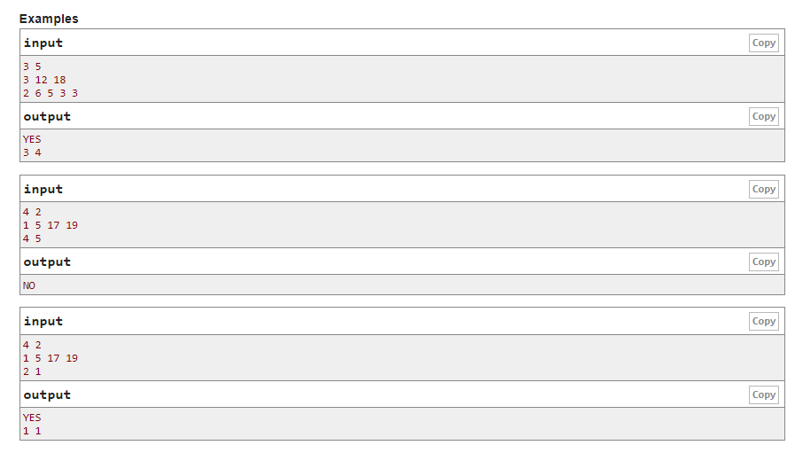

# Codeforces - 1155C. Alarm Clocks Everywhere(GCD)

#### [题目链接](https://codeforces.com/problemset/problem/1155/C)

> https://codeforces.com/problemset/problem/1155/C

#### 题目

给出N个时刻(x数组), M个时间间隔(p数组), 给出一个闹钟可以在任意时刻响起, 使用其中一个间隔(索引), 使得可以覆盖所有的时刻。





### 解析

求出`x[i-1] ~ x[i]`间距之间的最大公约数，记为`Gc`，然后在`p[i]`中找到`Gc % p[i]`的即可。

代码:

```java
import java.util.*;
import java.io.*;

public class Main{

    static long gcd(long a, long b){
        long r;
        while(b != 0){
            r = a % b;
            a = b;
            b = r;
        }
        return a;
    }

    static long ngcd(long[] a, int n){
        if(n == 1) return a[0];
        return gcd(a[n-1], ngcd(a, n-1));
    }

    static void solve(Scanner in, PrintWriter out){
        int n = in.nextInt();
        int m = in.nextInt();
        long[] x = new long[n];
        long[] p = new long[m];
        long[] g = new long[n];
        long pre = 0;
        for(int i = 0; i < n; i++){
            x[i] = in.nextLong();
            if(i > 0) g[i-1] = x[i] - pre;
            pre = x[i];
        } 
        for(int i = 0; i < m; i++) p[i] = in.nextLong();
        long Gc = ngcd(g, n-1);
        boolean flag = false;
        int resi = -1;
        for(int i = 0; i < m; i++) if(Gc % p[i] == 0){ // notice not Gc == p[i]
            flag = true;
            resi = i;
            break;
        }
        if(!flag) out.println("NO");
        else {
            out.println("YES");
            out.println(x[0] + " " + (resi+1));
        }
    }

    public static void main(String[] args) {
        Scanner in = new Scanner(new BufferedInputStream(System.in));
        PrintWriter out = new PrintWriter(System.out);
        solve(in, out);
        out.close();
    }
}

```

