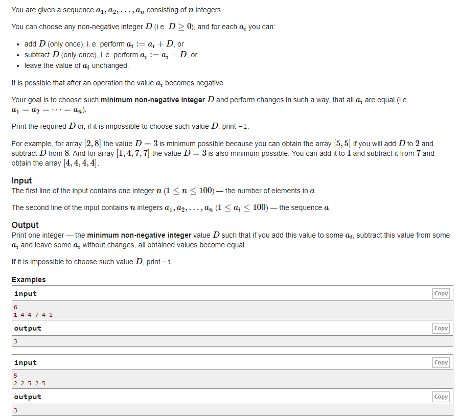

# Codeforcess - 1154B. Make Them Equal

#### [题目链接](https://codeforces.com/problemset/problem/1154/B)

> https://codeforces.com/problemset/problem/1154/B

#### 题目

给你一个数组，要你选出一个最小的D，使得将数组中的每一个数+D或者-D或者不变，操作一遍之后能够将数组中的所有数变成同一个数。如果不行输出-1。



### 解析

比较好的方法是用set去重，set中超过三个元素就不满足，然后自己再判断一下就行了。

```java
import java.util.*;
import java.io.*;

public class Main{

   
    static void solve(Scanner in, PrintWriter out){
        int n = in.nextInt();
        int[] a = new int[n];
        HashSet<Integer> set = new HashSet<>();
        int mx = Integer.MIN_VALUE;
        int mn = Integer.MAX_VALUE;
        for(int i = 0; i < n; i++){
            a[i] = in.nextInt();
            set.add(a[i]);
            mx = Math.max(mx, a[i]);
            mn = Math.min(mn, a[i]);
        }
        if(set.size() > 3){
            out.println(-1);
            return;
        }
        if(set.size() == 1){
            out.println(0);
            return;
        }
        if(set.size() == 2){
            out.println( (mx - mn)%2 == 0 ? (mx - mn)/2 : mx - mn);
            return;
        }
        // set.size() == 3
        if ((mx - mn) % 2 == 1) {
            out.println(-1);
            return;
        }
        int d = (mx - mn) / 2;
        for(int i = 0; i < n; i++) if(!(mx == a[i] || mn == a[i] || a[i] + d == mx)){
            out.println(-1);
            return;
        }
        out.println(d);
    }

    public static void main(String[] args) {
        Scanner in = new Scanner(new BufferedInputStream(System.in));
        PrintWriter out = new PrintWriter(System.out);
        solve(in, out);
        out.close();
    }
}

```

