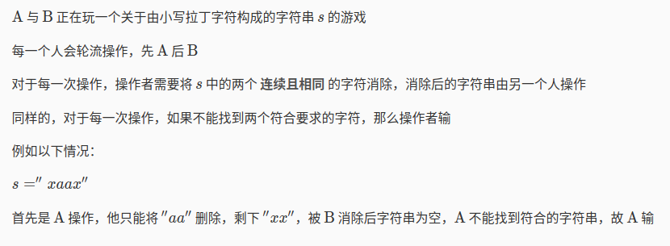
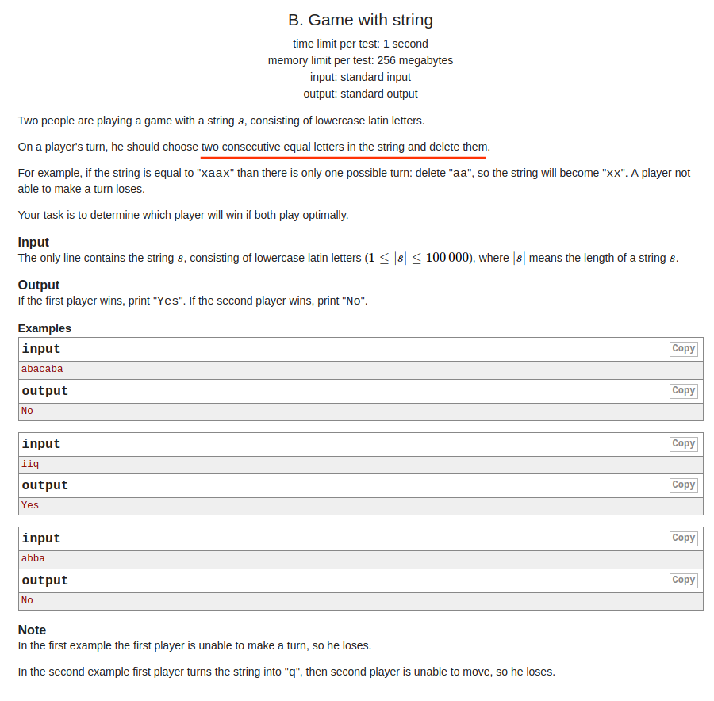
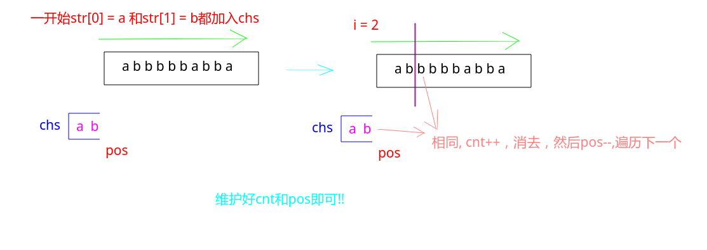

## Codeforces - 1104B. Game with string(思维|模拟)

#### [题目链接](https://codeforces.com/problemset/problem/1104/B)

> https://codeforces.com/problemset/problem/1104/B


#### 题目






#### 解析

直接用字符串模拟(利用`substring`截取)会超时，要灵活运用下标的变化来模拟:

* 可以用一个`cnt`变量累计消去的回合，如果消去奇数回合，`A`赢，否则`B`赢；

* 利用一个`chs`数组和`pos`下标，`chs[pos-1]`是`chs`数组的最后一个元素；
* 每次检查`str.charAt(i) == chs[pos-1]`，如果`true`，就说明可以消去(当前玩家这回合不会输)；
* 然后当不相等的时候，就将`str.charAt(i)`放入`chs`数组，并累加`pos`即可；




```java
import java.io.*;
import java.util.*;

public class Main {

    public static void main(String[] args){
        Scanner in = new Scanner(new BufferedInputStream(System.in));
        PrintStream out = System.out;
        String str = in.next();
        char[] chs = new char[str.length()];
        int cnt = 0, pos = 0; 
        for(int i = 0; i < str.length(); i++){ 
            char c = str.charAt(i);
            if(pos == 0)
                chs[pos++] = c;
            else { 
                if(c == chs[pos - 1]){ 
                    cnt++;
                    pos--;
                }else { 
                    chs[pos++] = c;
                }
            }
        }
        out.println( cnt % 2 == 0 ? "NO" : "YES");
    }
}

```


**超时代码：**

```java
import java.io.*;
import java.util.*;

public class Main {

    public static void main(String[] args){
        Scanner in = new Scanner(new BufferedInputStream(System.in));
        PrintStream out = System.out;
        String str = in.next();

        boolean first = true;
        while(str != ""){
            boolean ok = false;
            for(int i = 1; i < str.length(); i++){
                if(str.charAt(i) == str.charAt(i-1)){
                    ok = true;
                    str = str.substring(0, i-1) + str.substring(i+1);
                    break;
                }
            }
            if(!ok && !first){
                out.println("YES");
                break;
            }
            if(!ok && first){
                out.println("NO");
                break;
            }
            first = !first;
        }
    }
}
```

