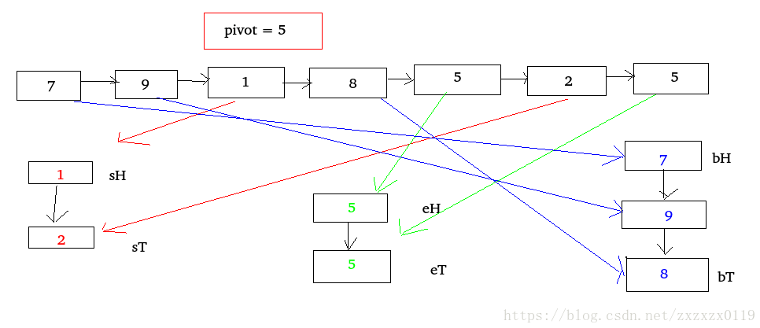

## 将单链表按某值划分成左边小，中间相等，右边大的形式

 - 普通方法，将链表节点放到数组然后partition
 - 进阶方法，将链表划分成三个子链表，然后合并
***
### 普通方法，将链表节点放到数组然后partition

*  这个方法比较简单，直接将链表中的值保存到一个数组中，然后按照荷兰国旗的划分方式，将数组划分成左边小于那个数，中间等于那个数，右边大于那个数的形式，(荷兰国旗问题用于[**快速排序**](https://blog.csdn.net/zxzxzx0119/article/details/79826380#t8)中的`partition`过程)；

* 划分完之后，再把数组中的值用链表的形式连接起来。　但是这个方法需要额外的`O(n)`的空间复杂度，而且`partition`不能达到稳定性(就是会改变原来的相对顺序)；

```java
    static class Node {
        public int value;
        public Node next;

        public Node(int value) {
            this.value = value;
        }
    }

    //普通的需要额外空间O(n)且不能达到稳定性的　方法
    static Node partitionList_1(Node head, int pivot) { //pivot表示　枢轴；中心点；旋转运动
        if (head == null) return null;
        Node cur = head;
        int len = 0;
        while (cur != null) {
            len++;
            cur = cur.next;
        }
        Node[] nodeArr = new Node[len];
        cur = head;
        for (int i = 0; i < nodeArr.length; i++) {
            nodeArr[i] = cur;
            cur = cur.next;
        }
        arrPartition(nodeArr, pivot);
        for (int i = 1; i < nodeArr.length; i++) {
            nodeArr[i - 1].next = nodeArr[i];
        }
        nodeArr[nodeArr.length - 1].next = null;  //一定要记得把最后一个指针指向null
        return nodeArr[0];
    }

    //数组划分的paration
    static void arrPartition(Node[] nodeArr, int pivot) {
        int less = -1;
        int more = nodeArr.length;
        int cur = 0;
        while (cur < more) {
            if (nodeArr[cur].value < pivot) {
                swap(nodeArr, ++less, cur++);
            } else if (nodeArr[cur].value > pivot) {
                swap(nodeArr, --more, cur); //注意放到大于区域的时候cur不能++
            } else {
                cur++;
            }
        }
    }

    //交换两个结点
    static void swap(Node[] arrNode, int a, int b) {
        Node temp = arrNode[a];
        arrNode[a] = arrNode[b];
        arrNode[b] = temp;
    }
```
***
### 进阶方法，将链表划分成三个子链表，然后合并

* 这个方法是将原来的链表依次划分成三个链表，三个链表分别为`small`代表的是左边小于的部分，`equal`代表的是中间相等的部分，`big`代表的是右边的大于部分；
 * 这三个链表都有自己的两个指针`Head`和`Tail`分别代表各自的头部和尾部，分成三个子链表之后，我们只需要遍历链表，然后和给定的值比较，按照条件，向三个链表中添加值就可以了，最后把三个链表连接起来就可以了；

但是，这个题目要注意一些边界条件。具体看下图: 



代码如下

```java
    //第二种　进阶的方法　不需要额外的空间复杂度，且能达到稳定性
    static Node partitionList_2(Node head,int piovt){
        if(head == null)return null;
        Node sH = null,sT = null; //小于部分链表的  head 和tail
        Node eH = null,eT = null; //等于部分链表的　head 和tail
        Node bH = null,bT = null; //大于部分链表的　head 和tail

        Node next = null;  //用来保存下一个结点

        //划分到　三个不同的链表
        while(head != null){
            next = head.next;
            head.next = null; //这个是为了链表拼接后　最后一个就不用再去赋值其next域为null 了
            if(head.value < piovt){  //向　small 部分　分布
                if(sH == null){ //small部分的第一个结点
                    sH = head;
                    sT = head;
                }else {
                    sT.next = head; //把head放到small最后一个
                    sT = head;  //更新small部分的sT
                }
            }else if(head.value == piovt){
                if(eH == null){
                    eH = head;
                    eT = head;
                }else{
                    eT.next = head;
                    eT = head;
                }
            }else {
                if(bH == null){
                    bH = head;
                    bT = head;
                }else {
                    bT.next = head;
                    bT = head;
                }
            }
            head = next;
        }

        //将三个链表合并(注意边界的判断)

        if(null != sT) { //合并small和equal部分
            sT.next = eH;
            eT = eT == null ? sT : eT;
        }
        if(null != eT){
            eT.next = bH;
        }

        return sH != null ? sH : eH != null ? eH : bH;
    }
```
最后贴上测试完整代码

```java
/**
 * 将一个链表划分成　左边小于num,中间等于num,右边大于num
 * 方法1 : 先将链表存到一个数组中，然后使用　　和　荷兰国旗问题相同的方法进行　划分，然后再重新连成一个链表即可(缺点: 额外的空间复杂度和不能做到稳定性)
 * 方法2 : 使用有限的变量，small equal big 划分成三个链表，这三个链表都分别有自己的头部和尾部，每次一只需要往对应的链表加上相应的数即可
 */

public class SmallerEqualBigger {

    static class Node{
        public int value;
        public Node next;

        public Node(int value) {
            this.value = value;
        }
    }

    //普通的需要额外空间O(n)且不能达到稳定性的　方法
    static Node partitionList_1(Node head,int pivot){ //pivot表示　枢轴；中心点；旋转运动
        if(head == null) return null;
        Node cur = head;
        int len = 0;
        while(cur != null){
            len++;
            cur = cur.next;
        }
        Node[] nodeArr = new Node[len];
        cur = head;
        for(int i = 0; i < nodeArr.length; i++){
            nodeArr[i] = cur;
            cur = cur.next;
        }
        arrPartition(nodeArr,pivot);
        for(int i = 1; i < nodeArr.length; i++){
            nodeArr[i-1].next = nodeArr[i];
        }
        nodeArr[nodeArr.length-1].next = null;  //一定要记得把最后一个指针指向null
        return nodeArr[0];
    }

    //数组划分的paration
    static void arrPartition(Node[] nodeArr, int pivot) {
        int less = -1;
        int more = nodeArr.length;
        int cur = 0;
        while(cur < more){
            if(nodeArr[cur].value < pivot){
                swap(nodeArr,++less,cur++);
            }else if(nodeArr[cur].value > pivot){
                swap(nodeArr,--more,cur); //注意放到大于区域的时候cur不能++
            }else {
                cur++;
            }
        }
    }

    //交换两个结点
    static void swap(Node[] arrNode,int a,int b){
        Node temp = arrNode[a];
        arrNode[a] = arrNode[b];
        arrNode[b] = temp;
    }


    //第二种　进阶的方法　不需要额外的空间复杂度，且能达到稳定性
    static Node partitionList_2(Node head,int piovt){
        if(head == null)return null;
        Node sH = null,sT = null; //小于部分链表的  head 和tail
        Node eH = null,eT = null; //等于部分链表的　head 和tail
        Node bH = null,bT = null; //大于部分链表的　head 和tail

        Node next = null;  //用来保存下一个结点

        //划分到　三个不同的链表
        while(head != null){
            next = head.next;
            head.next = null; //这个是为了链表拼接后　最后一个就不用再去赋值其next域为null 了
            if(head.value < piovt){  //向　small 部分　分布
                if(sH == null){ //small部分的第一个结点
                    sH = head;
                    sT = head;
                }else {
                    sT.next = head; //把head放到small最后一个
                    sT = head;  //更新small部分的sT
                }
            }else if(head.value == piovt){
                if(eH == null){
                    eH = head;
                    eT = head;
                }else{
                    eT.next = head;
                    eT = head;
                }
            }else {
                if(bH == null){
                    bH = head;
                    bT = head;
                }else {
                    bT.next = head;
                    bT = head;
                }
            }
            head = next;
        }

        //将三个链表合并(注意边界的判断)

        if(null != sT) { //合并small和equal部分
            sT.next = eH;
            eT = eT == null ? sT : eT;
        }
        if(null != eT){
            eT.next = bH;
        }

        return sH != null ? sH : eH != null ? eH : bH;
    }

    static void printList(Node node){
        while(node != null){
            System.out.print(node.value + " ");
            node = node.next;
        }
        System.out.println();
    }

    public static void main(String[] args) {
        System.out.println("----------测试第一种方法----------");
        Node head = new Node(9);
        head.next = new Node(0);
        head.next.next = new Node(4);
        head.next.next.next = new Node(5);
        head.next.next.next.next = new Node(1);
        printList(head);
        head = partitionList_1(head,3);
        printList(head);


        System.out.println("----------测试第二种方法----------");
        Node head2 = new Node(9);
        head2.next = new Node(0);
        head2.next.next = new Node(4);
        head2.next.next.next = new Node(5);
        head2.next.next.next.next = new Node(1);
        printList(head2);
        head2 = partitionList_2(head2,3);
        printList(head2);
    }
}
```
测试结果


