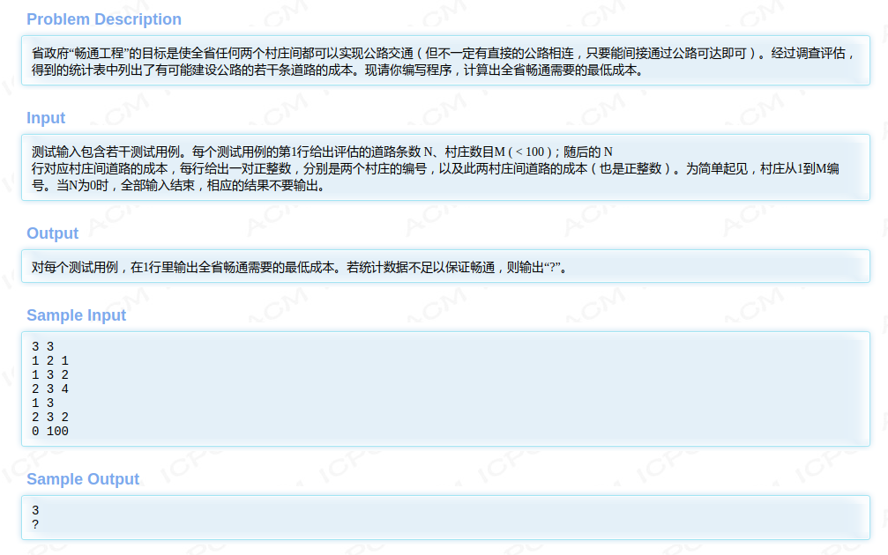
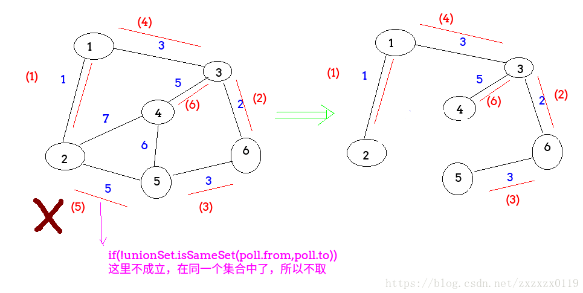
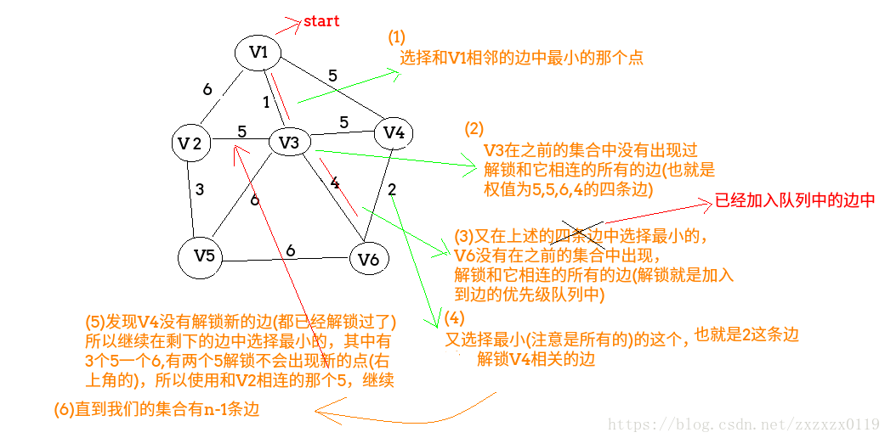

## Hdu - 1863. 畅通工程(最小生成树模板题)(Kruskal算法和Prim算法实现)

 - `Kruskal`算法思想及流程
 - `Prim`算法思想及流程: 

#### [题目链接](http://acm.hdu.edu.cn/showproblem.php?pid=1863)

> http://acm.hdu.edu.cn/showproblem.php?pid=1863

#### 题目



#### 题意
 就是一个求最小生成树的模板题(<font color = blue>一般是无向图</font>)。

***
### `Kruskal`算法思想及流程 

 - 首先各个顶点看成一个集合，每个顶点的根就是自己；
 - 从整个图中边的集合中取出**最小**的一条(一开始对边的集合排序)，判断该边的两个定点是不是同一个集合，如果不是，**合并两个集合；**
 - 如果是同一个集合，舍弃，继续取下一条边；
 - 直到集合中有`n - 1`条边为止；

**时间复杂度为为<font color =red>O(e<sup>2</sup>)</font>, 使用并查集优化后复杂度为 <font color = red>O（eloge）</font>，与网中的边数有关，适用于求边稀疏的网的最小生成树**



**推荐写法** 

* 建图和上面稍有不同，`kruskal`的特性只需要用到`Edge`这个类即可，对边集排序然后不断合并两个顶点即可；
* 这里并查集使用的数组，和上面有点不同，但是原理都是一样的；
```java
import java.io.BufferedInputStream;
import java.util.*;

public class Main {

    static int n;
    static int m;
    static ArrayList<Edge> edges;

    static class Edge implements Comparable<Edge> {
        public int from;
        public int to;
        public int w;

        public Edge(int from, int to, int w) {
            this.from = from;
            this.to = to;
            this.w = w;
        }

        @Override
        public int compareTo(Edge o) {
            return w - o.w;
        }
    }

    static class UnionSet {

        private int[] parent;
        private int[] rank;

        public UnionSet(int n) {
            parent = new int[n + 1];
            rank = new int[n + 1];
            for (int i = 0; i <= n; i++) {
                parent[i] = i;
                rank[i] = 0;
            }
        }

        public boolean isSameSet(int x, int y) {
            return find(x) == find(y);
        }

        public int find(int v) {
            while (parent[v] != v) {
                parent[v] = parent[parent[v]];  // 路径压缩优化
                v = parent[v];
            }
            return v;
        }

        public void union(int a, int b) {
            int aRoot = find(a);
            int bRoot = find(b);
            if (aRoot == bRoot)
                return;
            if (rank[aRoot] < rank[bRoot]) { // a更矮,所以挂到b更好
                parent[aRoot] = bRoot;
            } else if (rank[aRoot] > rank[bRoot]) {
                parent[bRoot] = aRoot;
            } else {
                parent[aRoot] = bRoot;
                rank[bRoot]++;
            }
        }
    }

    static int kruskal() {
        Collections.sort(edges);  // 对边集排序
        UnionSet uset = new UnionSet(n);
        int res = 0;
        int count = 0;
        for (int i = 0; i < edges.size(); i++) {
            int from = edges.get(i).from;
            int to = edges.get(i).to;
            int w = edges.get(i).w;
            if (!uset.isSameSet(from, to)) { //两个顶点不属于同一个集合
                res += w;
                count++;
                if (count == n - 1)
                    break;
                uset.union(from, to);
            }

        }
        return count == n - 1 ? res : -1;
    }

    public static void main(String[] args) {
        Scanner cin = new Scanner(new BufferedInputStream(System.in));
        while (cin.hasNext()) {
            m = cin.nextInt(); // 先输入道路条数
            n = cin.nextInt();
            if (m == 0)
                break;
            edges = new ArrayList<>();
            for (int i = 0; i < m; i++) {
                int from = cin.nextInt();
                int to = cin.nextInt();
                int w = cin.nextInt();
                edges.add(new Edge(from, to, w));
                edges.add(new Edge(to, from, w));
            }
            int res = kruskal();
            System.out.println(res == -1 ? "?" : res);
        }
    }
}
```
其他写法。
```java
import java.io.BufferedInputStream;
import java.util.*;

public class Main { //提交时改成Main

    static class Node {
        public int value;
        ArrayList<Node> nexts;

        public Node(int value) {
            this.value = value;
            nexts = new ArrayList<Node>();
        }
    }

    static class Edge {
        public int weight;
        public Node from;
        public Node to;

        public Edge(Node from, Node to, int weight) {
            this.from = from;
            this.to = to;
            this.weight = weight;
        }
    }

    static class Graph {
        public HashMap<Integer, Node> nodes;
        public HashSet<Edge> edges;

        public Graph() {
            nodes = new HashMap<>();
            edges = new HashSet<>();
        }
    }

    //并查集结构
    static class UnionSet {
        public HashMap<Node, Node> faMap;
        public HashMap<Node, Integer> sizeMap;

        public UnionSet() {
            faMap = new HashMap<>();
            sizeMap = new HashMap<>();
        }

        //初始化
        public void init(Collection<Node> nodes) {
            faMap.clear();
            sizeMap.clear();
            for (Node node : nodes) {
                faMap.put(node, node);
                sizeMap.put(node, 1);
            }
        }

        public Node findHead(Node v) {
            Node fa = faMap.get(v);
            if (fa != v) {
                fa = findHead(fa);
            }
            faMap.put(v, fa); //v的父改为根(沿途所有的)
            return fa;
        }

        public boolean isSameSet(Node a, Node b) {
            return findHead(a) == findHead(b);
        }

        public void union(Node a, Node b) {
            if (a == null || b == null) return;
            Node aF = findHead(a);
            Node bF = findHead(b);
            if (aF == bF) return;
            int aSize = sizeMap.get(a);
            int bSize = sizeMap.get(b);
            if (aSize >= bSize) {
                faMap.put(bF, aF); //把bF挂到aF下面
                sizeMap.put(aF, aSize + bSize);
            } else {
                faMap.put(aF, bF); //把aF挂到bF下面
                sizeMap.put(bF, aSize + bSize);
            }
        }
    }

    //在优先级队列中按照边的权值升序排列
    static class EdgeComparator implements Comparator<Edge> {
        @Override
        public int compare(Edge o1, Edge o2) { //按照边的权重升序排列
            return o1.weight - o2.weight;
        }
    }

    static Set<Edge> kruskal(Graph graph) {
        UnionSet unionSet = new UnionSet();
        unionSet.init(graph.nodes.values()); //初始化
        PriorityQueue<Edge> priorityQueue = new PriorityQueue<Edge>(new EdgeComparator());
        for (Edge edge : graph.edges) {
            priorityQueue.add(edge);
        }
        HashSet<Edge> set = new HashSet<Edge>();  //保存这n-1条边
        int cnt = 0;
        while (!priorityQueue.isEmpty()) {
            Edge poll = priorityQueue.poll();
            if (!unionSet.isSameSet(poll.from, poll.to)) {
                set.add(poll);
                cnt++;
                unionSet.union(poll.from, poll.to);
            }
            if (cnt == graph.nodes.size() - 1) break;
        }
        return set;
    }

    public static void main(String[] args) {
        Scanner cin = new Scanner(new BufferedInputStream(System.in));
        while (cin.hasNext()) {
            int m = cin.nextInt();
            int n = cin.nextInt();
            if (m == 0) break;
            Graph G = new Graph();
            for (int i = 1; i <= n; i++) G.nodes.put(i, new Node(i));
            for (int i = 0; i < m; i++) {
                int from = cin.nextInt();
                int to = cin.nextInt();
                int w = cin.nextInt();
                G.edges.add(new Edge(G.nodes.get(from), G.nodes.get(to), w));
            }
            Set<Edge> set = kruskal(G);
            if (set.size() != n - 1) { //没有n-1条边  不足以保持畅通
                System.out.println("?");

            } else {
                int sum = 0;
                for (Edge edge : set) {
                    sum += edge.weight;
                }
                System.out.println(sum);
            }
        }
    }
}
```


***
### `Prim`算法思想及流程: 

 - 一开始也有一个集合，和`Kruskal`算法不同的是，这个不是慢慢的合并(通过并查集)变大，而是一个一个的添加结点；
 - 一开始选择一个起点，有一个<font color =  red>优先队列</font>存放边的集合，**把这个结点相连的边加入优先队列**；
 - 然后选择一条相连的且**权值最小**的边，**并判断这条边的终点是否已经加入过点的集合(<font color = red>准确的来说是看这两个点相连的边是否已经加入过集合(但是这里是用两个端点都是否进过`vis`数组替代)</font>)，如果没有，就加入，并且把这条边加入到结果集，并且解锁和它相连的边(解锁就是把边加入到优先队列)**
 - 如果出现过，<font color = blue>继续从优先队列中拿出最小的边判断</font>；
 - 直到结果集达到`n-1`条边，或者图不连通；



**推荐写法**

```java
import java.io.BufferedInputStream;
import java.util.*;

public class Main {

    static int n;
    static int m;
    static boolean[] vis;
    static ArrayList<Edge>[] G;


    static class Edge implements Comparable<Edge> {
        public int to;
        public int w;

        public Edge(int to, int w) {
            this.to = to;
            this.w = w;
        }

        @Override
        public int compareTo(Edge o) {
            return w - o.w;
        }
    }

    private static int prim(int start) {
        PriorityQueue<Edge> pq = new PriorityQueue<>();
        for (int i = 0; i < G[start].size(); i++)
            pq.add(G[start].get(i));
        int count = 0;
        int res = 0;
        vis[start] = true; // 起始节点已经在集合中
        while (!pq.isEmpty()) {
            Edge curEdge = pq.poll();
            int to = curEdge.to;
            if (!vis[to]) {
                vis[to] = true;
                count++;
                res += curEdge.w;
                if (count == n - 1)
                    break;
                for (int i = 0; i < G[to].size(); i++) {
                    int nxtNode = G[to].get(i).to;
                    if (!vis[nxtNode]) // to -> nxtNode 没有加入过
                        pq.add(G[to].get(i)); // 将to-> nxtNode的边加入优先队列
                }
            }
        }
        if (count != n - 1)
            return -1;
        return res;
    }

    public static void main(String[] args) {
        Scanner cin = new Scanner(new BufferedInputStream(System.in));
        while (cin.hasNext()) {
            m = cin.nextInt(); // 先输入道路条数
            n = cin.nextInt();
            if (m == 0)
                break;
            G = new ArrayList[n + 1];  // 1~n
            vis = new boolean[n + 1];
            for (int i = 0; i <= n; i++) {
                G[i] = new ArrayList<>();
            }
            for (int i = 0; i < m; i++) {
                int from = cin.nextInt();
                int to = cin.nextInt();
                int w = cin.nextInt();
                G[from].add(new Edge(to, w));
                G[to].add(new Edge(from, w));
            }
            int res = prim(1);
            System.out.println(res == -1 ? "?" : res);
        }
    }
}

```
其他写法。
```java
import java.io.BufferedInputStream;
import java.util.*;

public class Main {
    static class Node {
        public int value;
        ArrayList<Edge> edges; //以这个点作为起点出发的边

        public Node(int value) {
            this.value = value;
            edges = new ArrayList<>();
        }
    }

    static class Edge {
        public int weight;
        public Node from;
        public Node to;

        public Edge(Node from, Node to, int weight) {
            this.from = from;
            this.to = to;
            this.weight = weight;
        }
    }

    static class Graph {
        public HashMap<Integer, Node> nodes;
        public HashSet<Edge> edges;

        public Graph() {
            nodes = new HashMap<>();
            edges = new HashSet<>();
        }
    }

    static class EdgeComparator implements Comparator<Edge> {
        @Override
        public int compare(Edge o1, Edge o2) { //按照边的权重升序排列
            return o1.weight - o2.weight;
        }
    }

    static Set<Edge> prim(Graph graph) {
        PriorityQueue<Edge> priorityQueue = new PriorityQueue<>(new EdgeComparator());
        HashSet<Edge> res = new HashSet<>();
        HashSet<Node> set = new HashSet<>();
        Node start = graph.nodes.get(1); //从第一个点开始
        set.add(start);
        for (Edge edge : start.edges) {
            priorityQueue.add(edge);
        }
        while (!priorityQueue.isEmpty()) {
            Edge poll = priorityQueue.poll();
            Node toNode = poll.to;   //这条边的to点
            if (!set.contains(toNode)) {
                set.add(toNode);
                res.add(poll);    //注意这个不能放在if的上面
                if (res.size() == graph.nodes.size() - 1) break;
                for (Edge nextEdge : toNode.edges) {
                    priorityQueue.add(nextEdge);
                }
            }
        }
        return res;
    }

    static Graph createGraph(Scanner in, int n, int m) {
        Graph G = new Graph();
        for (int i = 1; i <= n; i++) G.nodes.put(i, new Node(i));
        for (int i = 0; i < m; i++) {
            int a = in.nextInt();
            int b = in.nextInt();
            int w = in.nextInt();
            Node from = G.nodes.get(a);
            Node to = G.nodes.get(b);
            Edge newEdge = new Edge(from, to, w);
            G.edges.add(newEdge);
            from.edges.add(newEdge);  //记得添加这条边
        }
        return G;
    }

    public static void main(String[] args) {
        Scanner in = new Scanner(new BufferedInputStream(System.in));
        while (in.hasNext()) {
            int m = in.nextInt();
            int n = in.nextInt();
            if (m == 0) break;
            Graph G = createGraph(in, n, m);
            Set<Edge> set = prim(G);
            if (set.size() != n - 1) { //没有n-1条边  不足以保持畅通
                System.out.println("?");

            } else {
                int sum = 0;
                for (Edge edge : set) {
                    sum += edge.weight;
                }
                System.out.println(sum);
            }
        }
    }
}
```

***
