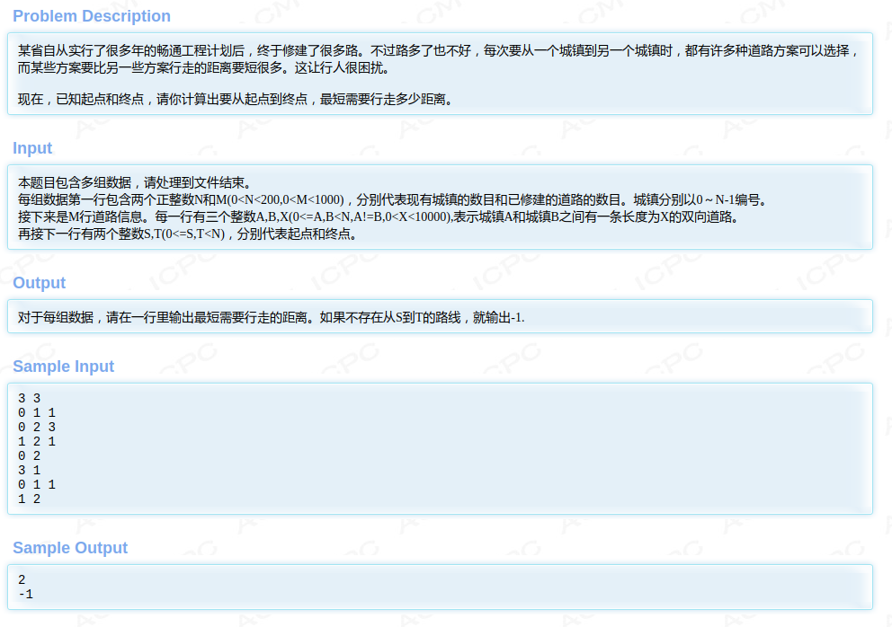
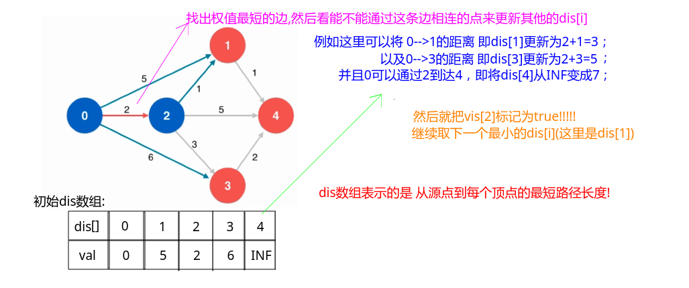

## Hdu - 1874. 畅通工程续(最短路dijkstra模板)

 - `dijkstra`算法总结
 - 常用模板解决
 - 其他写法

***
#### [题目链接](http://acm.hdu.edu.cn/showproblem.php?pid=1874)

> http://acm.hdu.edu.cn/showproblem.php?pid=1874

#### 题目



### `dijkstra`算法总结
总结一下`dijkstra`算法大致的流程: 

 - 一开始有一个`dist[]`数组(也可以是`map`)来保存从`start`(起点)到每个点的最短路径(一开始的话，如果`start`和某个点没有边，就为`INF`(或者为`null`)，如果有连线的话就是边的权值)；
 - 然后每次从`dist`数组中取出一个`dist[i]`最小的`i`(不能取已经用过的顶点(`vis`数组标记))，也就是**start距离某个结点**最近的一个；
 - 取出这个结点之后，用这个结点更新和**它相连的边的`dist`数组**；
 - 直到把所有的`dist`数组都更新一遍；



> 注意: <font color = red>`dijkstra`为什么不能有负权边? 因为如果有的话，我们找最小的那个结构的时候，没准它还能通过松弛变得更短，例如上面我们一开始选出`0~2`这条边的时候，试想如果`2~1`的那条边权值为`-4`，那一开始我们找的`0~2`这条边就是错的，所以不能有负权边。</font>
***
###  常用模板解决
**推荐的写法**
```java
import java.io.BufferedInputStream;
import java.util.*;

public class Main {

    static int n;
    static int m;
    static boolean[] vis;
    static ArrayList<Edge> G[];


    static class Edge implements Comparable<Edge> {
        public int to;
        public int w;

        public Edge(int to, int w) {
            this.to = to;
            this.w = w;
        }

        @Override
        public int compareTo(Edge o) {
            return w - o.w;
        }
    }

    static int[] dijkstra(int start) {
        PriorityQueue<Edge> pq = new PriorityQueue<>();
        int[] dis = new int[n];
        for (int i = 0; i < n; i++) dis[i] = Integer.MAX_VALUE; //初始标记（不是-1(因为是求最小的)）
        dis[start] = 0;
//        G.vis[start] = true;  //第一个访问 start, 不能将start标记为true
        pq.add(new Edge(start, 0)); //将第一条边加入 pq, 自环边
        while (!pq.isEmpty()) {
            Edge curEdge = pq.poll();
            int to = curEdge.to;
            if (vis[to])
                continue;
            vis[to] = true;
            for (int i = 0; i < G[to].size(); i++) { //更新相邻的边
                int nxtNode = G[to].get(i).to;
                int nxtW = G[to].get(i).w;
                if (!vis[nxtNode] && dis[nxtNode] > dis[to] + nxtW) {
                    dis[nxtNode] = dis[to] + nxtW;
                    pq.add(new Edge(nxtNode, dis[nxtNode])); //将这个新的dis[nxtNode]加入优先队列，没准它是下一个(很小)
                }
            }
        }
        return dis;
    }

    public static void main(String[] args) {
        Scanner cin = new Scanner(new BufferedInputStream(System.in));
        while (cin.hasNext()) {
            n = cin.nextInt();
            m = cin.nextInt();
            G = new ArrayList[n]; // 0~n-1
            vis = new boolean[n];
            for (int i = 0; i < n; i++) {
                G[i] = new ArrayList<>();
                vis[i] = false;
            }
            for (int i = 0; i < m; i++) {
                int from = cin.nextInt();
                int to = cin.nextInt();
                int w = cin.nextInt();
                G[from].add(new Edge(to, w));
                G[to].add(new Edge(from, w));
            }
            int s = cin.nextInt();
            int e = cin.nextInt();
            int[] dis = dijkstra(s);
            System.out.println(dis[e] == Integer.MAX_VALUE ? -1 : dis[e]);
        }
    }
}
```
### 其他写法
没有使用堆优化，也就是说找出当前最小的`dist`所在的结构的时候，遍历了一遍当前的`dist`。
```java
import java.io.BufferedInputStream;
import java.util.ArrayList;
import java.util.HashMap;
import java.util.HashSet;
import java.util.Map.Entry;
import java.util.Scanner;

public class Main {

    private static class Node{
        public int value;
        public ArrayList<Edge>edges;

        public Node(int value) {
            this.value = value;
            edges = new ArrayList<>();
        }
    }

    private static class Edge{
        public int weight;
        public Node from;
        public Node to;

        public Edge( Node from, Node to,int weight) {
            this.from = from;
            this.to = to;
            this.weight = weight;
        }
    }

    private static class Graph{
        public HashMap<Integer,Node>nodes;

        public Graph() {
            nodes = new HashMap<>();
        }
    }

    //没有使用堆优化的 O(n^2)
    public static HashMap<Node,Integer> dijkstra(Node head){
        HashMap<Node,Integer>dist = new HashMap<>();
        dist.put(head,0);
        for(Edge edge : head.edges){
            dist.put(edge.to,edge.weight);
        }

        HashSet<Node>set = new HashSet<>();
        for(Node minNode = getMinAndUnSelect(dist,set); minNode != null ; minNode = getMinAndUnSelect(dist,set)){
            int distance = dist.get(minNode);
            for(Edge edge : minNode.edges){
                Node toNode = edge.to;
                if(set.contains(toNode))continue;
                if(!dist.containsKey(toNode)){
                    dist.put(toNode,distance + edge.weight);
                }
                dist.put(toNode,Math.min(dist.get(toNode),distance + edge.weight));
            }
            set.add(minNode); //使用过这个之后就标记
        }
        return dist;
    }

    //找出dist中最小且没有选择的结点
    private static Node getMinAndUnSelect(HashMap<Node, Integer> dist, HashSet<Node> set) {
        Node minNode = null;
        int minDistance = Integer.MAX_VALUE;
        for(Entry<Node,Integer> entry : dist.entrySet()){ // map遍历方式 https://www.cnblogs.com/fqfanqi/p/6187085.html
            Node node = entry.getKey();
            int distance = entry.getValue();
            if(!set.contains(node) && distance < minDistance){
                minDistance = distance;
                minNode = node;
            }
        }
        return minNode;
    }

    public static void main(String[] args) {
        Scanner cin = new Scanner(new BufferedInputStream(System.in));
        while(cin.hasNext()){
            int n = cin.nextInt();
            int m = cin.nextInt();
            Graph G = new Graph();
            for(int i = 0; i < n; i++)G.nodes.put(i,new Node(i));
            for(int i = 0; i < m; i++){
                int a = cin.nextInt();
                int b = cin.nextInt();
                int w = cin.nextInt();
                Node from = G.nodes.get(a);
                Node to = G.nodes.get(b);
                from.edges.add(new Edge(from,to,w));
                to.edges.add(new Edge(to,from,w));
            }
            int start = cin.nextInt();
            int end = cin.nextInt();
            HashMap<Node, Integer> dist = dijkstra(G.nodes.get(start));//从start开始
            Integer res = dist.get(G.nodes.get(end));
            System.out.println((res == null) ? -1 : res);
        }
    }
}
```
***

堆优化，其他写法(建图稍有不同): 
```java
import java.io.BufferedInputStream;
import java.util.*;
import java.util.Map.Entry;

public class Main {

    static class Node{
        public int value;
        public ArrayList<Edge>edges;

        public Node(int value) {
            this.value = value;
            edges = new ArrayList<>();
        }
    }

    static class Edge{
        public int weight;
        public Node from;
        public Node to;

        public Edge( Node from, Node to,int weight) {
            this.from = from;
            this.to = to;
            this.weight = weight;
        }
    }

    static class Graph{
        public HashMap<Integer,Node>nodes;

        public Graph() {
            nodes = new HashMap<>();
        }
    }

    static class NodeRecord {
        public Node node;
        public int distance;

        public NodeRecord(Node node, int distance) {
            this.node = node;
            this.distance = distance;
        }
    }

    static class EdgeComparator implements Comparator<NodeRecord>{

        @Override
        public int compare(NodeRecord o1, NodeRecord o2) {
            return o1.distance - o2.distance;
        }
    }

    static HashMap<Node, Integer> dijkstra(Node head){
        HashMap<Node,Integer>dist = new HashMap<>();
        dist.put(head,0);
        for(Edge edge : head.edges){//这个不能少
            dist.put(edge.to,edge.weight);
        }
        PriorityQueue<NodeRecord>priorityQueue = new PriorityQueue<>(new EdgeComparator());
        priorityQueue.add(new NodeRecord(head,0));
        HashSet<Node>set = new HashSet<>();
        while(!priorityQueue.isEmpty()){
            NodeRecord poll = priorityQueue.poll();
            Node cur = poll.node;
            int distance = poll.distance;
            if(set.contains(cur))continue;
            set.add(cur);
            for(Edge edge : cur.edges){
                int w = edge.weight;
                Node toNode = edge.to;
                if(set.contains(toNode))continue;
                if(!dist.containsKey(toNode))dist.put(toNode,distance + w);
                dist.put(toNode,Math.min(dist.get(toNode),distance + w));
                priorityQueue.add(new NodeRecord(toNode,dist.get(toNode)));
            }
        }
        return dist;
    }


    public static void main(String[] args) {
        Scanner cin = new Scanner(new BufferedInputStream(System.in));
        while(cin.hasNext()){
            int n = cin.nextInt();
            int m = cin.nextInt();
            Graph G = new Graph();
            for(int i = 0; i < n; i++)G.nodes.put(i,new Node(i));
            for(int i = 0; i < m; i++){
                int a = cin.nextInt();
                int b = cin.nextInt();
                int w = cin.nextInt();
                Node from = G.nodes.get(a);
                Node to = G.nodes.get(b);
                from.edges.add(new Edge(from,to,w));
                to.edges.add(new Edge(to,from,w)); //注意无向图
            }
            int start = cin.nextInt();
            int end = cin.nextInt();
            HashMap<Node, Integer> dist = dijkstra(G.nodes.get(start));//从start开始
            Integer res = dist.get(G.nodes.get(end));
            System.out.println((res == null) ? -1 : res);
        }
    }
}
```
***
手写堆解决写法。

```java
import java.io.BufferedInputStream;
import java.util.*;

public class Main {
    static class Node{
        public int value;
        public ArrayList<Edge> edges;

        public Node(int value) {
            this.value = value;
            edges = new ArrayList<>();
        }
    }

    static class Edge{
        public int weight;
        public Node from;
        public Node to;

        public Edge( Node from, Node to,int weight) {
            this.from = from;
            this.to = to;
            this.weight = weight;
        }
    }

    static class Graph{
        public HashMap<Integer,Node> nodes;

        public Graph() {
            nodes = new HashMap<>();
        }
    }

    static class NodeRecord {
        public Node node;
        public int distance;

        public NodeRecord(Node node, int distance) {
            this.node = node;
            this.distance = distance;
        }
    }

    static class NodeHeap {
        private Node[] nodes;
        private HashMap<Node, Integer> indexMap;//堆的下标
        private HashMap<Node, Integer> distMap; //堆里面Node对应的distance
        private int size;

        public NodeHeap(int size) {
            nodes = new Node[size];
            indexMap = new HashMap<>();
            distMap = new HashMap<>();
            this.size = 0;
        }

        public boolean isEmpty() {//堆是否为空
            return size == 0;
        }

        public void addOrUpdateOrIgnore(Node node, int distance) {
            //如果在堆中已经有了这个结点，就要更新   -1表示的是被访问过了
            if (indexMap.containsKey(node) && indexMap.get(node) != -1) { //update contain and index != -1
                distMap.put(node, Math.min(distMap.get(node), distance));
                insertHeapify(node, indexMap.get(node));
            }

            //如果 堆中没有这个结点 就创建一个
            if (!indexMap.containsKey(node)) {//if isEntered --> ignore
                nodes[size] = node;
                indexMap.put(node, size);
                distMap.put(node, distance);
                insertHeapify(node, size++);
            }
        }

        //从堆中取一个
        public NodeRecord poll() {
            NodeRecord top = new NodeRecord(nodes[0], distMap.get(nodes[0]));//取出堆顶
            swap(0, size - 1); //和最后一个交换
            indexMap.put(nodes[size - 1], -1); //标记已经用过，相当于　Hashset作用
            distMap.remove(nodes[size - 1]);  //距离数组中李处
            nodes[size - 1] = null;  //结点数组中设置为null
            heapify(0, --size);
            return top;
        }

        private void insertHeapify(Node node, int index) { //插入并调整
            while (distMap.get(nodes[index]) < distMap.get(nodes[(index - 1) / 2])) {
                swap(index, (index - 1) / 2);
                index = (index - 1) / 2;
            }
        }

        private void heapify(int index, int size) {
            int left = index * 2 + 1;
            while (left < size) {
                int minIndex = left + 1 < size && distMap.get(nodes[left + 1]) < distMap.get(nodes[left])
                        ? left + 1 : left;
                minIndex = distMap.get(nodes[minIndex]) < distMap.get(nodes[index]) ? minIndex : index;
                if (minIndex == index) break;
                swap(minIndex, index);
                index = minIndex;
                left = index * 2 + 1;
            }
        }

        private void swap(int a, int b) {
            indexMap.put(nodes[a], b);//交换各自的下标
            indexMap.put(nodes[b], a);
            Node tmp = nodes[a];
            nodes[a] = nodes[b];
            nodes[b] = tmp;
        }
    }

    static HashMap<Node,Integer> dijkstra(Graph G,int start){
        NodeHeap heap = new NodeHeap(G.nodes.size());
        heap.addOrUpdateOrIgnore(G.nodes.get(start),0);
        HashMap<Node,Integer>dist = new HashMap<>();
        while(!heap.isEmpty()){
            NodeRecord poll = heap.poll();
            Node cur = poll.node;
            int distance = poll.distance;
            for(Edge edge : cur.edges){
                heap.addOrUpdateOrIgnore(edge.to, distance + edge.weight);
            }
            dist.put(cur,distance);
        }
        return dist;
    }


    static Graph createGraph(Scanner cin,int n,int m){
        Graph G = new Graph();
        for(int i = 0; i < n; i++)G.nodes.put(i,new Node(i));
        for(int i = 0; i < m; i++){
            int a = cin.nextInt();
            int b = cin.nextInt();
            int w = cin.nextInt();
            Node from = G.nodes.get(a);
            Node to = G.nodes.get(b);
            from.edges.add(new Edge(from,to,w));
            to.edges.add(new Edge(to,from,w));
        }
        return G;
    }

    public static void main(String[] args) {
        Scanner cin = new Scanner(new BufferedInputStream(System.in));
        while(cin.hasNext()){
            int n = cin.nextInt();
            int m = cin.nextInt();
            Graph G = createGraph(cin,n,m);
            int start = cin.nextInt();
            int end = cin.nextInt();
            HashMap<Node, Integer> dist = dijkstra(G,start);//从start开始
            Integer res = dist.get(G.nodes.get(end));
            System.out.println((res == null) ? -1 : res);
        }
    }
}
```
