## 矩阵相关操作和矩阵快速幂
* 矩阵基本运算以及快速幂模板
* POJ - 3070. Fibonacci
* Hdu - 1757A. Simple Math Problem
* Codeforces - 185A. Plant

***
### 矩阵基本运算以及快速幂模板
先看一下矩阵的乘法规则: 

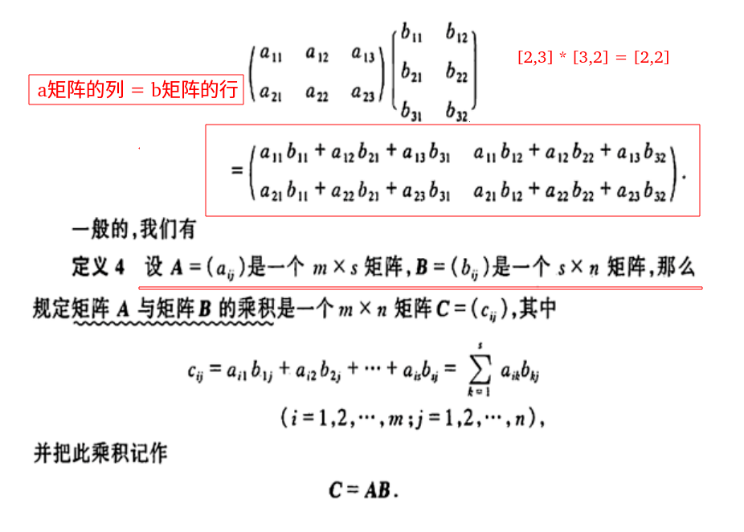

##### <font color = red>直接给出一个模板题，直接包含了基本的乘法和求幂，求幂的详细解释，可以看这篇[乘法快速幂](https://blog.csdn.net/zxzxzx0119/article/details/82816131)。</font>
#### 题目来源: XYNU OJ
#### 题目

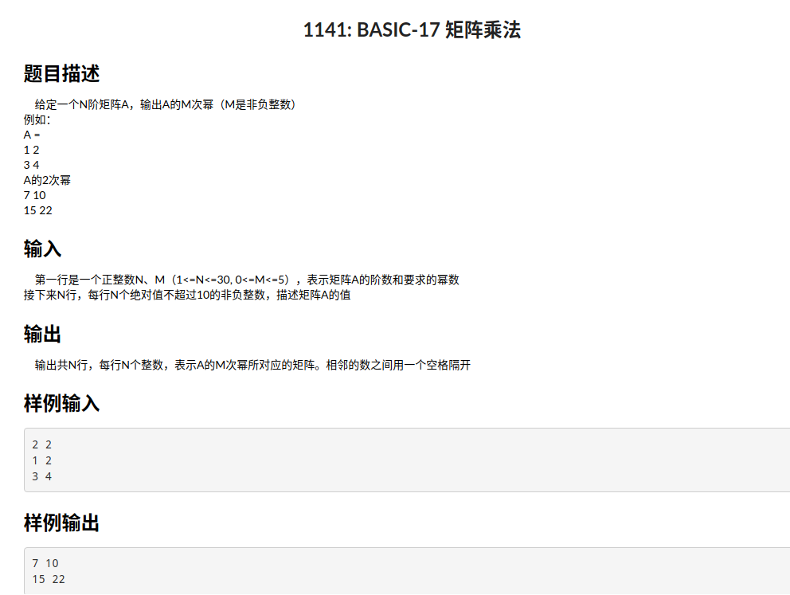

注意: 

* 矩阵的乘法必须满足第一个矩阵的列 = 第二个矩阵的行；
* 矩阵的求幂必须满足矩阵是一个方阵；


```java
import java.io.BufferedInputStream;
import java.util.Scanner;

public class Main {

    static class Matrix {
        public int row;
        public int col;
        public int[][] m;

        public Matrix(int row, int col) {
            this.row = row;
            this.col = col;
            m = new int[row][col];
        }
    }

    // 两个矩阵相加  -->  a,b必须为 同型矩阵
    static Matrix add(Matrix a, Matrix b) {
        Matrix c = new Matrix(a.row, a.col);
        for (int i = 0; i < a.row; i++) {
            for (int j = 0; j < a.col; j++) {
                c.m[i][j] = a.m[i][j] + b.m[i][j]; // sub 减法换成-
            }
        }
        return c;
    }

    // 必须满足a.col = b.row  才能相乘
    static Matrix mul(Matrix a, Matrix b) {
        Matrix c = new Matrix(a.row, b.col); //注意这里

        for (int i = 0; i < a.row; i++) {
            for (int j = 0; j < b.col; j++) {
                for (int k = 0; k < a.col; k++)
                    c.m[i][j] = c.m[i][j] + a.m[i][k] * b.m[k][j];
            }
        }
        return c;
    }

    // 必须为 方阵才能 求幂
    static Matrix pow(Matrix a, int k) { // 矩阵 a 的 k次幂
        Matrix res = new Matrix(a.row, a.col);  //求幂必须满足 a.row = a.col(也就是方阵)
        for (int i = 0; i < a.row; i++)
            res.m[i][i] = 1;

        // 真正的快速幂
        while (k > 0) {
            if ((k & 1) != 0)
                res = mul(res, a);
            a = mul(a, a);
            k >>= 1;
        }
        return res;
    }

    public static void main(String[] args) {
        Scanner cin = new Scanner(new BufferedInputStream(System.in));

        int n = cin.nextInt();
        int k = cin.nextInt();

        Matrix a = new Matrix(n, n);
        for (int i = 0; i < n; i++) {
            for (int j = 0; j < n; j++) {
                a.m[i][j] = cin.nextInt();
            }
        }

        Matrix res = pow(a, k);
        for (int i = 0; i < n; i++) {
            for (int j = 0; j < n; j++) {
                if (j == n - 1) {
                    System.out.println(res.m[i][j]);
                } else {
                    System.out.print(res.m[i][j] + " ");
                }
            }
        }
    }
}
```
***
### POJ - 3070. Fibonacci
#### [题目链接](http://poj.org/problem?id=3070)

> http://poj.org/problem?id=3070

#### 题目
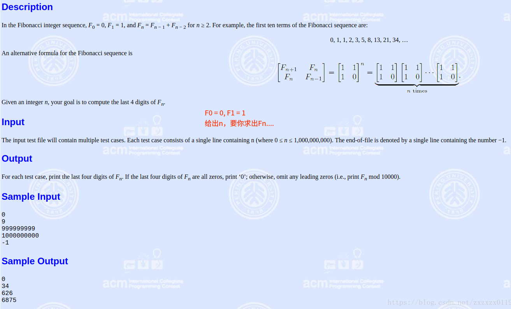
#### 解析
关键在于推导出递推式，也就是左边是一个`A`矩阵，`B`一般是一个列向量；
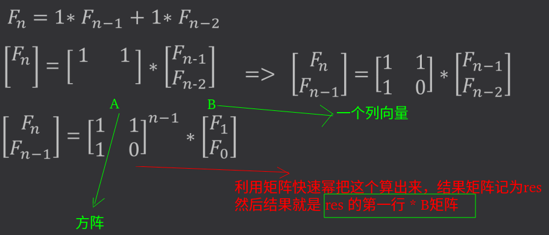

类似的规律: 

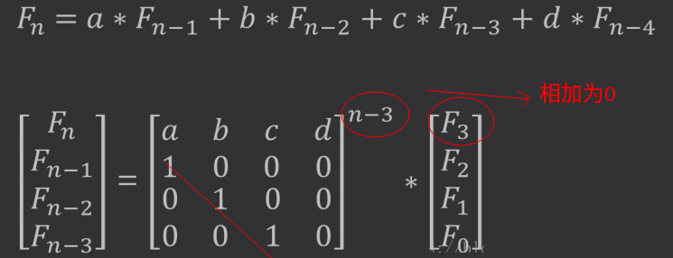

```java
import java.io.BufferedInputStream;
import java.util.Scanner;

public class Main {

    static class Matrix{
        public int row;
        public int col;
        public int[][] m;

        public Matrix(int row, int col) {
            this.row = row;
            this.col = col;
            m = new int[row][col];
        }
    }

    static final int mod = 10000;


    static Matrix mul(Matrix a,Matrix b){
        Matrix c = new Matrix(a.row,b.col); //注意这里

        for(int i = 0; i < a.row; i++){
            for(int j = 0; j < b.col; j++){
                for(int k = 0; k < a.col; k++)
                    c.m[i][j] = (c.m[i][j] + a.m[i][k]*b.m[k][j]) % mod;
            }
        }
        return c;
    }

    static Matrix pow(Matrix a,int k){
        Matrix res = new Matrix(a.row,a.col); // 方阵
        for(int i = 0; i < a.row; i++)
            res.m[i][i] = 1;
        while(k > 0){
            if( (k&1) != 0)
                res = mul(res,a);
            a = mul(a,a);
            k >>= 1;
        }
        return res;
    }

    public static void main(String[] args) {
        Scanner cin = new Scanner(new BufferedInputStream(System.in));

        while(cin.hasNext()){
            int n = cin.nextInt();
            if( n == -1)break;
            if(n == 0){
                System.out.println(0);
                continue;
            }

            Matrix a = new Matrix(2,2);
            a.m[0][0] = a.m[0][1] = a.m[1][0] = 1;
            a.m[1][1] = 0;

            Matrix res = pow(a,n-1);

            System.out.println(res.m[0][0] % mod);
        }
    }

}

```
***
### Hdu - 1757A. Simple Math Problem
#### [题目链接](http://acm.hdu.edu.cn/showproblem.php?pid=1757)

> http://acm.hdu.edu.cn/showproblem.php?pid=1757

#### 题目
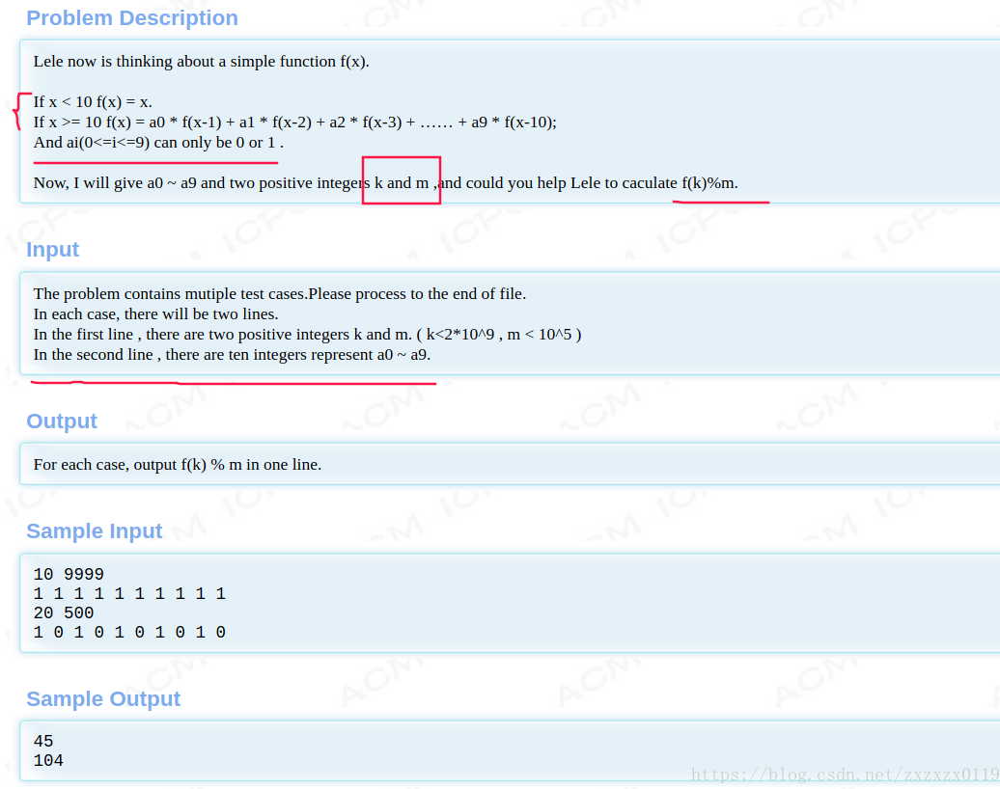
#### 解析
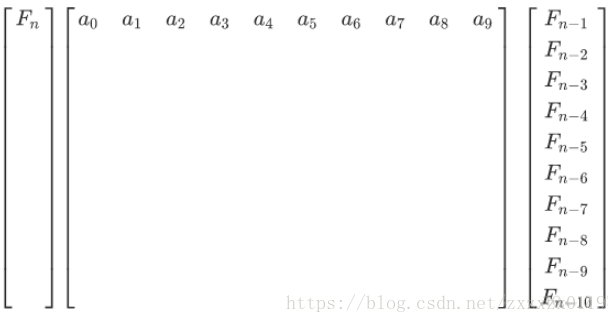
继续递推: 

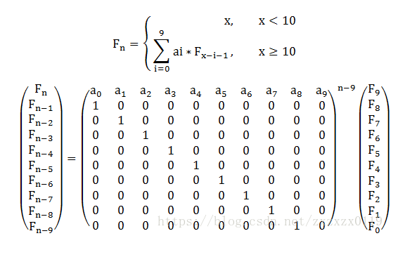

```java
import java.io.BufferedInputStream;
import java.util.Scanner;

public class Main {

    static class Matrix{
        public int row;
        public int col;
        public int[][] m;

        public Matrix(int row, int col) {
            this.row = row;
            this.col = col;
            m = new int[row][col];
        }
    }

    static Matrix mul(Matrix a,Matrix b,int mod){
        Matrix c = new Matrix(a.row,b.col); //注意这里

        for(int i = 0; i < a.row; i++){
            for(int j = 0; j < b.col; j++){
                for(int k = 0; k < a.col; k++)
                    c.m[i][j] = (c.m[i][j] + a.m[i][k]*b.m[k][j]) % mod;
            }
        }
        return c;
    }

    static Matrix pow(Matrix a,int k,int mod){
        Matrix res = new Matrix(a.row,a.col); // 方阵
        for(int i = 0; i < a.row; i++)
            res.m[i][i] = 1;
        while(k > 0){
            if( (k&1) != 0)
                res = mul(res,a,mod);
            a = mul(a,a,mod);
            k >>= 1;
        }
        return res;
    }


    public static void main(String[] args) {
        Scanner cin = new Scanner(new BufferedInputStream(System.in));

        while(cin.hasNext()){
            int k = cin.nextInt();
            int mod = cin.nextInt();

            if(k < 10){
                System.out.println(k);
                continue;
            }
            Matrix a = new Matrix(10,10);
            // init
            for(int i = 0; i < 10; i++)
                a.m[0][i] = cin.nextInt();
            for(int i = 1; i < 10; i++)
                a.m[i][i-1] = 1;

            // computer  matrix ^ (k-9)
            Matrix res = pow(a,k-9,mod);

            int sum = 0;
            for(int i = 0; i < 10; i++)
                sum += (res.m[0][i] * (9 - i)) % mod;

            System.out.println(sum % mod); // also should mod
        }
    }
}
```
***
### Codeforces - 185A. Plant
#### [题目链接](http://codeforces.com/problemset/problem/185/A)

> http://codeforces.com/problemset/problem/185/A

#### 题目
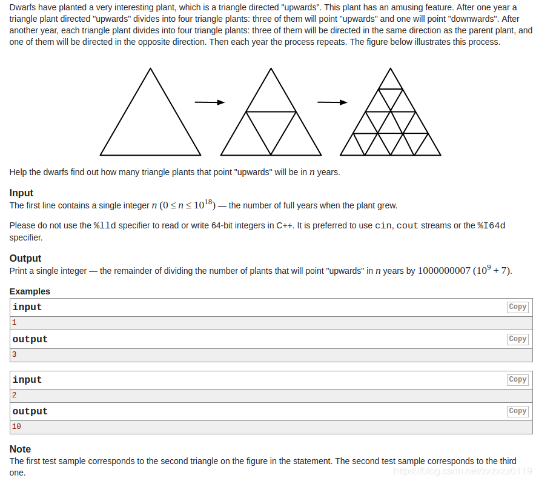

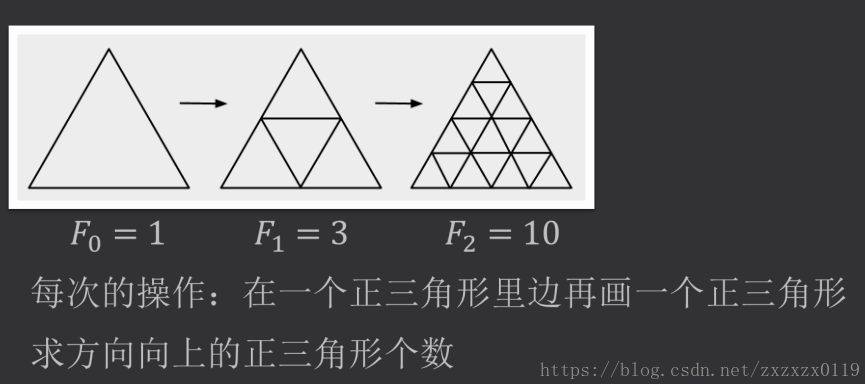

#### 解析
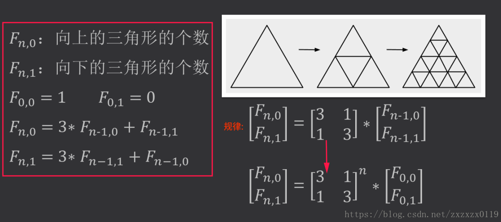
```java
import java.io.BufferedInputStream;
import java.util.Scanner;

public class Main {

    static class Matrix {
        public int row;
        public int col;
        public long[][] m;

        public Matrix(int row, int col) {
            this.row = row;
            this.col = col;
            m = new long[row][col];
        }
    }

    static final int mod = 1000000007;

    static Matrix mul(Matrix a, Matrix b) {
        Matrix c = new Matrix(a.row, b.col); //注意这里

        for (int i = 0; i < a.row; i++) {
            for (int j = 0; j < b.col; j++) {
                for (int k = 0; k < a.col; k++)
                    c.m[i][j] = (c.m[i][j] + a.m[i][k] * b.m[k][j]) % mod;
            }
        }
        return c;
    }

    static Matrix pow(Matrix a, long k) {
        Matrix res = new Matrix(a.row, a.col); // 方阵
        for (int i = 0; i < a.row; i++)
            res.m[i][i] = 1;
        while (k > 0) {
            if ((k & 1) != 0)
                res = mul(res, a);
            a = mul(a, a);
            k >>= 1;
        }
        return res;
    }

    public static void main(String[] args) {
        Scanner cin = new Scanner(new BufferedInputStream(System.in));

        long n = cin.nextLong();

        Matrix a = new Matrix(2, 2);
        a.m[0][0] = a.m[1][1] = 3;
        a.m[0][1] = a.m[1][0] = 1;

        Matrix res = pow(a, n);

        System.out.println(res.m[0][0] % mod);
    }
}
```

