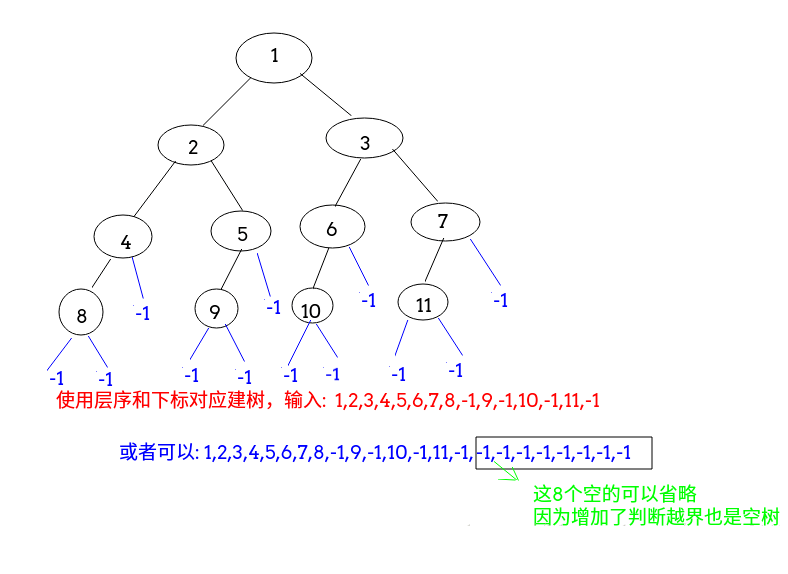
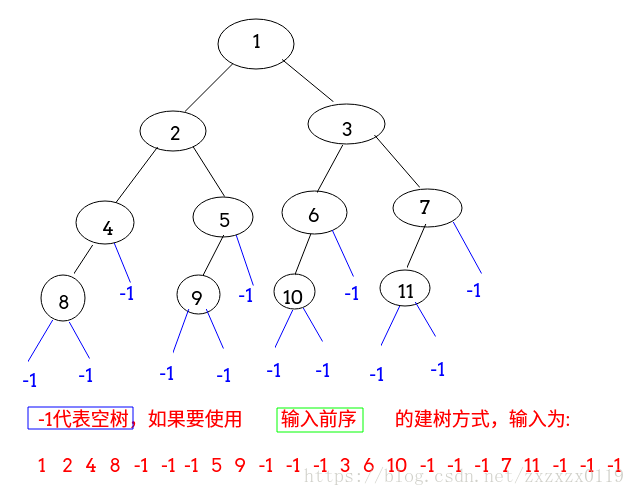
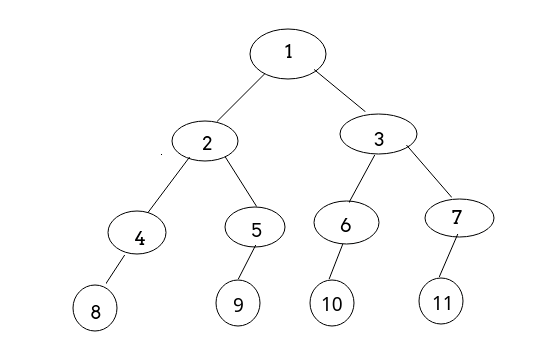
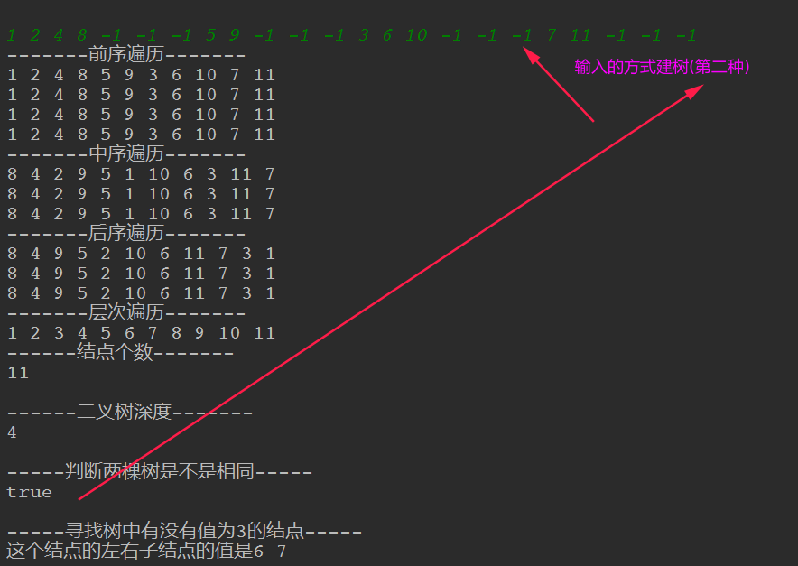

# 二叉树的各种操作(递归和非递归遍历,树深度,结点个数等等)
 - [建立二叉树](#建立二叉树)
     - [1、根据下标关系](#1根据下标关系)
     - [2、前序输入(cin)建立](#2前序输入cin建立)
 - [前序遍历](#前序遍历)
    - [1、递归前序](#1递归前序)
    - [2、非递归前序](#2非递归前序)
 - [中序遍历](#中序遍历)
     - [1、递归中序](#1递归中序)
     - [2、非递归中序](#2、非递归中序)
 - [后序遍历](#后序遍历)
     - [1、递归后序](#1递归后序)
     - [2、非递归后序](#2非递归后序)
 - [层次遍历](#层次遍历)
 - [寻找树中有没有值为x的结点](#寻找树中有没有值为x的结点)
 - [统计树中结点的个数](#统计树中结点的个数)
 - [计算树的高度](#计算树的高度)
 - [判断两颗树是不是相等](#判断两颗树是不是相等)
 - [完整测试代码](#完整测试代码)
***
## 二叉树建立
先给出结点结构: 

```java
static class Node {
    public int val;
    public Node left;
    public Node right;

    public Node(int val) {
        this.val = val;
    }
}
```
两种建立方式:

 - 可以根据二叉树根节点和左右子结点的下标关系递归建立二叉树，层次输入二叉树结点；
 - <font color = red>也可以使用输入流前序建立二叉树(注意空树要输入-1)；


### 1、根据下标关系

```java
// given a arr to build
static Node createTree(int arr[], int i) {
    if (i >= arr.length || arr[i] == -1)
        return null;
    Node root = new Node(arr[i]);
    root.left = createTree(arr, 2 * i + 1);
    root.right = createTree(arr, 2 * i + 2);
    return root;
}
```
大致过程如下:


### 2、前序输入(cin)建立

```java
// cin method	
static Node buildTree(Scanner cin) {
    Node root = null;
    int data = cin.nextInt();
    if (data != -1) {
        root = new Node(data);
        root.left = buildTree(cin);
        root.right = buildTree(cin);
    }
    return root;
}
```
过程如下:



## 前序遍历
### 1、递归前序

```java
static void preOrder(Node T) {
    if (T == null)
        return;
    System.out.print(T.val + " ");
    preOrder(T.left);
    preOrder(T.right);
}
```
### 2、非递归前序

前序遍历顺序为: **根结点->左子树->右子树**，所以对于正在访问的根结点，可以直接访问，访问完之后，按照相同的方式访问左子树，再访问右子树，过程如下 : 

  - 如果当前节点`p`不为空，访问结点`p`，并将结点`p`入栈，并继续访问左子树(直到左子树为空)；
  - 否则将栈顶元素出栈，并访问栈顶的元素的右子树；
  - 直到栈为空且`p`为空，循环结束。

代码:

```java
static void iterativePre(Node root) {
    Stack<Node> s = new Stack<>();
    Node p = root;
    while (!s.empty() || p != null) {
        if (p != null) {//也可以写一个while循环，直到左子树为空
            s.push(p);
            System.out.print(p.val + " ");
            p = p.left;
        } else {
            p = s.pop();
            p = p.right;
        }
    }
}
```
也可以将上面的一直访问到左子树为空写成一个`while`循环:

```java
static void iterativePre2(Node root) {
    Stack<Node> s = new Stack<>();
    Node p = root;
    while (!s.empty() || p != null) {
        while (p != null) { // while循环，直到左子树为空
            s.push(p);
            System.out.print(p.val + " ");
            p = p.left;
        }
        p = s.pop();
        p = p.right;
    }
}
```

 还有另外一种写法是:　


 - 先把根节点入栈，然后每次出栈一个元素，先访问这个元素，然后如果它的右子树存在，就入栈，如果它的左子树存在也入栈；
 - **为什么要先入右子树呢，因为，前序遍历是中->左->右，而栈可以逆序，所以先右再左；**

> 这个方法在后续遍历的双栈法中有体现，那个只是这个稍微的修改。

```java
static void iterativePre3(Node root) {
    if (root == null)
        return;
    Node p = root;
    Stack<Node> stack = new Stack<>();
    stack.add(p);
    while (!stack.isEmpty()) {
        p = stack.pop();
        System.out.print(p.val + " ");
        if (p.right != null)// 先右再左即可
            stack.push(p.right);
        if (p.left != null)
            stack.push(p.left);
    }
}
```

***
## 中序遍历
### 1、递归中序

```java
static void inOrder(Node T) {
    if (T == null)
        return;
    inOrder(T.left);
    System.out.print(T.val + " ");
    inOrder(T.right);
}
```
### 2、非递归中序

中序遍历 : **左子树->根->右子树**，过程如下：

 - 当前节点不空`!= null`，压入栈中(和前序遍历不同的是，不需要打印)，当前节点向左；
 - 当前节点为空`== null`，从栈中拿出一个并且打印(在这里打印) ，当前节点向右；


直到栈为空且p为空，循环结束。

```java
/**
* 1)、当前节点不空(!=null)，压入栈中(和前序遍历不同的是，不需要打印)，当前节点向左；
* 2)、当前节点为空(==null)，从栈中拿出一个并且打印(在这里打印) ，当前节点向右；
*/
static void iterativeIn(Node root) {
    if (root == null)
        return;
    Stack<Node> s = new Stack<>();
    Node p = root;
    while (!s.empty() || p != null) {
        if (p != null) {
            s.push(p);
            p = p.left;
        } else {
            p = s.pop();
            System.out.print(p.val + " "); //在这里打印
            p = p.right;
        }
    }
}
```
同理，那个一直访问左孩子那里也可以改成`whlie`:

```java
static void iterativeIn2(Node root) {
    if (root == null)
        return;
    Stack<Node> s = new Stack<>();
    Node p = root;
    while (!s.empty() || p != null) {
        while (p != null) { //这里改成while
            s.push(p);
            p = p.left;
        }
        p = s.pop();
        System.out.print(p.val + " "); //在这里打印
        p = p.right;
    }
}
```

***
## 后序遍历
### 1、递归后序

```java
static void postOrder(Node T) {
    if (T == null)
        return;
    postOrder(T.left);
    postOrder(T.right);
    System.out.print(T.val + " ");
}
```
### 2、非递归后序
#### 1)、双栈法

这个其实就是非递归前序(`iterativePre3`)的稍微一点改进。

 - 首先，前序遍历入栈(`iterativePre3`)的顺序是**先 右　再左**；
 - 这时，我们可以做到**反过来先　左　再右**，这样遍历的顺序可以做到 **"中右左"**，而后续遍历是 **"左右中"**，正好是前面那个的相反，所以我们**再使用一个栈反转保存即可**；

代码:

```java
/**
* 非递归后续1(双栈法解决非递归后续)
* 后续遍历是要实现　　　左->右->中
* 这个方法和前序遍历的第二种方法　只是多了一个栈而已
* 因为　前序遍历是  中->左->右　　压栈顺序是 右->左
* 这样，我们就很容易实现　中->右->左遍历　　压栈顺序是　左->右
* 而后续遍历是要实现  左->右->中，
* 我们把上面的　　中右左　压入到另一个栈中　就实现了　左右中
*/
static void iterativePos(Node root) {
    Stack<Node> s = new Stack<>(), s2 = new Stack<>();
    Node p;
    s.push(root);
    while (!s.empty()) {
        p = s.pop();
        s2.push(p);
        if (p.left != null) s.push(p.left); //这里是先左再右  (非递归前序是先右再左)
        if (p.right != null) s.push(p.right);
    }
    while (!s2.empty())
        System.out.print(s2.pop().val + " ");
}
```

#### 2)、设置`pre`结点

过程如下:

 - 对于任一结点`p`，先将其入栈；
 - 可以访问的情况:  ①若`p`不存在左孩子和右孩子，则可以直接访问它。②或者`p`存在左孩子或者右孩子，但是左孩子和右孩子都已经被访问过了，则也可以直接访问该结点；
 - 若非上述两种情况，**则将右孩子和左孩子依次入栈**。这样可以保证每次取栈顶元素时，左孩子在右孩子前面被访问，根结点在左孩子和右孩子访问**之后**被访问；

代码:


```java
/*** 非递归后续2(设置pre结点) */
static void iterativePos2(Node root) {
    Node cur, pre = null;
    Stack<Node> s = new Stack<>();
    s.push(root);
    while (!s.empty()) { 
        cur = s.peek();
        // 两种可以访问的情况
        if ((cur.left == null && cur.right == null) ||
            ((pre != null) && (pre == cur.left || pre == cur.right))) {
            System.out.print(cur.val + " ");
            s.pop();
            pre = cur;
        } else {
            if (cur.right != null) s.push(cur.right);
            if (cur.left != null) s.push(cur.left);
        }
    }
}
```
***
## 层次遍历
很简单。利用队列BFS即可，每次访问完`p`，若左右孩子存在，则入队，直至队空；

```java
static void levelOrder(Node root) {
    if (root == null)
        return;
    Queue<Node> queue = new LinkedList<>();
    queue.add(root);
    while (!queue.isEmpty()) {
        Node now = queue.poll();
        System.out.print(now.val + " ");
        if (now.left != null) queue.add(now.left);
        if (now.right != null) queue.add(now.right);
    }
}
```
## 寻找树中有没有值为x的结点
递归条件有两个，一个是为空代表没找到，找到了的话直接返回，否则递归查找左右子树。

```java
//查找某个值为x的结点
static Node search(Node T, int x) {
    if (T == null)
        return null;
    if (T.val == x)
        return T;
    else {
        if (search(T.left, x) == null)
            return search(T.right, x);
        else
            return search(T.left, x);
    }
}
```
## 统计树中结点的个数
树中结点的个数等于根节点(1) + 左子树结点个数 + 右子树的个数，递归求解即可。

```java
//统计结点个数
static int count(Node T) {
    if (T == null)
        return 0;
    else
        return count(T.left) + count(T.right) + 1;
}
```
## 计算树的高度
也是递归求解，左右子树的高度中的比较高的加上根节点就是树的高度。

```java
//计算二叉树的深度
static int depth(Node T) {
    if (T == null)
        return 0;
    return Math.max(depth(T.left), depth(T.right)) + 1;
}
```
## 判断两棵树是不是相等
也是递归求解，两棵树相等，既要根节点的值相等，而且左右子树也要相等。

```java
//判断两棵树是不是相等
static boolean is_SameTree(Node T1, Node T2) {
    if (T1 == null && T2 == null)
        return true;
    else {
        return T1 != null && T2 != null && T1.val == T2.val
            && is_SameTree(T1.left, T2.left) && is_SameTree(T1.right, T2.right);
    }
}
```


***
## 完整测试代码
完整的测试代码，这里输入的样例树(就是建树的时候那个例子)如下:



代码:

```java
import java.io.BufferedInputStream;
import java.util.*;

public class BinaryTree {

    static class Node {
        public int val;
        public Node left;
        public Node right;

        public Node(int val) {
            this.val = val;
        }
    }

    // given a arr to build
    static Node createTree(int arr[], int i) {
        if (i >= arr.length || arr[i] == -1)
            return null;
        Node root = new Node(arr[i]);
        root.left = createTree(arr, 2 * i + 1);
        root.right = createTree(arr, 2 * i + 2);
        return root;
    }

    // cin method	
    static Node buildTree(Scanner cin) {
        Node root = null;
        int data = cin.nextInt();
        if (data != -1) {
            root = new Node(data);
            root.left = buildTree(cin);
            root.right = buildTree(cin);
        }
        return root;
    }

    static void preOrder(Node T) {
        if (T == null)
            return;
        System.out.print(T.val + " ");
        preOrder(T.left);
        preOrder(T.right);
    }

    static void iterativePre(Node root) {
        Stack<Node> s = new Stack<>();
        Node p = root;
        while (!s.empty() || p != null) {
            if (p != null) {
                s.push(p);
                System.out.print(p.val + " ");
                p = p.left;
            } else {
                p = s.pop();
                p = p.right;
            }
        }
    }


    static void iterativePre2(Node root) {
        Stack<Node> s = new Stack<>();
        Node p = root;
        while (!s.empty() || p != null) {
            while (p != null) { // while循环，直到左子树为空
                s.push(p);
                System.out.print(p.val + " ");
                p = p.left;
            }
            p = s.pop();
            p = p.right;
        }
    }

    /**
     * 理解 :  push右子树，再push左子树，这样的话弹栈的时候就是先访问左子树，再右子树
     */
    static void iterativePre3(Node root) {
        if (root == null)
            return;
        Node p = root;
        Stack<Node> stack = new Stack<>();
        stack.add(p);
        while (!stack.isEmpty()) {
            p = stack.pop();
            System.out.print(p.val + " ");
            if (p.right != null)
                stack.push(p.right);
            if (p.left != null)
                stack.push(p.left);
        }
    }


    static void inOrder(Node T) {
        if (T == null)
            return;
        inOrder(T.left);
        System.out.print(T.val + " ");
        inOrder(T.right);
    }

    /**
     * 1)、当前节点不空(!=null)，压入栈中(和前序遍历不同的是，不需要打印)，当前节点向左；
     * 2)、当前节点为空(==null)，从栈中拿出一个并且打印(在这里打印) ，当前节点向右；
     */
    static void iterativeIn(Node root) {
        if (root == null)
            return;
        Stack<Node> s = new Stack<>();
        Node p = root;
        while (!s.empty() || p != null) {
            if (p != null) {
                s.push(p);
                p = p.left;
            } else {
                p = s.pop();
                System.out.print(p.val + " "); //在这里打印
                p = p.right;
            }
        }
    }

    static void iterativeIn2(Node root) {
        if (root == null)
            return;
        Stack<Node> s = new Stack<>();
        Node p = root;
        while (!s.empty() || p != null) {
            while (p != null) { //这里改成while
                s.push(p);
                p = p.left;
            }
            p = s.pop();
            System.out.print(p.val + " "); //在这里打印
            p = p.right;
        }
    }


    static void postOrder(Node T) {
        if (T == null)
            return;
        postOrder(T.left);
        postOrder(T.right);
        System.out.print(T.val + " ");
    }

    /**
     * 非递归后续1(双栈法解决非递归后续)
     * 后续遍历是要实现　　　左->右->中
     * 这个方法和前序遍历的第二种方法　只是多了一个栈而已
     * 因为　前序遍历是  中->左->右　　压栈顺序是 右->左
     * 这样，我们就很容易实现　中->右->左遍历　　压栈顺序是　左->右
     * 而后续遍历是要实现  左->右->中，
     * 我们把上面的　　中右左　压入到另一个栈中　就实现了　左右中
     */
    static void iterativePos(Node root) {
        Stack<Node> s = new Stack<>(), s2 = new Stack<>();
        Node p;
        s.push(root);
        while (!s.empty()) {
            p = s.pop();
            s2.push(p);
            if (p.left != null) s.push(p.left); //这里是先左再右  (非递归前序是先右再左)
            if (p.right != null) s.push(p.right);
        }
        while (!s2.empty())
            System.out.print(s2.pop().val + " ");
    }


    /*** 非递归后续2(设置pre结点) */
    static void iterativePos2(Node root) {
        Node cur, pre = null;
        Stack<Node> s = new Stack<>();
        s.push(root);
        while (!s.empty()) {
            cur = s.peek();
            // 两种可以访问的情况
            if ((cur.left == null && cur.right == null) ||
                    ((pre != null) && (pre == cur.left || pre == cur.right))) {
                System.out.print(cur.val + " ");
                s.pop();
                pre = cur;
            } else {
                if (cur.right != null) s.push(cur.right);
                if (cur.left != null) s.push(cur.left);
            }
        }
    }

    static void levelOrder(Node root) {
        if (root == null)
            return;
        Queue<Node> queue = new LinkedList<>();
        queue.add(root);
        while (!queue.isEmpty()) {
            Node now = queue.poll();
            System.out.print(now.val + " ");
            if (now.left != null) queue.add(now.left);
            if (now.right != null) queue.add(now.right);
        }
    }

    //查找某个值为x的结点
    static Node search(Node T, int x) {
        if (T == null)
            return null;
        if (T.val == x)
            return T;
        else {
            if (search(T.left, x) == null)
                return search(T.right, x);
            else
                return search(T.left, x);
        }
    }

    //统计结点个数
    static int count(Node T) {
        if (T == null)
            return 0;
        else
            return count(T.left) + count(T.right) + 1;
    }

    //计算二叉树的深度
    static int depth(Node T) {
        if (T == null)
            return 0;
        return Math.max(depth(T.left), depth(T.right)) + 1;
    }

    //判断两棵树是不是相等
    static boolean is_SameTree(Node T1, Node T2) {
        if (T1 == null && T2 == null)
            return true;
        else {
            return T1 != null && T2 != null && T1.val == T2.val
                    && is_SameTree(T1.left, T2.left) && is_SameTree(T1.right, T2.right);
        }
    }

    public static void main(String[] args) {
        Scanner cin = new Scanner(new BufferedInputStream(System.in));
        //		int[] arr = {1,2,3,4,5,6,7,8,-1,9,-1,10,-1,11,-1, -1,-1,-1,-1,-1,-1,-1,-1};
        int[] arr = {1, 2, 3, 4, 5, 6, 7, 8, -1, 9, -1, 10, -1, 11, -1};
        Node root = createTree(arr, 0);
        //		树结构和上面相同,输入: 1 2 4 8 -1 -1 -1 5 9 -1 -1 -1 3 6 10 -1 -1 -1 7 11 -1 -1 -1
        Node root2 = buildTree(cin);

        System.out.println("-------前序遍历-------");
        preOrder(root);
        System.out.println();
        iterativePre(root);
        System.out.println();
        iterativePre2(root);
        System.out.println();
        iterativePre3(root);

        System.out.println("\n" + "-------中序遍历-------");
        inOrder(root);
        System.out.println();
        iterativeIn(root);
        System.out.println();
        iterativeIn2(root);

        System.out.println("\n" + "-------后序遍历-------");
        postOrder(root);
        System.out.println();
        iterativePos(root);
        System.out.println();
        iterativePos2(root);

        System.out.println("\n" + "-------层次遍历-------");
        levelOrder(root);

        System.out.println("\n" + "------结点个数-------");
        System.out.println(count(root));

        System.out.println("\n" + "------二叉树深度-------");
        System.out.println(depth(root));

        System.out.println("\n" + "-----判断两棵树是不是相同-----");
        System.out.println(is_SameTree(root, root2));

        System.out.println("\n" + "-----寻找树中有没有值为3的结点-----");
        Node Find = search(root, 3);
        if (null == Find)
            System.out.println("没有找到结点");
        else
            System.out.println("这个结点的左右子结点的值是" + Find.left.val + " " + Find.right.val);
    }
}
```

运行效果如下图:

