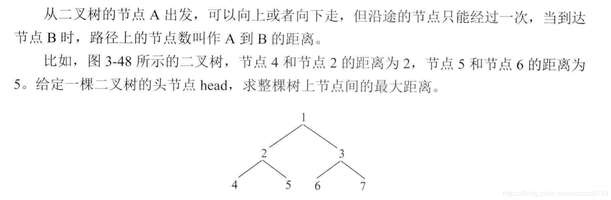
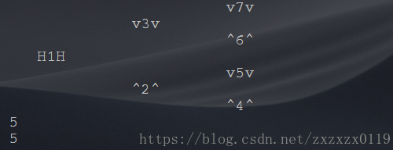

## 二叉树结点间的最大距离问题

 - 递归
 - 改进的写法
 - 完整测试代码
#### 题目 



### 递归
解析
这个也是一个二叉树的问题，分为三步:
 - 列出所有可能性；
 - 列出结点需要的信息，并整合信息(成一个结构体)；
 - 改递归 ，先假设左和右都给我信息(黑盒)，然后怎么利用左边和右边的信息组出来我该返回的信息，最后`basecase`(边界)填什么；


具体到这个题目:
**第一步，列出可能性：** 一个以`node`为头的树上，最大距离只可能来自下面三种情况: 

 - 不需要经过`node`这个点，node的左子树上自己的最大距离；
 - 不需要经过`node`这个点，node的右子树上自己的最大距离；
 - 要经过`node`这个点，此时就是左子树的高度 `+ `右子树的高度` +` `1 `；

**第二步，确定结点需要的信息，并整合:**

 - 信息一: 返回的以`node`为头的树的最大距离；
 - 信息二: 返回的以`node`为头的高度；


**第三步，封装信息，写出递归**

```java
public class Main {

    static class Node {
        public int value;
        public Node left;
        public Node right;

        public Node(int value) {
            this.value = value;
        }
    }

    static class Pair {
        public int max;
        public int h;

        public Pair(int max, int h) {
            this.max = max;
            this.h = h;
        }
    }

    static int maxDistance(Node head) {
        return rec(head).max;
    }

    static Pair rec(Node head) {
        if (head == null)
            return new Pair(0, 0);
        Pair L = rec(head.left);
        Pair R = rec(head.right);
        return new Pair(Math.max((L.h + R.h + 1), Math.max(L.max, R.max)),
                Math.max(L.h, R.h) + 1);
    }

}
```
***
### 改进的写法
可以使用一个全局变量记录高度，然后`max`正常返回: <font color = red>注意在`java`中要使用数组，**是引用**，这样的话就可以一直传递，不能使用一个变量</font>


```java
    static int maxDistance2(Node head) {
        int[] rec = new int[1];
        return rec2(head, rec);
    }

    static int rec2(Node head, int[] rec) {
        if (head == null) {
            rec[0] = 0;
            return 0;
        }
        int L = rec2(head.left, rec);
        int lH = rec[0];
        int R = rec2(head.right, rec);
        int rH = rec[0];
        rec[0] = Math.max(lH, rH) + 1;
        return Math.max(lH + rH + 1, Math.max(L, R));
    }
```
***
### 完整测试代码

```java
public class MaxDistance {

    static class Node {
        public int value;
        public Node left;
        public Node right;

        public Node(int value) {
            this.value = value;
        }
    }

    static class Pair {
        public int max;
        public int h;

        public Pair(int max, int h) {
            this.max = max;
            this.h = h;
        }
    }

    static int maxDistance(Node head) {
        return rec(head).max;
    }

    static Pair rec(Node head) {
        if (head == null) {
            return new Pair(0, 0);
        }
        Pair L = rec(head.left);
        Pair R = rec(head.right);
        return new Pair(Math.max((L.h + R.h + 1), Math.max(L.max, R.max)), Math.max(L.h, R.h) + 1);
    }


    static int maxDistance2(Node head) {
        int[] rec = new int[1];
        return rec2(head, rec);
    }

    static int rec2(Node head, int[] rec) {
        if (head == null) {
            rec[0] = 0;
            return 0;
        }
        int L = rec2(head.left, rec);
        int lH = rec[0];
        int R = rec2(head.right, rec);
        int rH = rec[0];
        rec[0] = Math.max(lH, rH) + 1;
        return Math.max(lH + rH + 1, Math.max(L, R));
    }

    static Node build(int[] arr, int index) {
        if (index >= arr.length || arr[index] == -1)
            return null;
        Node root = new Node(arr[index]);
        root.left = build(arr, index * 2 + 1);
        root.right = build(arr, index * 2 + 2);
        return root;
    }

    static void printTree(Node head, int height, String to, int len) {
        if (head == null) return;
        printTree(head.right, height + 1, "v", len);
        String val = to + head.value + to;  //两边指示的字符
        int lenV = val.length();
        int lenL = (len - lenV) / 2;  //左边的空格(分一半)
        int lenR = len - lenV - lenL; // 右边的空格
        System.out.println(getSpace(len * height) + getSpace(lenL) + val + getSpace(lenR));

        printTree(head.left, height + 1, "^", len);
    }

    //获取指定的空格
    static String getSpace(int len) {
        StringBuffer str = new StringBuffer();
        for (int i = 0; i < len; i++) str.append(" ");
        return str.toString();
    }

    public static void main(String[] args) {
        int[] arr = {1, 2, 3, 4, 5, 6, 7};
        Node head = build(arr, 0);
        printTree(head, 0, "H", 10);
        System.out.println(maxDistance(head));
        System.out.println(maxDistance2(head));
    }
}
```
运行结果:(打印二叉树见[**这个博客**](https://blog.csdn.net/zxzxzx0119/article/details/81096554))


