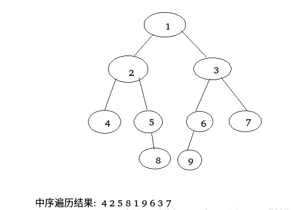
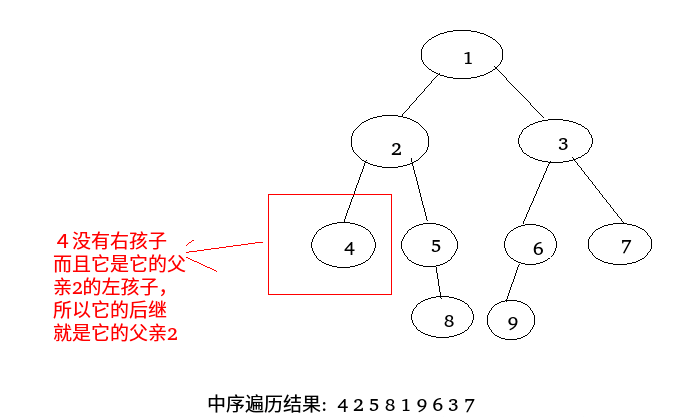
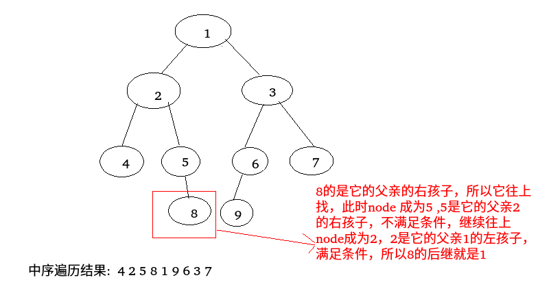

## 在一颗二叉树中寻找一个结点的后继结点(前驱结点)

 - 找后继结点
 - 找前驱结点

***
### 找后继结点

 首先知道什么是后继结点，就是二叉树中序遍历的序列中，某个结点紧随的那个结点比如下面的二叉树以及对应的中序遍历顺序。



则`4`的后继是`2` ，`2`的后继是`5`，`7`的后继是`null`。

在树的结构中，每个结点有一个指向父亲的域`parent`，看如下结构

```java
    static class Node{
        public int value;
        public Node left;
        public Node right;
        public Node parent;

        public Node(int value) {
            this.value = value;
        }
    }

```


那么如何快速的寻找当前结点`node`后继结点呢? 其实只需要分为两种情况

 - 第一，如果`node`结点有右子树，那么就是右子树上**最左**的结点，例如上图的`２`的右子树上的最左结点是`5`，`5`的右子树上最左的结点是`8`，`1`的右子树上最左的结点是`9`，`3`的右子树上最左的结点是`7`。
 - 第二，如果`node`结点没有右子树，那么要分两种情况 : <font color = blue>**a**. 看当前结点`node` 是不是它父亲(node.parent)的左孩子，如果是，那么它父亲(`node.parent`)就是它的后继；</font><font color = #ff00ff>**b**.如果当前结点是它父亲的右孩子(`node.parent.right == node`)，那么就向上不停的寻找它的后继结点，即当前结点为`node`，它的父亲为parent，如果`node`还是`parent`的右孩子，就令`node= parent，parent = parent.parent`，一直向上，直到`parent.left = node`，就停止，此时`parent`就是当初要找的结点的后继。

(1) 对于上面的第二种情况看上面的例子，首先`a`情况



(2) 然后再看第二种情况的`b` ，也就是往上找后继的过程




### 找前驱结点

 这个和找后继是同理的:  
 - 当一个结点有左子树的时候，就是最左子树的最右结点；
 - 没有左子树的时候，<font color = blue>**a.** 看当前结点`node `是不是它父亲(`node.parent`)的**右**孩子，如果是，那么它父亲(`node.parent`)就是它的前驱；</font><font color = #ff00ff>**b**. 如果当前结点是它父亲的左孩子(`node.parent.left == node`)，那么就向上不停的寻找它的前驱结点，即当前结点为`node`，它的父亲为`parent`，如果`node`还是`parent`的左孩子，就令`node= parent，parent = parent.parent`，一直向上，直到`parent.right = node`，就停止，此时`parent`就是当初要找的结点的前驱。

### 完整的测试代码如下

```java
/**
 * 寻找结点的后继和前驱结点
 */
public class SuccessorNode {

    static class Node {
        public int value;
        public Node left;
        public Node right;
        public Node parent;

        public Node(int value) {
            this.value = value;
        }
    }

    //寻找某个结点的后继结点
    static Node getSuccessorNode(Node node) {
        if (node == null) 
            return null;
        if (node.right != null) 
            return getMostLeft(node.right);//第一种情况　　结点的右子树为null
        else {  //第二种情况
            Node parent = node.parent;
            while (parent != null && parent.left != node) {
                node = parent;
                parent = node.parent;
            }
            return parent;
        }
    }

    //找到某个结点的最左边的结点
    static Node getMostLeft(Node node) {
        if (node == null)
            return null;
        while (node.left != null)
            node = node.left;
        return node;
    }


    //寻找某个结点的前驱结点
    static Node getPrecursorNode(Node node) {
        if (node == null)
            return null;
        if (node.left!= null)
            return getMostRight(node.left);//第一种情况　　结点的右子树为null
        else {  //第二种情况
            Node parent = node.parent;
            while (parent != null && parent.right != node) {
                node = parent;
                parent = node.parent;
            }
            return parent;
        }
    }

    //找到某个结点的最右边的结点
    static Node getMostRight(Node node) {
        if (node == null)
            return null;
        while (node.right != null)
            node = node.right;
        return node;
    }

    public static void main(String[] args) {

        //先创建上图的树
        Node head = new Node(1);
        head.left = new Node(2);
        head.left.parent = head;
        head.left.left = new Node(4);
        head.left.left.parent = head.left;
        head.left.right = new Node(5);
        head.left.right.parent = head.left;
        head.left.right.right = new Node(8);
        head.left.right.right.parent = head.left.right;
        head.right = new Node(3);
        head.right.parent = head;
        head.right.left = new Node(6);
        head.right.left.parent = head.right;
        head.right.left.left = new Node(9);
        head.right.left.left.parent = head.right.left;
        head.right.right = new Node(7);
        head.right.right.parent = head.right;

        System.out.println("----------test Successor----------");
        Node node = head; //测试1
        System.out.println(node.value + "'s next : " + getSuccessorNode(node).value);

        node = head.left.left; //测试4
        System.out.println(node.value + "'s next : " + getSuccessorNode(node).value);

        node = head.left.right.right; // 测试8
        System.out.println(node.value + "'s next : " + getSuccessorNode(node).value);


        System.out.println("----------test Precursor----------");

        node = head; //测试1
        System.out.println(node.value + "'s next : " + getPrecursorNode(node).value);

        node = head.right.left.left; // 测试9
        System.out.println(node.value + "'s next : " + getPrecursorNode(node).value);

    }
}

```

运行结果


