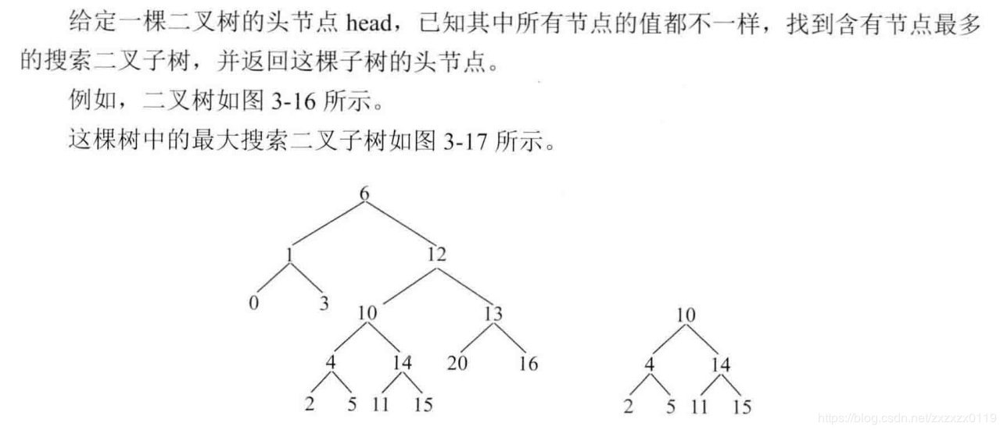
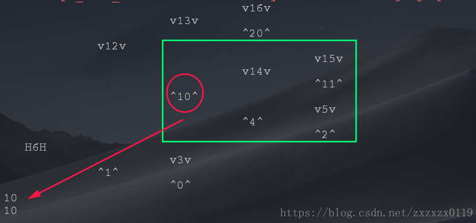

## 找到二叉树中的最大搜索二叉子树

 - 递归
 - 技巧的写法
 - 完整测试代码

#### 题目


#### 递归
解析: 
这种题目的解题过程分为三步: 

 - **列出所有可能性**；
 - **列出结点需要的信息，并整合信息(成一个结构体)**；
 - **改递归 ，先假设左和右都给我信息(黑盒)，然后怎么利用左边和右边的信息组出来我该返回的信息，最后`basecase`(边界)填什么**；


具体到这个题目： 
<font color = red>第一步，列出所有可能性</font>： 

 - 第一种可能性，以`node`为头的结点的最大二叉搜索子树可能来自它左子树；
 - 第二种可能性，以`node`为头的结点的最大二叉搜索子树可能来自它右子树；
 - 第三种可能性，左树整体是搜索二叉树，右树整体也是搜索二叉树，而且左树的头是`node.left`，右树的头是`node.right`，且左树的最大值`< node.value`，右树的最小值` > node.value`，  **那么以我为头的整棵树都是搜索二叉树；**


<font color = red>第二步，列出结点需要的信息:</font>

 - 信息一: 左树最大搜索二叉树大小；
 - 信息二: 右树最大搜索二叉树大小；
 - 信息三: 左树上最大搜索二叉树的头部是什么；
 - 信息四: 右树上最大搜索二叉树的头部是什么；
 - 信息五: 左树上的最大值；
 - 信息六: 右树上的最小值；

整合成一个`Pair`结构: 信息一和信息二整合：`size` ，信息三和信息四整合 : `head`(结点类型)，以及信息五和信息六 ；

```java
    //返回的类型
    static class Pair {
        public int size; //左右子树的大小
        public Node root; //左右子树的头
        public int min;
        public int max;
    }
```
然后第三部就是改成递归，具体如下(是后序遍历的顺序(需要左右的信息来构造头部的信息)): 

```java
    static class Node {
        public int value;
        public Node left;
        public Node right;

        public Node(int value) {
            this.value = value;
        }
    }

    //返回的类型
    static class Pair {
        public int size; //左右子树的大小
        public Node root; //左右子树的头
        public int min;
        public int max;

        public Pair(int size, Node root, int min, int max) {
            this.size = size;
            this.root = root;
            this.min = min;
            this.max = max;
        }
    }

    static Node biggestSubBST(Node head) {
        return rec(head).root;
    }

    static Pair rec(Node head) {
        if (head == null)
            return new Pair(0, null, Integer.MAX_VALUE, Integer.MIN_VALUE);
        Pair L = rec(head.left);
        Pair R = rec(head.right);
        int msize =
                (L.root == head.left && R.root == head.right && L.max < head.value && R.min > head.value)
                        ? L.size + R.size + 1 : 0;
        int maxSize = Math.max(Math.max(L.size, R.size), msize);
        Node mroot = L.size > R.size ? L.root : R.root;
        if (maxSize == msize) mroot = head;
        return new Pair(maxSize, mroot, Math.min(head.value, Math.min(L.min, R.min)),
                Math.max(head.value, Math.max(L.max, R.max)));
    }
```

### 改造的写法
技巧的写法(使用一个数组来记录`size,min,max`):

```java
    static Node biggestSubBST2(Node head) {
        int[] rec = new int[3];  //0 记录size 1记录min 2记录max
        return rec2(head, rec);
    }

    static Node rec2(Node head, int[] rec) {
        if (head == null) {
            rec[0] = 0;
            rec[1] = Integer.MAX_VALUE;
            rec[2] = Integer.MIN_VALUE;
            return null;
        }
        Node L = rec2(head.left, rec);
        int lsize = rec[0], lmin = rec[1], lmax = rec[2];
        Node R = rec2(head.right, rec);
        int rsize = rec[0], rmin = rec[1], rmax = rec[2];
        int msize = (L == head.left && R == head.right && lmax < head.value && rmin > head.value) ? lsize + rsize + 1 : 0;
        int maxSize = Math.max(msize, Math.max(lsize, rsize));
        Node root = lsize > rsize ? L : R;
        if (msize == maxSize) root = head;
        rec[0] = maxSize;
        rec[1] = Math.min(head.value, Math.min(lmin, rmin));
        rec[2] = Math.max(head.value, Math.max(lmax, rmax));
        return root;
    }
```

### 完整测试代码(测试样例)

```java
/**
 * 返回一棵树中最大的二叉搜索子树的大小
 */

public class BiggestSubBST {

    static class Node {
        public int value;
        public Node left;
        public Node right;

        public Node(int value) {
            this.value = value;
        }
    }

    //返回的类型
    static class Pair {
        public int size; //左右子树的大小
        public Node root; //左右子树的头
        public int min;
        public int max;

        public Pair(int size, Node root, int min, int max) {
            this.size = size;
            this.root = root;
            this.min = min;
            this.max = max;
        }
    }

    static Node biggestSubBST(Node head) {
        return rec(head).root;
    }

    static Pair rec(Node head) {
        if (head == null)
            return new Pair(0, null, Integer.MAX_VALUE, Integer.MIN_VALUE);
        Pair L = rec(head.left);
        Pair R = rec(head.right);
        int msize =
                (L.root == head.left && R.root == head.right && L.max < head.value && R.min > head.value)
                        ? L.size + R.size + 1 : 0;
        int maxSize = Math.max(Math.max(L.size, R.size), msize);
        Node mroot = L.size > R.size ? L.root : R.root;
        if (maxSize == msize) mroot = head;
        return new Pair(maxSize, mroot, Math.min(head.value, Math.min(L.min, R.min)),
                Math.max(head.value, Math.max(L.max, R.max)));
    }


    static Node biggestSubBST2(Node head) {
        int[] rec = new int[3];  //0 记录size 1记录min 2记录max
        return rec2(head, rec);
    }

    static Node rec2(Node head, int[] rec) {
        if (head == null) {
            rec[0] = 0;
            rec[1] = Integer.MAX_VALUE;
            rec[2] = Integer.MIN_VALUE;
            return null;
        }
        Node L = rec2(head.left, rec);
        int lsize = rec[0], lmin = rec[1], lmax = rec[2];
        Node R = rec2(head.right, rec);
        int rsize = rec[0], rmin = rec[1], rmax = rec[2];
        int msize = (L == head.left && R == head.right && lmax < head.value && rmin > head.value) ? lsize + rsize + 1 : 0;
        int maxSize = Math.max(msize, Math.max(lsize, rsize));
        Node root = lsize > rsize ? L : R;
        if (msize == maxSize) root = head;
        rec[0] = maxSize;
        rec[1] = Math.min(head.value, Math.min(lmin, rmin));
        rec[2] = Math.max(head.value, Math.max(lmax, rmax));
        return root;
    }

    //建立二叉树
    static Node build(int[] arr, int index) {
        if (index >= arr.length || arr[index] == -1) return null;
        Node root = new Node(arr[index]);
        root.left = build(arr, index * 2 + 1);
        root.right = build(arr, index * 2 + 2);
        return root;
    }

    /**
     * @param head   传入的节点
     * @param height 　　层数(根节点为0)
     * @param to     表示的特定节点  H表示根节点   ^表示父亲节点在左上方　v表示父亲节点在左下方
     * @param len    　　　指定每一个节点打印的宽度
     */
    static void printTree(Node head, int height, String to, int len) {
        if (head == null) return;
        printTree(head.right, height + 1, "v", len);

        String val = to + head.value + to;  //两边指示的字符
        int lenV = val.length();
        int lenL = (len - lenV) / 2;  //左边的空格(分一半)
        int lenR = len - lenV - lenL; // 右边的空格
        System.out.println(getSpace(len * height) + getSpace(lenL) + val + getSpace(lenR));

        printTree(head.left, height + 1, "^", len);
    }

    //获取指定的空格
    static String getSpace(int len) {
        StringBuffer str = new StringBuffer();
        for (int i = 0; i < len; i++) str.append(" ");
        return str.toString();
    }


    public static void main(String[] args) {
        int[] arr = {6, 1, 12, 0, 3, 10, 13, -1, -1, -1, -1, 4, 14, 20, 16, -1, -1, -1, -1, -1, -1, -1, -1, 2, 5, 11, 15, -1, -1, -1, -1};
        Node head = build(arr, 0);
        printTree(head, 0, "H", 10);
        System.out.println(biggestSubBST(head).value);
        System.out.println(biggestSubBST2(head).value);
    }
}

```
二叉树打印见[这个博客](https://blog.csdn.net/zxzxzx0119/article/details/81096554)
测试效果: 


