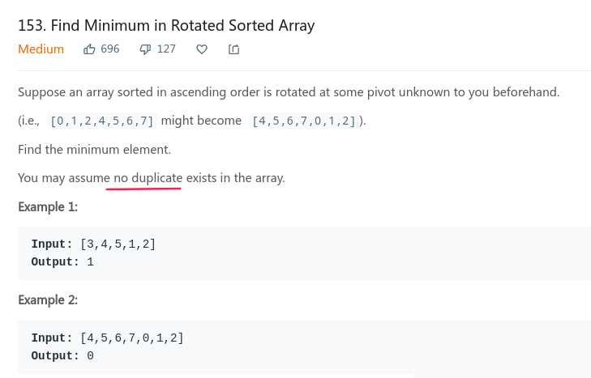
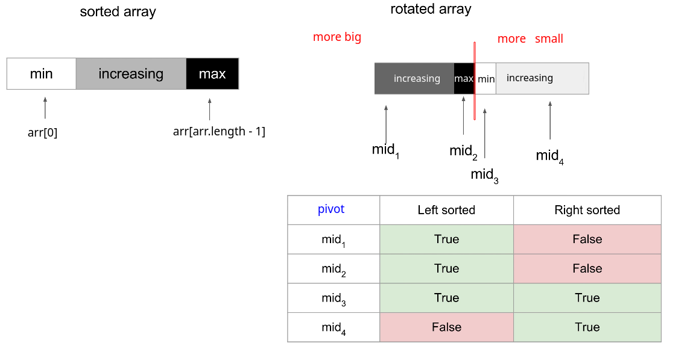
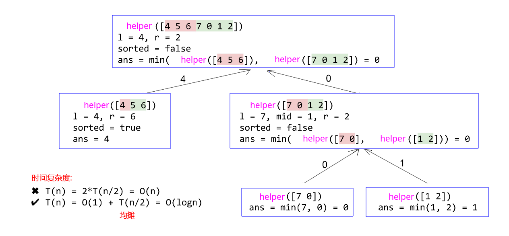
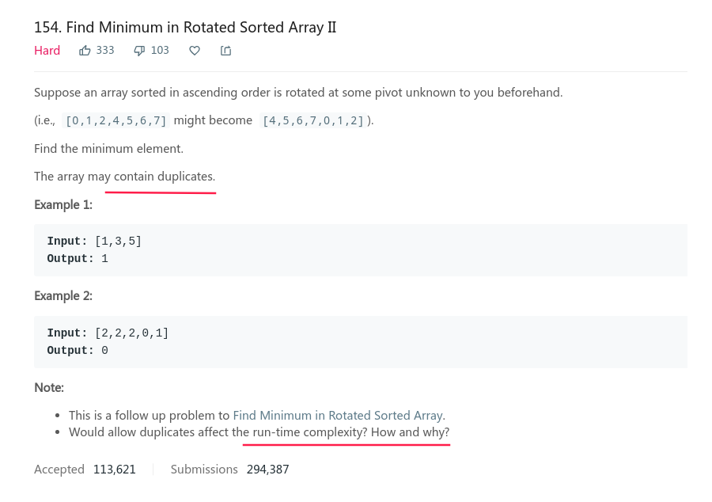

## LeetCode - 153. Find Minimum in Rotated Sorted Array (旋转数组中的最小值)

***
### LeetCode - 153. Find Minimum in Rotated Sorted Array

#### [题目链接](https://leetcode.com/problems/find-minimum-in-rotated-sorted-array/)

> https://leetcode.com/problems/find-minimum-in-rotated-sorted-array/

#### 题目


#### 解析
**<font color = blue>这个题目在[剑指Offer](https://blog.csdn.net/zxzxzx0119/article/details/79772754#t6)中也出现过**</font>，可以分为递归和非递归的解法。

##### 递归

* 递归解法中，递归函数先取两边区间的中点`mid = (L + R)/2`，然后开始递归到左右子区间求解最小值；
* 递归终止条件就是当区间范围只有`1`个或`2`个数，就返回最小值即可；
* 如果只是上面的程序，就没有优化；
* 优化就在当区间划分的时候，如果某个区间`nums[R] > nums[L]`就直接返回`nums[L]`了；
* 看下表的绿色部分，就可以知道，这样的优化是有意义的，可以降低复杂度；



样例递归过程: 

```cpp
class Solution {
    // no duplicate elements
    public int findMin(int[] nums) {
        if(nums == null || nums.length == 0)
            return -1;
        if(nums.length == 1 || nums[nums.length - 1] > nums[0])
            return nums[0];
        return helper(nums, 0, nums.length - 1);
    }
    
    private int helper(int[] nums, int L, int R){
        if(L + 1 >= R)      // must  >= , not == 
            // return nums[R]; // wrong answer
            return Math.min(nums[L], nums[R]);
        if(nums[R] > nums[L])  // judge the sequence is sorted
            return nums[L];
        int mid = L + (R - L)/2;       
        // return Math.min(helper(nums, L, mid-1), helper(nums, mid, R)); //the same result as below
        return Math.min(helper(nums, L, mid), helper(nums, mid+1, R));
    }
}
```
也可以改进，先判断一下是否是递增序列，然后再看是否只有一个或者两个元素了。这样的话，就不需要返回`Math.min(nums[L]，nums[R])`了，因为既然不是递增的序列，那一定是第二个(右边的部分)更小了。
```java
class Solution {
    // no duplicate elements
    public int findMin(int[] nums) {
        if(nums == null || nums.length == 0)
            return -1;
        if(nums.length == 1 || nums[nums.length - 1] > nums[0])
            return nums[0];
        return helper(nums, 0, nums.length - 1);
    }
    
    private int helper(int[] nums, int L, int R){
        if(nums[R] > nums[L])  // judge the sequence is sorted
            return nums[L];
        if(L + 1 >= R)  //  must >= , not == 
            return nums[R];
        int mid = L + (R - L)/2;       
        return Math.min(helper(nums, L, mid-1), helper(nums, mid, R));
        // return Math.min(helper(nums, L, mid), helper(nums, mid+1, R)); //the same result as above
    }
}
```
如果将递归的边界改成只有一个元素的时候，递归的就只能两边都写成`mid`了， 因为最后的判断条件是`L+1 == R`，此时区间一定需要两个元素，所以划分的时候要给至少两个元素。
```java
class Solution {
    // no duplicate elements
    public int findMin(int[] nums) {
        if(nums == null || nums.length == 0)
            return -1;
        if(nums.length == 1 || nums[nums.length - 1] > nums[0])
            return nums[0];
        return helper(nums, 0, nums.length - 1);
    }
    
    private int helper(int[] nums, int L, int R){
        if(L + 1 == R)    // not L+1 >= R
            return nums[R];
        if(nums[R] > nums[L]) 
            return nums[L];
        int mid = L + (R - L)/2;       
        // return Math.min(helper(nums, L, mid-1), helper(nums, mid, R));  // err
        // return Math.min(helper(nums, L, mid), helper(nums, mid+1, R));  // err
        return Math.min(helper(nums, L, mid), helper(nums, mid, R)); // both mid 
    }
}
```
##### 非递归
* 非递归的解法就是利用二分查找的思想，不断的缩小`L、R`指向的前面的递增区间和后面的递增区间，最后`L、R`分别指向第一个区间的最后一个数、第二个区间的第一个数，于是我们返回的是`R`。
* 具体的过程可以看[剑指Offer](https://blog.csdn.net/zxzxzx0119/article/details/79772754#t6)中前面那部分<font color = blue>没有重复元素的分析</font>。
```java
class Solution {
    // no duplicate elements
    public int findMin(int[] nums) {
        if(nums == null || nums.length == 0)
            return -1;
        if(nums.length == 1 || nums[nums.length - 1] > nums[0])
            return nums[0];
    
        int L = 0, R = nums.length - 1;
        
        while(nums[L] > nums[R]){   // ensure it is rotated
            // if(L + 1 >= R)
            if(L + 1 == R)   // notice this is ok
                return nums[R];
            int mid = L + (R - L)/2;
            if(nums[mid] > nums[L])  // the min value is in the  second half of the array
                L = mid+1;
            else 
                R = mid;
            
            // below is ok, the same result as above
            // if(nums[mid] > nums[L])  // the min value is in the  second half of the array
            //     L = mid;
            // else 
            //     R = mid;
            
            // but below is error, the boundary we should notice
            // if(nums[mid] > nums[L]) 
            //     L = mid;
            // else 
            //     R = mid-1;
        }
        return nums[L];  // nums[L] < nums[R], directly return the nums[L]
    }
}
```
***


### LeetCode - 154. Find Minimum in Rotated Sorted Array II
##### [题目链接](https://leetcode.com/problems/find-minimum-in-rotated-sorted-array-ii/)
##### 题目


#### 解析
* 递归解法和`LeetCode153`一样，只是要注意的是，如果`nums[R] == nums[L]`的时候，就不能判断是`Rotated Array` ，而上一题也没有判断，所以是可以的；
* 只是非递归解法的时间复杂度和那个不同了，因为当某个区间`L、R`中出现`nums[L] == nums[L]`的时候就不能直接返回`nums[L]`，而需要继续递归，所以上面<font color = red>那个表格中的绿色部分都会消失</font>，所以时间复杂度是`O(n) = 2 * T(n/2) = O(n)`；
* 非递归解法和上面那个有点不同，也就是在区间端点相同以及`nums[mid]`相同的情况下，做不同的处理，具体可看[剑指Offer](https://blog.csdn.net/zxzxzx0119/article/details/79772754#t6)中的题解。
```java
class Solution {
    // have duplicate elements
    public int findMin(int[] nums) {
        if(nums == null || nums.length == 0)
            return -1;
        if(nums.length == 1 || nums[nums.length - 1] > nums[0])
            return nums[0];
    
        int L = 0, R = nums.length - 1;
        
        while(nums[L] >= nums[R]){   // ensure it is rotated, notice >= instead >, have duplicate elements
            if(L + 1 >= R)
            // if(L + 1 == R)   //is ok
                return nums[R];
            int mid = L + (R - L)/2;
            
            // this is the different with the The previous question
            if(nums[L] == nums[mid] && nums[mid] == nums[R]){ // can't judge
                for(int i = L+1; i <= R; i++){
                    if(nums[i] < nums[i-1])
                        return nums[i];
                }
            }
            // ok 
            // if(nums[mid] >= nums[L])  // notice >=
            //     L = mid;
            // else 
            //     R = mid;
            
            // below is ok
            if(nums[mid] >= nums[L])  // the min value is in the second half of the array
                L = mid+1;
            else 
                R = mid;
            
            //but below is error
            // if(nums[mid] >= nums[L]) 
            //     L = mid;
            // else 
            //     R = mid-1;
        }
        return nums[L];  // nums[L] < nums[R], directly return the nums[L]
    }
}
```

