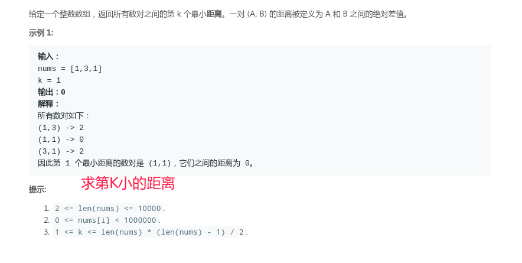
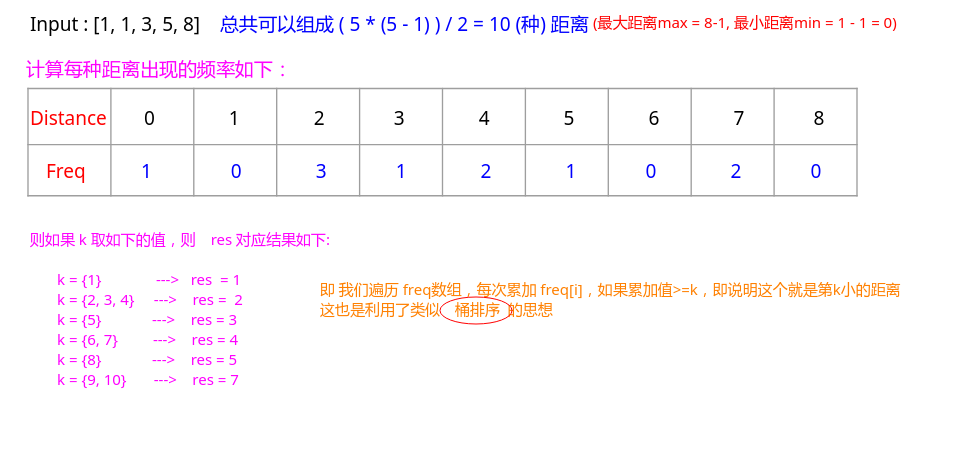

# LeetCode - 719. Find K-th Smallest Pair Distance(暴力 | 二分)
#### [题目链接](https://leetcode.com/problems/find-k-th-smallest-pair-distance/)

> https://leetcode.com/problems/find-k-th-smallest-pair-distance/

#### 题目


#### 解析

第一种方法的思想: 

* 先将`nums`数组排序，然后暴力枚举所有的`distance`（也就是`len * (len - 1 ) / 2`种），算出每一种`distance`出现的频率；
* 然后利用类似桶排序的过程，每个频率看做一个桶，我们从小频率到大频率遍历，每次累加频率到一个`count`值，如果这个`count`值`>=k`，即说明这个就是第`k`小的距离对了；

例子: 



代码:

```java
import java.io.*;
import java.util.*;

class Solution {

    // find K-th Smallest Pair Distance
    public int smallestDistancePair(int[] nums, int k) {
        Arrays.sort(nums);
        int n = nums.length;
        int[] freqs = new int[nums[n-1] + 1]; //注意nums[i]可能为0,所以要+1
        for(int i = 0; i < n; i++){ 
            for(int j = i + 1; j < n; j++){ 
                freqs[nums[j] - nums[i]]++;
            }
        }
        int cnt = 0;
        for(int d = 0; d < freqs.length; d++){ 
            cnt += freqs[d];
            if(cnt >= k)
                return d;
        }
        return 0;
    } 

    public static void main(String[] args){
        Scanner cin = new Scanner(new BufferedInputStream(System.in));
        PrintStream out = System.out;
        int[] nums = {1,3,1};
        int k = 1;
        out.println(new Solution().
            smallestDistancePair(nums, k)
        );
    }
}
```

这题更快的方法是用`二分+类似DP`来解: 

* 也是需要先对`nums`数组排序，然后我们需要**在最大距离值和最小距离值中找到一个值`key`，使得恰好它前面有`k`对`pairs`他们**的`distance  <= key` ；
* 而我们需要找的恰好是最小的那样的`key`，所以需要利用二分查找的找到第一个`>=key`的写法，具体可以看[**这篇博客**](https://blog.csdn.net/zxzxzx0119/article/details/82670761#t4)；
* 这里每次二分里面我们需要去遍历数组(`i`)，看似每次需要用另一个索引`j`来逐个统计这种`pair`的`distance`是否`<=mid`，但是这个过程是一个递增的顺序，也就是说我们已经对数组排序了，然后有点类似两个指针不断往后推动的情况，也就是说原本需要`O(N^2)`的时间复杂度可以降低到`2 * O(N)`，所以总的时间复杂度是`O( 2 * N * log(N))`；

例子: 当二分寻找距离`<=3`的`pair`数。


代码:

```java
import java.io.*;
import java.util.*;

class Solution {

    // find K-th Smallest Pair Distance
    public int smallestDistancePair(int[] nums, int k) {
        Arrays.sort(nums);
        int n = nums.length;
        int L = 0;
        int R = nums[n-1] - nums[0];
        while(L <= R){ 
            int mid = L + (R - L) / 2;
            int count = 0;
            int j = 0;
            for(int i = 0; i < n; i++){
                while(j < n && nums[j] - nums[i] <= mid) j++;
                count += j - i - 1; // j not in it,  [i, i+1]、[i, i+2]....[i, j-1]'s dist <= m
            }
            if(count >= k) // 因为需要寻找第一个>=key的, 所以不能当count == k的时候返回
                R = mid - 1;
            else           // 没有这么多对数的dist <= m, 需要增加
                L = mid + 1; 
        }
        return L; // 返回第一个>=key的
    } 

    public static void main(String[] args){
        Scanner cin = new Scanner(new BufferedInputStream(System.in));
        PrintStream out = System.out;
        int[] nums = {1,3,1};
        int k = 1;
        out.println(new Solution().
            smallestDistancePair(nums, k)
        );
    }
}
```

