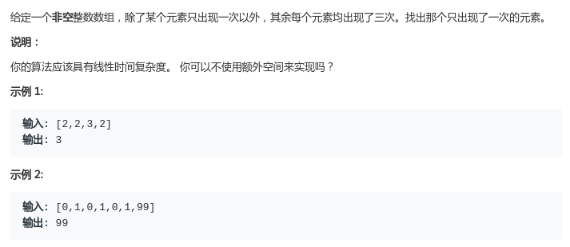
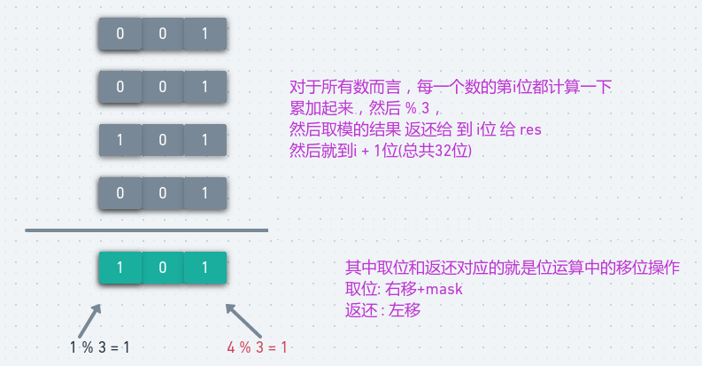
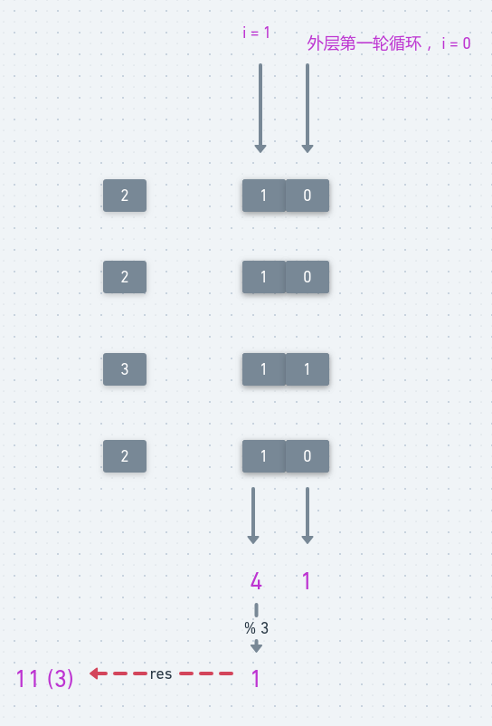

# LeetCode - 137. Single Numer II

#### [题目链接](https://leetcode.com/problems/single-number-ii/)

> https://leetcode.com/problems/single-number-ii/

#### 题目



这里只讨论位运算的方法。排序、hash都挺简单，不多说。

## 方法一

方法: 对每个数的32位都进行一下统计，统计所有数的每一位中`1`出现的次数，累加然后`%3`，然后送回原来对应的位。



看题目中`[2, 2, 3, 2]`的例子:

<div align="center"></div><br>

代码:

```java
class Solution {
    public int singleNumber(int[] nums) {
        int res = 0;
        for(int i = 0; i < 32; i++){
            int sum = 0;
            for(int num : nums) {
                sum += (num >> i) & 1; // 第i位的1的个数
                sum %= 3;
            }
            res |= (sum << i); // 将sum的结果返回给第i位(赋值)
        }
        return res;
    }
}
```

## 方法二

第二种解法感觉把位运算用到了极致，一般人是想不出来了。。。

* 我们用one记录当前位置之前(包括当前位置)所有数字的各个二进制位的总数模3等于1 。
* 同样用two记录当前位置之前(包括当前位置)所有数字的各个二进制位的总数模3等于2。
* 比如当前数字是3，前面有1与4，那么one会记录`[3，1，4]`第1至32位bit中1出现的次数`%3 == 1`的结果，two会记录`%3 == 2`的结果。
* one&two的结果的某个比特位`==1`，说明one中的该比特位与two中的该比特位都是1，那么说明该比特位出现了3次，需要从当前结果中消掉这些比特位。
* 很简单，one&two**按位取反**表明不需要去掉的比特位。
* 那么`one&(~(one&two))`将one中的出现3次的比特位去掉。
* 最后剩下只出现一次的数的所有的比特位都在one中记录。那么one肯定就是那个只出现一次的数。

代码:

```java
class Solution {
    public int singleNumber(int[] nums) {
        int one = 0, two = 0, three = 0;
        for(int num : nums){
            two |= (one & num);
            one ^= num;
            three = ~(one & two);
            one &= three;
            two &= three;
        }
        return one;
    }
}
```

