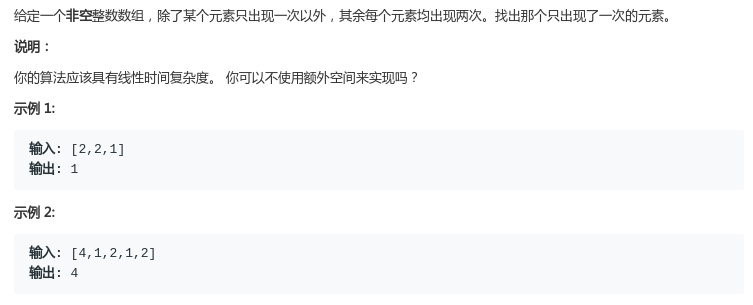

# LeetCode - 136. Single Number

#### [题目链接](https://leetcode.com/problems/single-number/)

> https://leetcode.com/problems/single-number/

#### 题目



## 解析

这题很简单。利用**异或运算**的一条性质: `n ^ n = 0`。哈希和排序就不说了，更简单。

异或的几条性质：

* 交换律：`a ^ b ^ c <=> a ^ c ^ b`；
* 任何数于0异或为任何数` 0 ^ n => n`；
* `n ^ n = 0`；

代码:

```java
class Solution {
    public int singleNumber(int[] nums) {
        int res = 0;
        for(int num : nums) res ^= num;
        return res;
    }
}
```

