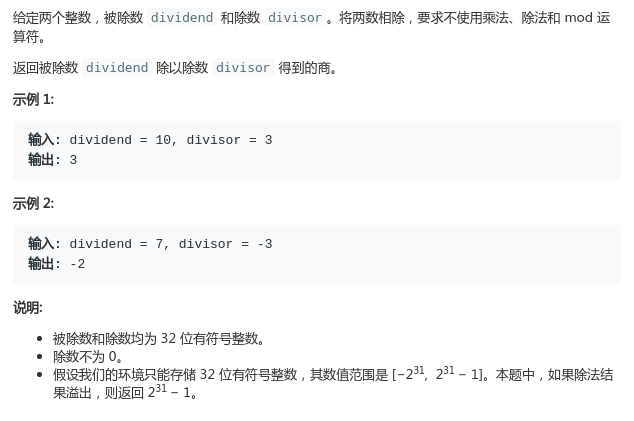
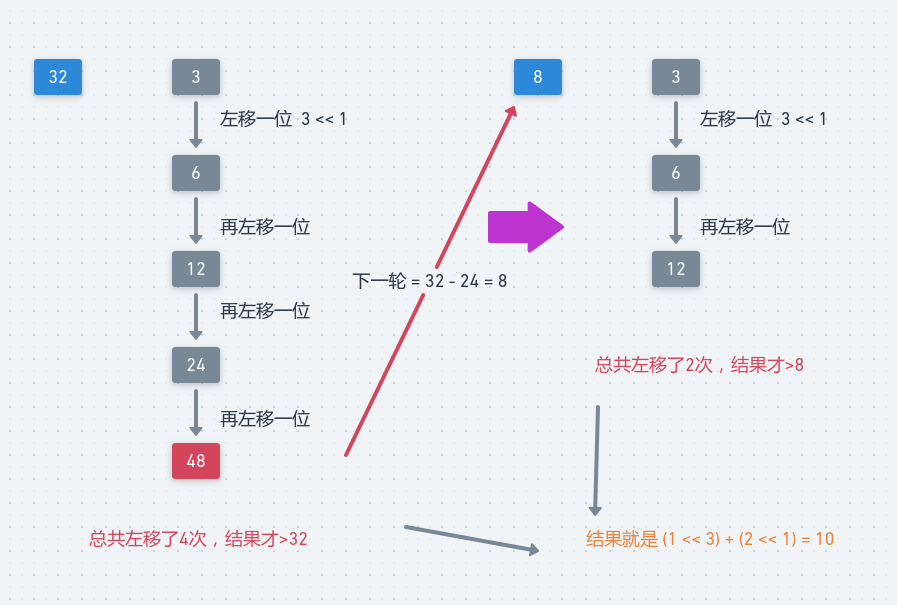

# LeetCode - 29. Divide Two Integers

#### [题目链接](https://leetcode.com/problems/divide-two-integers/)

> https://leetcode.com/problems/divide-two-integers/

#### 题目



### 解析

利用位运算，比如`32/3 = 10`。

先用`3`不断左移(`3 << 1`)，直到结果`>32`。

即

```java
3  << 1  -->  6
6  << 1  -->  12
12 << 1  -->  24
24 << 1  -->  48 (此时48 > 32了，退出)
```

此时我们需要到`24`停下来，所以还余下`32-24 = 8`，继续进行:

```java
3 << 1  --> 6
6 << 1  --> 12 (此时12 > 8)
```

此时我们需要到`6`停下来，所以还余下`8-6 =2 `，因为`2 < 3`，所以结束。

我们的答案就是`24/3 + 6/3 = 10`。

图:  



还需要注意正负号，我们将`dividend`和`divisor`都化为正数。

且要注意最小值和最大值问题。

代码:

```java
class Solution {

    // 要求不使用乘法、除法和 mod 运算符
    public int divide(int dividend, int divisor) {
        if(divisor == 0) return Integer.MAX_VALUE;
        // 必须加上这个特殊判断,不然就会错
        if(dividend == Integer.MIN_VALUE) { // 注意 [-2147483648,2147483647]
            if(divisor == -1) return Integer.MAX_VALUE;
            else if(divisor == 1) return Integer.MIN_VALUE;
        }
        // 需要进行转换，不然会在移位溢出的时候发生死循环
        long divd = (long)dividend;
        long divs = (long)divisor;
        int sign = 1;
        if(divd < 0){
            divd = -divd;
            sign = -sign;
        }
        if(divs < 0){
            divs = -divs;
            sign = -sign;
        }
        int res = 0;
        while(divd >= divs){
            int shift = 1;
            while(divd >= (divs << shift))
                shift++;
            res += (1 << (shift-1));
            divd -= (divs << (shift-1));
        }
        return res * sign;
    }
}
```

