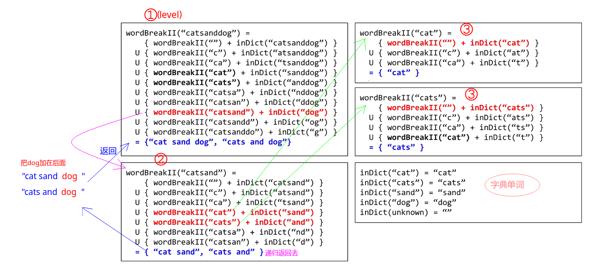

# LeetCode - 140. Word BreakII

#### [题目链接](https://leetcode.com/problems/word-break-ii/description/)

> https://leetcode.com/problems/word-break-ii/description/

#### 题目


#### 解析
和上题不同的是，这个题目要求出所有的组合：

记忆化递归的方式：　

* 在递归的每一层，如果R(右边部分) 包含在`wordDict`中，则左边求出的所有解(放在`List`中)，都和右边部分的字符串组成一个新的解(新的`List`)，并添加到结果中；
* 注意递归的每一层，一开始要判断没有划分的那个，也就是`dict.contains(s)`这句。

图:



代码:

```java
class Solution {

    public List<String> wordBreak(String s, List<String> wordDict) {
        if (s == null || wordDict == null)
            return new ArrayList<>();
        return rec(s, new HashMap<>(), wordDict);
    }

    public List<String> rec(String s, HashMap<String, List<String>> map, List<String> dict) {
        if (map.containsKey(s))
            return map.get(s);
        List<String> res = new ArrayList<>();
        if (dict.contains(s))
            res.add(s);
        for (int i = 1; i < s.length(); i++) {//注意这里不需要<=因为是对每一个划分
            String R = s.substring(i);
            if (!dict.contains(R))
                continue;
            String L = s.substring(0, i);
            List<String> LRes = rec(L, map, dict); //先求出左边的结果
            for (String si : LRes)
                res.add(si + " " + R);
        }
        map.put(s, res);
        return res;
    }
}
```

同理，也可以写成下面的样子(左边查看在不在`wordDict`中，右边递归) ;
```java
class Solution {
    public List<String> wordBreak(String s, List<String> wordDict) {
        if (s == null || wordDict == null)
            return new ArrayList<>();
        return rec(s, new HashMap<>(), wordDict);
    }

    public List<String> rec(String s, HashMap<String, List<String>> map, List<String> dict) {
        if (map.containsKey(s))
            return map.get(s);
        List<String> res = new ArrayList<>(); 
        if (dict.contains(s))
            res.add(s);
        for (String word : dict) {
            if (s.startsWith(word)) {
                String R = s.substring(word.length());
                List<String> RRes = rec(R, map, dict);
                for (String si : RRes)
                    res.add(word + " " + si);
            }
        }
        map.put(s, res);
        return res;
    }
}
```
改成`dp`的方式超内存(有时候超时)了，不知道是写错了还是怎么的，代码也贴上来: 

```java
class Solution {

    public List<String> wordBreak(String s, List<String> wordDict) {
        if (s == null || wordDict == null)
            return new ArrayList<>();
        List<String> res = new ArrayList<>();

        HashMap<String, List<String>> dp = new HashMap<>();

        dp.put("", new ArrayList<>());

        String sI, R;
        List<String> LRes;
        for (int i = 1; i <= s.length(); i++) {
            sI = s.substring(0, i);
            res = new ArrayList<>();
            if (wordDict.contains(sI))
                res.add(sI);

            for (int j = 0; j < i; j++) {
                R = sI.substring(j);
                if (!wordDict.contains(R))
                    continue;
                LRes = dp.get(sI.substring(0, j));
                for (String si : LRes)
                    res.add(si + " " + R);
            }
            dp.put(sI, res);
        }
        return res;
    }
}
```
