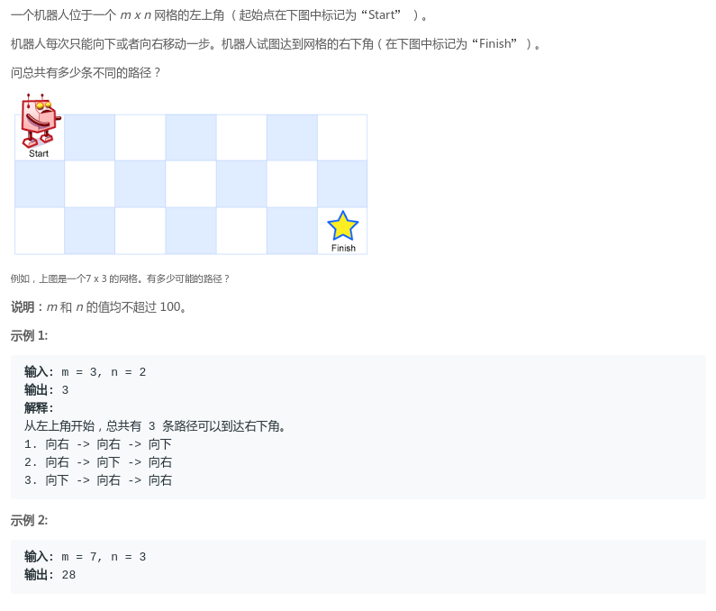
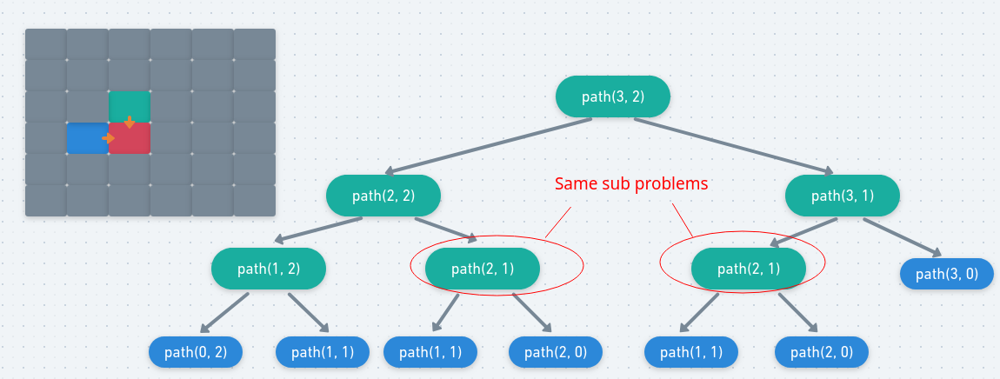
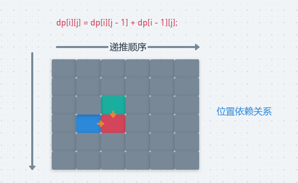

# LeetCode - 62. Unique Paths(不同的路径数量)(简单dp)
 - 记忆化
 - 二维dp
 - 空间优化

***
#### [题目链接](https://leetcode.com/problems/unique-paths/description/)

> https://leetcode.com/problems/unique-paths/description/

#### 题目



这个题目和[最小路径和问题](https://github.com/ZXZxin/ZXBlog/blob/master/%E5%88%B7%E9%A2%98/LeetCode/DP/LeetCode%20-%2064.%20Minimum%20Path%20Sum(%E6%9C%80%E5%B0%8F%E8%B7%AF%E5%BE%84%E5%92%8C).md)很类似。

## 1、记忆化


* **来到某个结点，因为只能往右边和下面走，所以一个位置`[i,j]`依赖的位置是`[i-1,j]`和`[i,j-1]`位置两个点之前的数量之和**；
 * 所以我们把`[i,j]`看做是**终点**的话就得出下面的递归关系。
 * 但是由于有重复的子问题，所以我们需要使用记忆化递归来优化。

图: 

<div align="center"></div><br>

如果不记录重复子问题的话就会是`O(2^n)`；


```java
class Solution {

    private int[][] dp;

    public int uniquePaths(int m, int n) {
        dp = new int[m + 1][n + 1];
        return rec(m, n, m, n);
    }

    public int rec(int m, int n, int i, int j) {
        if (i == 1 && j == 1)
            return 1;
        if (dp[i][j] != 0) //已经计算过
            return dp[i][j];
        if (i == 1)
            dp[i][j] = rec(m, n, i, j - 1);
        else if (j == 1)
            dp[i][j] = rec(m, n, i - 1, j);
        else
            dp[i][j] = rec(m, n, i - 1, j) + rec(m, n, i, j - 1);
        return dp[i][j];
    }
}
```
## 2、二维dp
递归改动态规划就是和递归相反的方向: 
<div align="center"></div><br>

代码：


```java
class Solution {
    public int uniquePaths(int m, int n) {
        int[][] dp = new int[m + 1][n + 1];
        dp[m][n] = 1;
        for (int j = n - 1; j >= 1; j--) dp[m][j] = dp[m][j + 1];
        for (int i = m - 1; i >= 1; i--) dp[i][n] = dp[i + 1][n];
        for (int i = m - 1; i >= 1; i--) {
            for (int j = n - 1; j >= 1; j--) {
                dp[i][j] = dp[i][j + 1] + dp[i + 1][j];
            }
        }
        return dp[1][1];
    }
}
```

可以有两种写法，在于你看问题的角度:


 - 第一种看问题的角度，把`[i,j]`看做是终点，那就是上面的递归关系；
 - 第二种看问题的角度，把`[i,j]`看做是起点，此时`[i,j]`总共的数量就是从`[i+1,j]`出发和从`[i,j+1]`出发的数量，那就是下面的递归关系；

就是说递归和动态规划也可以写成这样: 

<div align="center"></div><br>
```java
class Solution {
    public int uniquePaths(int m, int n) {
        int[][] dp = new int[m + 1][n + 1];
        dp[1][1] = 1;
        for (int j = 2; j <= n; j++) dp[1][j] = dp[1][j - 1]; //第一行
        for (int i = 2; i <= m; i++) dp[i][1] = dp[i - 1][1];
        for (int i = 2; i <= m; i++) {
            for (int j = 2; j <= n; j++) {
                dp[i][j] = dp[i][j - 1] + dp[i - 1][j];
            }
        }
        return dp[m][n];
    }
}

```

## 3、滚动优化
**滚动数组的优化就是其实你在算`dp[i][j]`的时候，你左边的`dp[i][j-1]`还是`dp[j-1]`，而你上面的`dp[i-1][j]`还是`dp[j] `(没有更新)，所以可以只需要一个数组，所以滚动优化决定的是你更新的顺序**；

```java
class Solution {
    public int uniquePaths(int m, int n) {
        int[] dp = new int[n + 1];
        for (int i = 1; i <= n; i++) dp[i] = 1;
        for (int i = 2; i <= m; i++) {
            for (int j = 2; j <= n; j++) {
                dp[j] = dp[j] + dp[j - 1];
            }
        }
        return dp[n];
    }
}

```
或者这样 (第二种): 

```java
class Solution {
    public int uniquePaths(int m, int n) {
        int[] dp = new int[n + 1];
        for (int i = 1; i <= n; i++) dp[i] = 1;
        for (int i = m - 1; i >= 1; i--) {
            for (int j = n - 1; j >= 1; j--) {
                dp[j] = dp[j] + dp[j + 1];
            }
        }
        return dp[1];
    }
}

```

