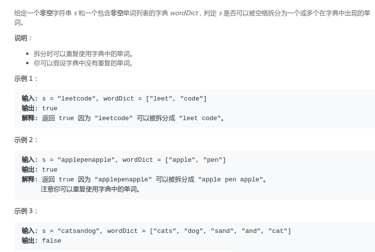
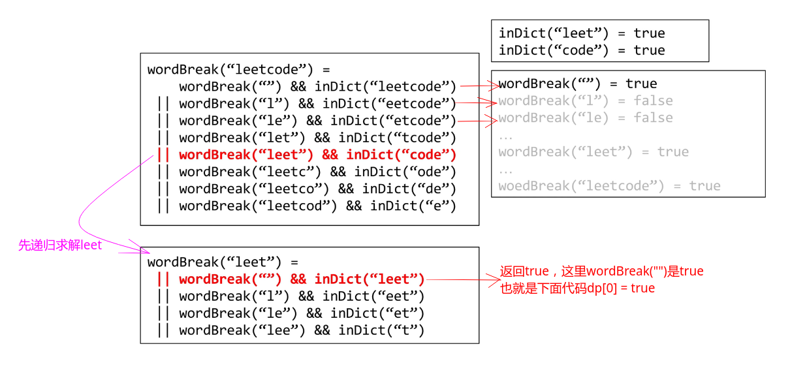

# LeetCode - 139. Word Break


#### [题目链接](https://leetcode.com/problems/word-break/)

> https://leetcode.com/problems/word-break/

#### 题目

## 解析
记忆化的思路: 

* 字符串在每个位置从左到右进行划分成左边和右边部分；
* 左边部分递归的去求看是否满足，右边看`wordDict`中是否有这个单词；
* 因为递归的时候有重复的子问题，所以使用`map`进行记忆化；
* 这里是从顶(**例如`"leetcode"`从最长求到最短**)到下，而`dp`是从短推到长；
* 这里每个位置只需要某个划分满足即可，所以下面递归函数中如果有一个划分满足条件，立即就`return `了；

图:




```java
class Solution {

    private HashMap<String, Boolean> dp;

    public boolean wordBreak(String s, List<String> wordDict) {
        if (s == null)
            return true;
        if (wordDict == null)
            return false;
        // memorize
        dp = new HashMap<>();
        return rec(s, wordDict);
    }

    private boolean rec(String s, List<String> dict) {
        if (dict.contains(s)) //这句话不能省略 因为下面只是判断到 < sb.length,
            return true;
        if (dp.containsKey(s))
            return dp.get(s);
        for (int i = 0; i < s.length(); i++) { // for(int i = 1; i < s.length(); i++){ 也可以写成从1开始 因为L == ""可以不用划分
            String L = s.substring(0, i); // [0,i)
            String R = s.substring(i);   //  [i,sb.length)
            if (dict.contains(R) && rec(L, dict)) {//先判断右半部分
                dp.put(s, true);
                return true;
            }
        }
        dp.put(s, false);
        return false;
    }
}
```

**注意到，也可以反过来改成`L`去判断在不在`wordDic`t中，而右边部分`R`去递归(这样代码简介很多，而且速度也更快)**

```java
class Solution {
    
    private HashMap<String, Boolean> dp;
    
    public boolean wordBreak(String s, List<String> wordDict) {
        if (s == null)
            return true;
        if (wordDict == null)
            return false;
        dp = new HashMap<>(); 
        return rec(s, wordDict); 
    }

    //相当于s的左边L去判断在不在wordDict中，而右边去递归
    private boolean rec(String s, List<String> dict) {
        if (s.isEmpty())
            return true;  //""返回true
        if (dp.containsKey(s))
            return dp.get(s);
        for (String word : dict) {
            if (s.startsWith(word)) {//  左边L在wordDict中有包含
                if (rec(s.substring(word.length()), dict)) {
                    dp.put(s, true);
                    return true;
                }
            }
        }
        dp.put(s, false);
        return false;
    }
}
```

递推dp， 也就是从下到上的求解:

* 注意，一开始`dp.put("",true)`，表示的是相当于`""`是返回`true`的，这个是必须的。因为某个划分`L`是`""`，而`R` 在`wordDict`中。
* 比如划分到`"leetcode"`的`"leet"`的时候，当`leet`被划分成`""`和`"leet"`左边就是`""`，右边是`"leet"`(在`wordDict`中)，所以满足；

代码：


```java
class Solution {

    public boolean wordBreak(String s, List<String> wordDict) {
        if (s == null)
            return true;
        if (wordDict == null)
            return false;
        HashMap<String, Boolean> dp = new HashMap<>();
        dp.put("", true);// must
        for (int i = 1; i <= s.length(); i++) {// 从1开始就可以 因为dp.put("",true)
            String sI = s.substring(0, i);
            for (int j = 0; j < i; j++) {
                String L = sI.substring(0, j);
                String R = sI.substring(j);
                if (dp.get(L) != null && dp.get(L) && wordDict.contains(R)) {
                    dp.put(sI.toString(), true);
                    break;
                }
            }
        }
        return dp.get(s) == null ? false : dp.get(s);
    }
}
```
稍微优化的思路: 

* 上面的`HashMap`中的`true`其实是表示的`dp`的值，因为`key`为`String`，所以不好用数组表示。
* 但是其实我们可以将左边部分的字符串映射为只需要以某个位置结尾的字符串就可以了。
* 也就是说`L`部分求解，只需要记录那个字符串的结束位置即可，也就是可以只用一个`boolean`数组求解即可。

代码:

```java
class Solution {
    public boolean wordBreak(String s, List<String> wordDict) {
        if (s == null)
            return true;
        if (wordDict == null)
            return false;
        StringBuilder sb = new StringBuilder(s);
        boolean[] dp = new boolean[s.length() + 1];
        dp[0] = true; // 类似 dp.put("",true);
        for (int i = 1; i <= sb.length(); i++) {//从1开始就可以
            String sbI = sb.substring(0, i);
            for (int j = 0; j < i; j++) {
                if (dp[j] && wordDict.contains(sbI.substring(j))) {
                    dp[i] = true;
                    break;
                }
            }
        }
        return dp[s.length()];
    }
}
```
**再次优化，连`sbI`也可以省略，因为可以直接取`[j,i)`之间的字符作为`sbI`即可**。

```java
class Solution {
    public boolean wordBreak(String s, List<String> wordDict) {
        if (s == null)
            return true;
        if (wordDict == null)
            return false;
        StringBuilder sb = new StringBuilder(s);
        boolean[] dp = new boolean[s.length() + 1];
        dp[0] = true; //  类似 dp.put("",true);
        for (int i = 0; i <= sb.length(); i++) {
            for (int j = 0; j < i; j++) {
                if (dp[j] && wordDict.contains(sb.substring(j, i))) {//这里简单的优化
                    dp[i] = true;
                    break;
                }
            }
        }
        return dp[s.length()];
    }
}
```
