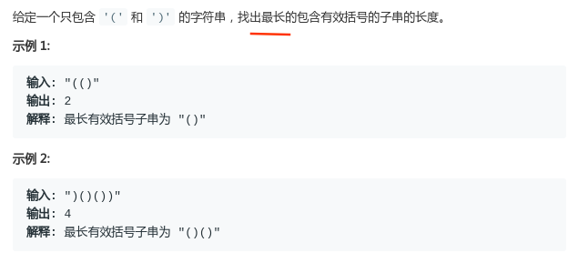
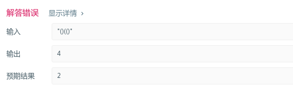
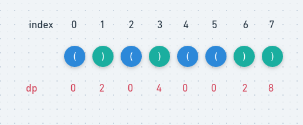
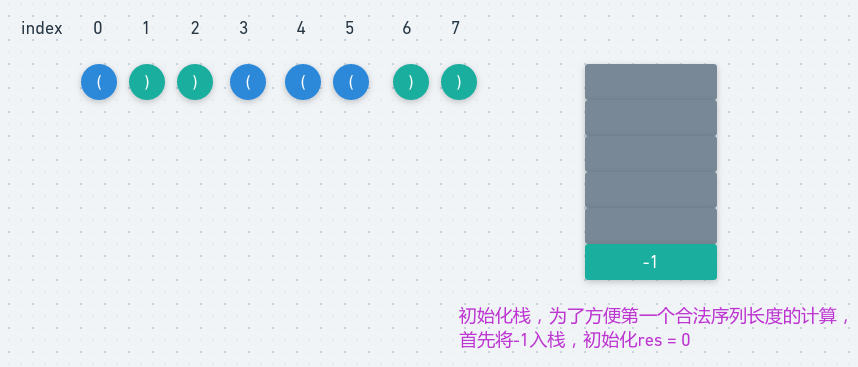
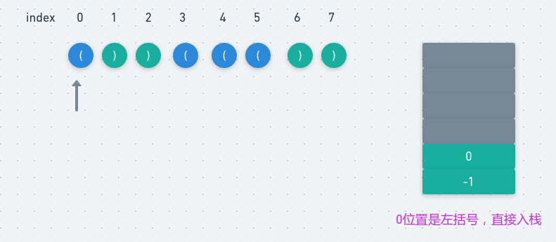
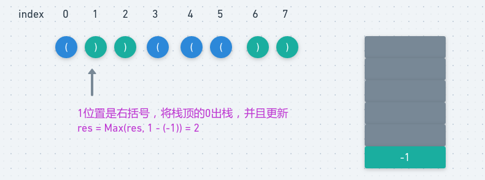
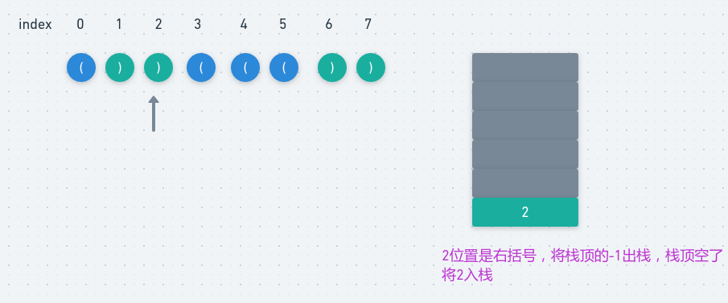
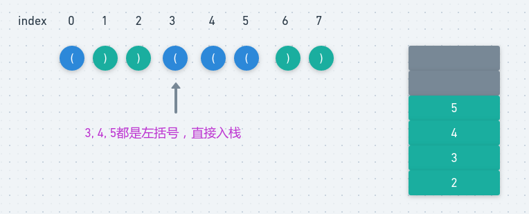
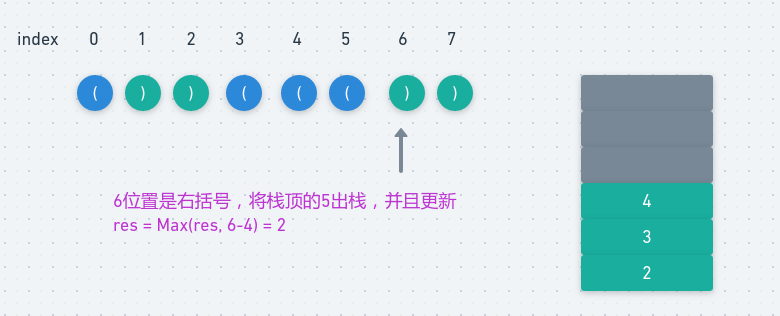
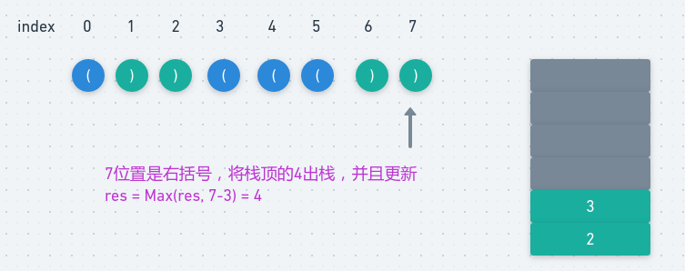

# LeetCode - 32. Longest Valid Parentheses

#### [题目链接](https://leetcode.com/problems/longest-valid-parentheses/)

> https://leetcode.com/problems/longest-valid-parentheses/

#### 题目



注意，不是问最多有多少可以匹配，而是问可以匹配的最大的长度。例如下面:



### 解析

#### 1、暴力解法

枚举每一个串，判断这个串是不是合法匹配，然后记录最大的长度，**这里有一个优化就是：可以只判断偶数长度的串**，但是还是会超时，时间复杂度`O(N^3)`。

```java
import java.util.*;

class Solution {

    // 判断s是不是合法匹配括号
    private boolean isValid(String s) {
        Stack<Character> stack = new Stack<>();
        for (int i = 0; i < s.length(); i++) {
            if (s.charAt(i) == '(')
                stack.push('(');
            else if (!stack.empty() && stack.peek() == '(')
                stack.pop();
            else
                return false;
        }
        return stack.empty();
    }

    public int longestValidParentheses(String s) {
        int res = 0;
        for (int i = 0; i < s.length(); i++) {
            // 只需要判断偶数长度的串
            for (int j = i + 2; j <= s.length(); j += 2) { //注意j<=s.length,因为s.substring()
                if (isValid(s.substring(i, j)))
                    res = Math.max(res, j - i);
            }
        }
        return res;
    }
}
```

#### 2、暴力优化

记录以每一个位置`i`开头的最长结果。

我们判断从**每个位置开始的最长合法子串是多长即可**。而判断是否是合法子串，我们不用栈，**而是用一个变量记录当前的括号情况，遇到左括号加 1，遇到右括号减 1，如果变成 0 ，我们就更新下最长合法子串**

`O(N^2)`

```java
class Solution {
    public int longestValidParentheses(String s) {
        int res = 0;
        for(int i = 0; i < s.length(); i++){
            int cnt = 0;
            for(int j = i; j < s.length(); j++){//注意从i开始
                char c = s.charAt(j);
                if(s.charAt(j) == '('){
                    cnt++;
                }else {
                    if(cnt <= 0) break;
                    else cnt--;
                }
                if(cnt == 0 && j-i+1 > res)
                    res = j-i+1;
            }
        }
        return res;
    }
}
```

#### 3、动态规划

动态规划的思路**是求以每一个位置结尾的最长符合条件的括号匹配的长度**。

`dp [ i ]` 代表以下标 `i `结尾的合法序列的最长长度，例如下图



下标 1 结尾的最长合法字符串长度是 2，下标 3 结尾的最长字符串是 str [ 0 , 3 ]，长度是 4 。

(1)、以左括号结尾的字符串一定是非法序列，所以 dp 是零，不用更改。

(2)、以右括号结尾的字符串分两种情况。

- a)、右括号前边是` (` ，类似于 `……（）`。

  `dp [ i ] = dp [ i - 2] + 2 `（前一个合法序列的长度，加上当前新增的长度 2）

  类似于上图中 `index = 3 `的时候的情况。

  `dp [ 3 ] = dp [ 3 - 2 ] + 2 = dp [ 1 ] + 2 = 2 + 2 = 4`

- b)、右括号前边是 `)`，类似于 `……））`。

  此时我们需要判断` i - dp[i - 1] - 1` （前一个合法序列的前边一个位置） 是不是左括号。

  例如上图的 index = 7 的时候，此时 index - 1 也是右括号，我们需要知道 `i - dp[i - 1] - 1 = 7 - dp [ 6 ] - 1 = 4 `位置的括号的情况。

  而刚好` index = 4 `的位置是左括号，此时 `dp [ i ] = dp [ i - 1 ] + dp [ i - dp [ i - 1] - 2 ] + 2 `（当前位置的前一个合法序列的长度，加上匹配的左括号前边的合法序列的长度，加上新增的长度 2），也就是 `dp [ 7 ] = dp [ 7 - 1 ] + dp [ 7 - dp [ 7 - 1] - 2 ] + 2 = dp [ 6 ] + dp [7 - 2 - 2] + 2 = 2 + 4 + 2 = 8`。

  如果 index = 4 不是左括号，那么此时位置 7 的右括号没有匹配的左括号，所以 dp [ 7 ] = 0 ，不需要更新。

代码:

```java
class Solution {
    public int longestValidParentheses(String s) {
        char[] chs = s.toCharArray();
        int res = 0;
        int dp[] = new int[s.length()];
        for (int i = 1; i < s.length(); i++) {
            if (chs[i] != ')') continue; // dp[i] = 0
            if (chs[i - 1] == '(')  //右括号前边是左括号
                dp[i] = (i >= 2 ? dp[i - 2] : 0) + 2;
            else if (i - dp[i - 1] > 0 && chs[i - dp[i - 1] - 1] == '(')   //右括号前边是右括号，并且除去前边的合法序列的前边是左括号
                dp[i] = dp[i - 1] + ((i - dp[i - 1]) >= 2 ? dp[i - dp[i - 1] - 2] : 0) + 2;
            res = Math.max(res, dp[i]);
        }
        return res;
    }
}
```

#### 4、栈

**从左到右扫描字符串，栈顶保存当前扫描的时候，合法序列前的一个位置位置下标是多少**。

我们扫描到左括号，就将当前位置入栈。

扫描到右括号，就将栈顶出栈（代表栈顶的左括号匹配到了右括号），然后分两种情况。

- 栈不空，那么就用当前的位置减去栈顶的存的位置，然后就得到当前合法序列的长度，然后更新一下最长长度。
- 栈是空的，说明之前没有与之匹配的左括号，那么就将当前的位置入栈。

案例: 
















```java
class Solution {
    public int longestValidParentheses(String s) {
        int res = 0;
        Stack<Integer> stack = new Stack<>();
        stack.push(-1);
        for (int i = 0; i < s.length(); i++) {
            if (s.charAt(i) == '(') {
                stack.push(i);
            } else {
                stack.pop();
                if (stack.isEmpty()) {
                    stack.push(i);
                } else {
                    res = Math.max(res, i - stack.peek());
                }
            }
        }
        return res;
    }
}
```

