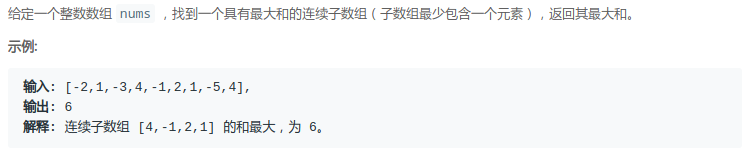
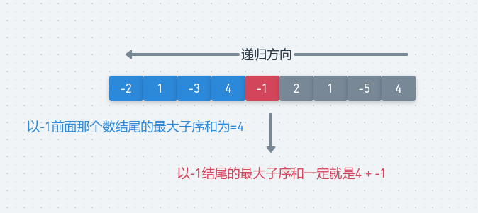
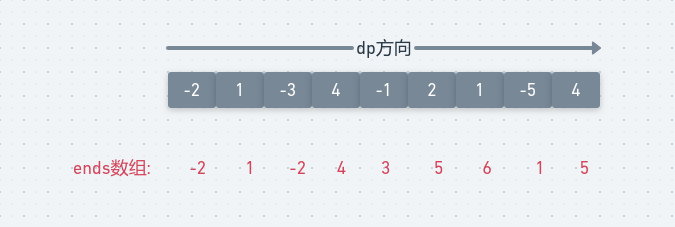
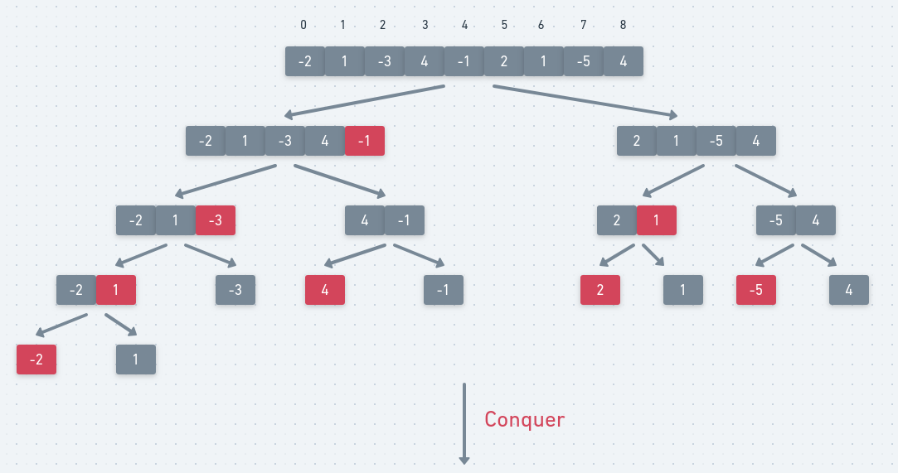
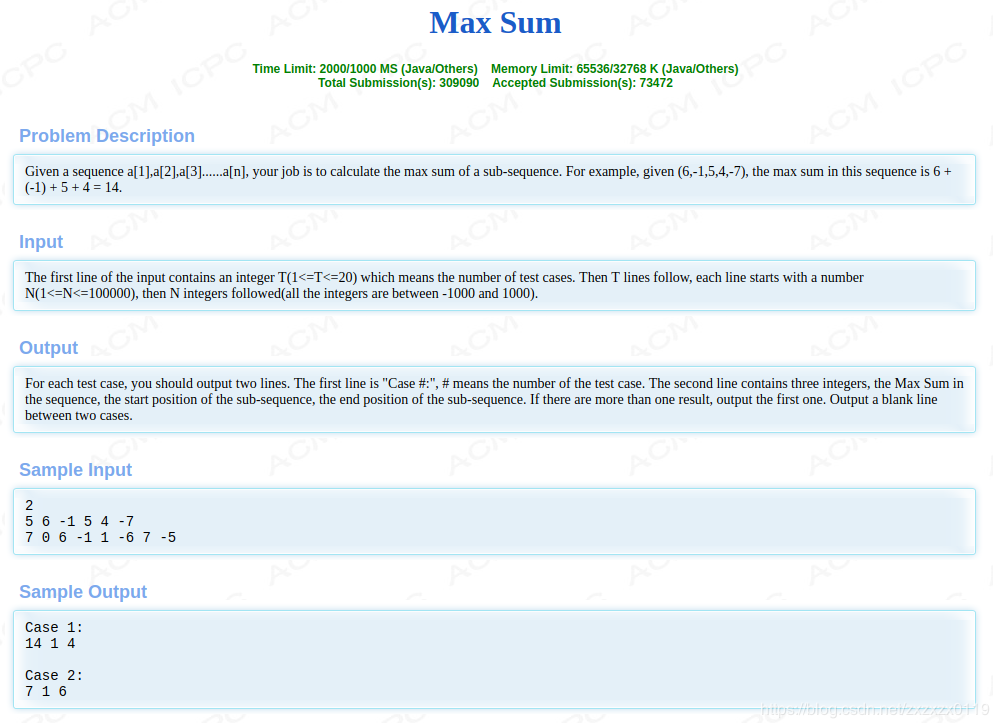

## LeetCode - 53. Maximum Subarray(最大子序和)(一维dp)

 - 递归写法
 - 一维dp数组
 - 滚动优化
 - 分治解法
 - Hdu - 1003. Max Sum
***
#### [题目链接](https://leetcode.com/problems/maximum-subarray/)

> https://leetcode.com/problems/maximum-subarray/

#### 题目


### 1、递归写法
我们可以从数组的最后开始往前看：

* 对于当前数`nums[i]`，以这个`nums[i]`结尾的最大值一定是**你前面的所有数求出一个最大的子序和**(但是由于是子数组，所以必须是判断前一个数)`+`我自己(`nums[i]`)。
* 所以这是一个递归的过程，边界条件就是`i = 0`时，最大子序和就是自己。

图: 

<div align="center"></div><br>
代码:

```java
class Solution {

    public int res;

    public int maxSubArray(int[] nums) {
        res = nums[0];
        rec(nums, nums.length - 1);
        return res;
    }

    public int rec(int[] nums, int index) {
        if (index == 0) {
            return nums[0];
        } else {
            int pre = rec(nums, index - 1);  //先给我求出前面的最大子序和
            int cur = pre > 0 ? pre + nums[index] : nums[index];
            res = Math.max(cur, res);
            return cur;
        }
    }
}

```
***
### 2、一维dp数组
动态规划就是从小问题到大问题，递归相反的方向，我们可以正向的保存一个**以每一个数结尾的最大子序和的数组**，然后递推到最后一个，其中使用个`max`保存最大值；

<div align="center"></div><br>
代码: 

```java
class Solution {

    public int maxSubArray(int[] nums) {
        int[] ends = new int[nums.length];
        ends[0] = nums[0];
        int max = ends[0];
        for (int i = 1; i < nums.length; i++) {
            ends[i] = ends[i - 1] > 0 ? ends[i - 1] + nums[i] : nums[i];
            max = Math.max(max, ends[i]);
        }
        return max;
    }
}

```
### 3、滚动优化
类似二维dp的滚动数组优化，因为每个位置只需要它前面的一个位置，所以我们只需要用一个变量保存即可。

```java
class Solution {

    public int maxSubArray(int[] nums) {
        int preMax = nums[0];
        int max = nums[0];
        for (int i = 1; i < nums.length; i++) {
            preMax = preMax > 0 ? preMax + nums[i] : nums[i];
            max = Math.max(max, preMax);
        }
        return max;
    }
}

```
### 4、分治解法

思路: 
* 找到中间位置，所求子串不是在中间位置的左边，就是右边，还有中间位置两边；
* 中间位置左边右边的和最大的子串可以递归地求得；
* 再求中间位置往左挨个加的最大和以及中间位置往右挨个数的最大和，这两个和就是子串跨越中间位置时的最大和；
* 这三个最大和中的最大值就是所求最大值；
* **这里要注意`LMax = process(arr,L,mid)`，这里的右边界不是`mid-1`，而是`mid`，因为边界是`L==R`的时候返回`arr[L]`，而且我们计算`crossMax`的时候包括了`arr[mid]`，就不需要再加**上`arr[mid]`。

图:



代码:

```java
class Solution {
    
    public int maxSubArray(int[] nums) {
        if (nums == null || nums.length == 0)
            return 0;
        return rec(nums, 0, nums.length - 1); 
    }

    //返回这个之间的最大子序和
    private int rec(int[] arr, int L, int R) {
        if (L == R)
            return arr[L];
        int mid = L + (R - L) / 2;
        int LMax = rec(arr, L, mid);
        int RMax = rec(arr, mid + 1, R);

        int sum = 0, LSumMax = Integer.MIN_VALUE, RSumMax = Integer.MIN_VALUE;

        for (int i = mid; i >= L; i--) {
            sum += arr[i];
            if (sum > LSumMax) {
                LSumMax = sum;
            }
        }
        sum = 0;
        for (int i = mid + 1; i <= R; i++) {
            sum += arr[i];
            if (sum > RSumMax) {
                RSumMax = sum;
            }
        }
        int crossMax = LSumMax + RSumMax;

        //compare crossMax、LMax,RMax
        if (LMax >= RMax && LMax >= crossMax)
            return LMax;
        if (RMax >= LMax && RMax >= crossMax)
            return RMax;
        return crossMax;
    }
}
```

***
### 5、Hdu - 1003. Max Sum
#### [题目链接](http://acm.hdu.edu.cn/showproblem.php?pid=1003)

> http://acm.hdu.edu.cn/showproblem.php?pid=1003

#### 题目



#### 解析
这个和上面有点不同的是要我们求出求得最大字段和的同时，要**求出左右边界，其实很简单，先记录一下右边界，然后从后往前递推左边界即可**；

一维dp: 

```java
import java.io.*;
import java.util.Scanner;

public class Main {

    public static void main(String[] args) {
        Scanner in = new Scanner(new BufferedInputStream(System.in));
        PrintWriter out = new PrintWriter(System.out);
        int T = in.nextInt();
        int kase = 0;
        while (T-- > 0) {
            int n = in.nextInt();
            int[] arr = new int[n];
            for (int i = 0; i < n; i++)
                arr[i] = in.nextInt();

            int[] ends = new int[arr.length];
            ends[0] = arr[0];
            int max = ends[0], maxi = 0;
            for (int i = 1; i < arr.length; i++) {
                ends[i] = ends[i - 1] > 0 ? ends[i - 1] + arr[i] : arr[i];
                if (ends[i] > max) {
                    max = ends[i];
                    maxi = i;
                }
            }
            int curSum = max, L = maxi; // L 是左边界 
            for (int i = maxi; i >= 0; i--) {
                curSum -= arr[i];
                if (curSum == 0) {
                    L = Math.min(L, i);
                }
            }
            out.println("Case " + (++kase) + ":");
            out.println(max + " " + (L + 1) + " " + (maxi + 1));
            if (T != 0) out.println();
        }
        out.close();
    }
}
```
滚动优化: 

```java
import java.io.*;
import java.util.Scanner;


public class Main {

    public static void main(String[] args) {
        Scanner in = new Scanner(new BufferedInputStream(System.in));
        PrintWriter out = new PrintWriter(System.out);
        int T = in.nextInt();
        int kase = 0;
        while (T-- > 0) {
            int n = in.nextInt();
            int[] arr = new int[n];
            for (int i = 0; i < n; i++)
                arr[i] = in.nextInt();

            int preMax = arr[0];
            int max = preMax, maxi = 0;
            for (int i = 1; i < arr.length; i++) {
                preMax = preMax > 0 ? preMax + arr[i] : arr[i];
                if (preMax > max) {
                    max = preMax;
                    maxi = i;
                }
            }

            int curSum = max, L = maxi;
            for (int i = maxi; i >= 0; i--) {
                curSum -= arr[i];
                if (curSum == 0) {
                    L = Math.min(L, i);
                }
            }
            out.println("Case " + (++kase) + ":");
            out.println(max + " " + (L + 1) + " " + (maxi + 1));
            if (T != 0) out.println();
        }
        out.close();
    }
}
```

