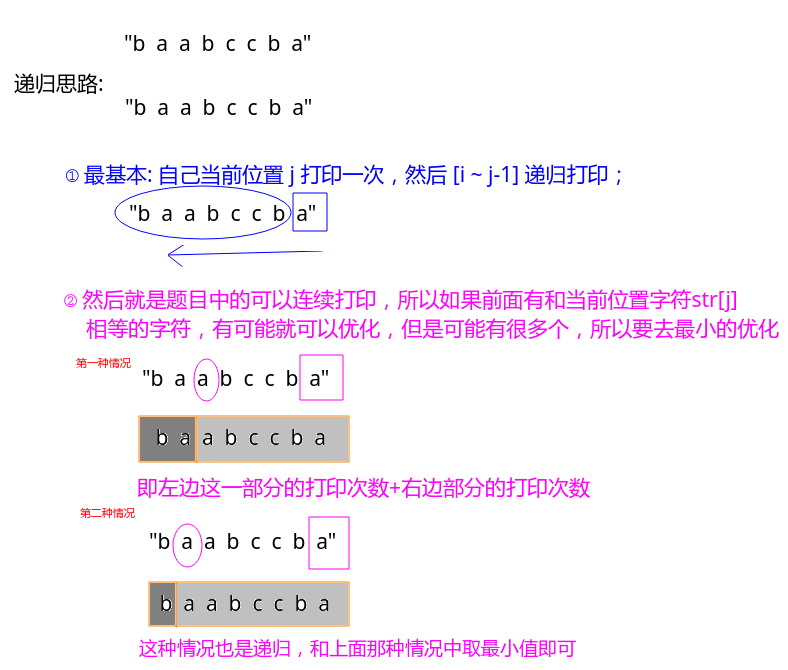
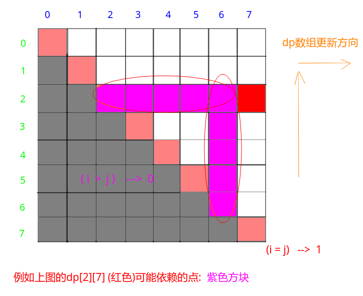

# LeetCode - 664. Strange Printer(DP)
#### [题目链接](https://leetcode.com/problems/strange-printer/)

> https://leetcode.com/problems/strange-printer/

#### 题目


#### 解析

递归思路:

* 当前递归函数求解`[i ~ j]`范围的最小打印次数；
* 则我们需要在`[i, j )`中寻找一个`k`，其中`s[k] == s[j]`，此时`[k ~ j]`范围内的字符可以一次打印，所以这样可以优化，所以我们要去在所以的`k  && s[k] == s[j]`中取一个最小的，然后去递归`[i, k]`和`[k+1, j]`即可；

举例:



代码:

```java
class Solution {
    
    private int[][] dp;
    
    public int recur(StringBuilder sb, int i, int j){
        if(i > j)
            return 0;
        if(i == j)
            return 1;
        if(dp[i][j] > 0)
            return dp[i][j];
        int res = recur(sb, i, j-1) + 1; // 最大的
        for(int k = i; k < j; k++){
            if(sb.charAt(k) == sb.charAt(j))
                res = Math.min(res, recur(sb, i, k) + recur(sb, k+1, j-1));
        }
        return dp[i][j] = res;
    }

    public int strangePrinter(String s) {
        if(s == null || s.length() == 0)
            return 0;
        dp = new int[s.length()][s.length()];
        return recur(new StringBuilder(s), 0, s.length()-1);
    }
}
```


然后就是改成动态规划(递推)，按照边界条件改即可，看一个例子`dp[2][7]`的可能依赖位置:



代码:

```java
class Solution {
    public int strangePrinter(String s) {
        if(s == null || s.length() == 0)
            return 0;
        int n = s.length();
        int[][] dp = new int[n][n];
        for(int i = 0; i < n; i++)
            dp[i][i] = 1;
        for(int i = n-2; i >= 0; i--){ //注意顺序
            for(int j = i + 1; j < n; j++){
                int tmp = dp[i][j-1] + 1;
                for(int k = i; k < j; k++)
                    if(s.charAt(j) == s.charAt(k))
                        tmp = Math.min(tmp, dp[i][k]+dp[k+1][j-1]);
                dp[i][j] = tmp;
            }
        }
        return dp[0][n-1];
    }
}
```


