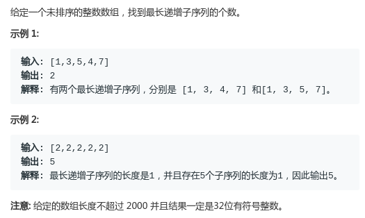
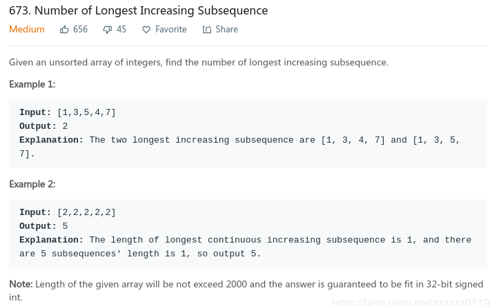
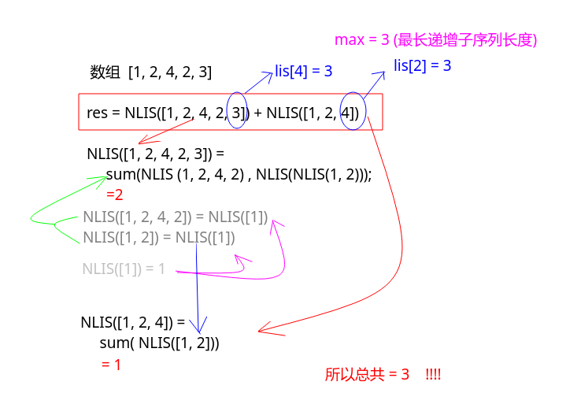

# LeetCode - 673. Number of Longest Increasing Subsequence(最长递增子序列的个数)

#### [题目链接](https://leetcode.com/problems/number-of-longest-increasing-subsequence/)

> https://leetcode.com/problems/number-of-longest-increasing-subsequence/

#### 题目






#### 解析
做这题之前先要知道[**求一个数组的最长递增子序列**](https://github.com/ZXZxin/ZXBlog/blob/master/%E5%88%B7%E9%A2%98/LeetCode/DP/LeetCode%20-%20354.%20Russian%20Doll%20Envelopes%E5%8F%8A%E6%9C%80%E9%95%BF%E4%B8%8A%E5%8D%87%E5%AD%90%E5%BA%8F%E5%88%97%E9%97%AE%E9%A2%98%E6%80%BB%E7%BB%93.md)。

做法: 

* 求出最长递增子序列的长度(`max`)，可以用记忆化也可以递推；
* 然后遍历数组，看以哪些数结尾的序列是最长序列，然后对每一个这样的序列进行递归处理，从后往前求以这个结尾的最长序列的个数，这个递归函数记为`NLIS`；
* `NLIS`函数递归的转移方程: `NLIS(i) = sum {NLIS(k)}  其中  lis[k] + 1 == lis[i] && nums[i] > nums[k] `，其中`k`的范围即`[0, i)`；

一个例子: `[1, 2, 4, 2, 3]`



代码:

```java
class Solution {
    
    public int findNumberOfLIS(int[] nums) {
        if(nums == null || nums.length == 0)
            return 0;
        int max = 1;
        int[] lis = new int[nums.length];
        Arrays.fill(lis, -1);  // 求以每个位置结尾的最长递增子序列的记忆化数组
        for(int i = 0; i < nums.length; i++)
            max = Math.max(max, LIS(nums, i, lis));
        int[] nlis = new int[nums.length];
        Arrays.fill(nlis, -1);
        int res = 0;
        for(int i = 0; i < nums.length; i++){
            if(lis[i] == max)
                res += NLIS(nums, i, nlis, lis);
        }
        return res;
    }
    
    // 求以每个位置结尾的最长递增子序列的个数
    private int NLIS(int[] nums, int i, int[] nlis, int[] lis){
        if(i == 0)
            return 1;
        if(nlis[i] != -1)
            return nlis[i];
        int res = 0;
        for(int k = 0; k < i; k++)
            if(nums[i] > nums[k] && lis[k] + 1 == lis[i])
                res += NLIS(nums, k, nlis, lis);
        if(res == 0) // 至少有自己一个
            res = 1; 
        return nlis[i] = res;
    }
    
    // 求以每一个位置结尾的最长递增子序列 
    private int LIS(int[] nums, int i, int[] lis){
        if(i == 0)
            return lis[i] = 1; // 这里将 lis[0]也要正确的赋值， 因为上面的 NLIS要用到这个 lis数组
        if(lis[i] != -1)
            return lis[i];  
        int res = 1;
        for(int k = 0; k < i; k++){
            if(nums[i] > nums[k])
                res = Math.max(res, LIS(nums, k, lis) + 1);
        }
        return lis[i] = res;
    } 
}
```

按照上面的方式也可以写成递推形式。

```java
class Solution {
    
    public int findNumberOfLIS(int[] nums) {
        if(nums == null || nums.length == 0)
            return 0;
        int max = 1;
        int[] lis = new int[nums.length];
        for(int i = 0; i < nums.length; i++){
            lis[i] = 1;
            for(int j = 0; j < i; j++){
                if(nums[j] < nums[i]){
                    lis[i] = Math.max(lis[i], lis[j] + 1);
                }
            }
            max = Math.max(lis[i], max);
        }
        int[] nlis = new int[nums.length];
        int res = 0;
        for(int i = 0; i < nums.length; i++){
            nlis[i] = 0;
            for(int j = 0; j < i; j++){
                if(nums[j] < nums[i] && lis[j] + 1 == lis[i]){
                    nlis[i] += nlis[j]; 
                }
            }
            if(nlis[i] == 0)
                nlis[i] = 1;
            if(lis[i] == max)
                res += nlis[i];
        }        
        return res;
    }
}
```

