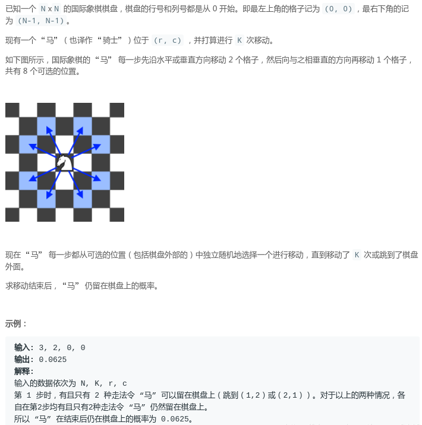
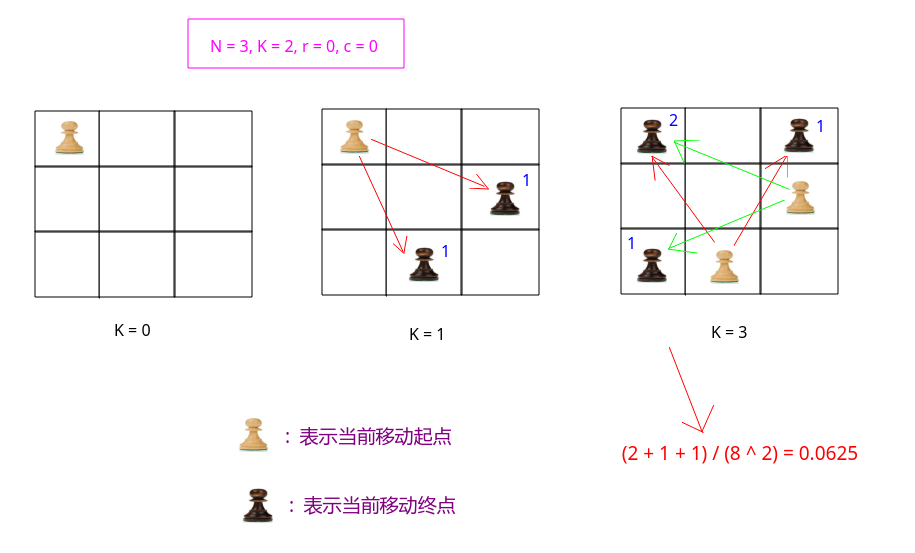

# LeetCode - 688. Knight Probability in Chessboard (DP)

#### [题目链接](https://leetcode.com/problems/knight-probability-in-chessboard/)

> https://leetcode.com/problems/knight-probability-in-chessboard/

#### 题目


#### 解析

思路: 

当前的步数以及当前的位置，可以由上一个可以走到当前位置的位置走到当前位置，如果没有越界，总共有`8`个这样的**上一个位置**。

看题目中的例子: 



于是如果是递归求解: 

* 则当前递归层依赖的是上一层(`k-1`)的`8`种位置的方法数量的和；
* 概率就是到第`k`层的时候的方法数 <font color =blue> / </font>`8 ^ K`；  
代码:

```java
import java.io.*;
import java.util.*;

class Solution {

    final int[][] dir = { {-2, 1}, {-1, 2}, {1, 2}, {2, 1},
                      {1, -2}, {2, -1}, {-1, -2}, {-2, -1} };

    private double dp[][][];

    private double recur(int k, int x, int y, int N){ 
        if(x < 0 || x >= N || y < 0 || y >= N) // 这个必须写在下面k == 0的条件之前
            return 0.0;
        if(k == 0)
            return 1.0;
        if(dp[k][x][y] != 0)
            return dp[k][x][y];
        double res = 0;
        for(int d = 0; d < 8; d++)
            res += recur(k-1, x - dir[d][0], y - dir[d][1], N);
        return dp[k][x][y] = res; 
    }

    public double knightProbability(int N, int K, int r, int c) {
        dp = new double[K+1][N][N];
        return recur(K, r, c, N) / Math.pow(8, K);
    }   

    public static void main(String[] args){ 
        Scanner cin = new Scanner(System.in);
        PrintStream out = System.out;

        out.println(new Solution().knightProbability(3, 2, 0, 0));
    }
}
```

也可以用递推来求解: 
```java
import java.io.*;
import java.util.*;

class Solution {

    final int[][] dir = { {-2, 1}, {-1, 2}, {1, 2}, {2, 1},
                      {1, -2}, {2, -1}, {-1, -2}, {-2, -1} };

    public double knightProbability(int N, int K, int r, int c) {
        double[][][] dp = new double[K+1][N][N];
        dp[0][r][c] = 1.0; 
        for(int k = 1; k <= K; k++){ 
            for(int i = 0; i < N; i++){ 
                for(int j = 0; j < N; j++){ 
                    for(int d = 0; d < 8; d++){ 
                        int x = i + dir[d][0];
                        int y = j + dir[d][1];
                        if(x < 0 || x >= N || y < 0 || y >= N)
                            continue;
                        dp[k][x][y] += dp[k-1][i][j];
                    }
                }
            }
        }
        double sum = 0;
        for(int i = 0; i < N; i++){ 
            for(int j = 0; j < N; j++)
                sum += dp[K][i][j];
        }
        return sum / Math.pow(8, K);
    }   

    public static void main(String[] args){ 
        Scanner cin = new Scanner(System.in);
        PrintStream out = System.out;

        out.println(new Solution().knightProbability(3, 2, 0, 0));
    }
}

```
由于只需要前后两个状态，所以可以优化空间。

优化空间: `O(N ^ 2)`: 

```java
import java.io.*;
import java.util.*;

class Solution {

    final int[][] dir = { {-2, 1}, {-1, 2}, {1, 2}, {2, 1},
                      {1, -2}, {2, -1}, {-1, -2}, {-2, -1} };

    public double knightProbability(int N, int K, int r, int c) {
        double[][] dp0 = new double[N][N];
        dp0[r][c] = 1.0;
        for(int k = 1; k <= K; k++){ 
            double[][] dp1 = new double[N][N];
            for(int i = 0; i < N; i++){ 
                for(int j = 0; j < N; j++){ 
                    for(int d = 0; d < 8; d++){ 
                        int x = i + dir[d][0];
                        int y = j + dir[d][1];
                        if(x < 0 || x >= N || y < 0 || y >= N)
                            continue;
                        dp1[x][y] += dp0[i][j];
                    }
                }
            }
            dp0 = dp1;
        }
        double sum = 0;
        for(int i = 0; i < N; i++){ 
            for(int j = 0; j < N; j++)
                sum += dp0[i][j];
        }
        return sum / Math.pow(8, K);
    }   

    public static void main(String[] args){ 
        Scanner cin = new Scanner(System.in);
        PrintStream out = System.out;

        out.println(new Solution().knightProbability(3, 2, 0, 0));
    }
}
```

